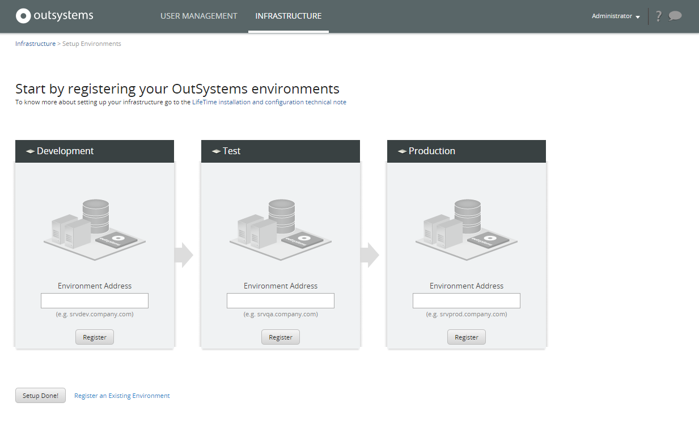
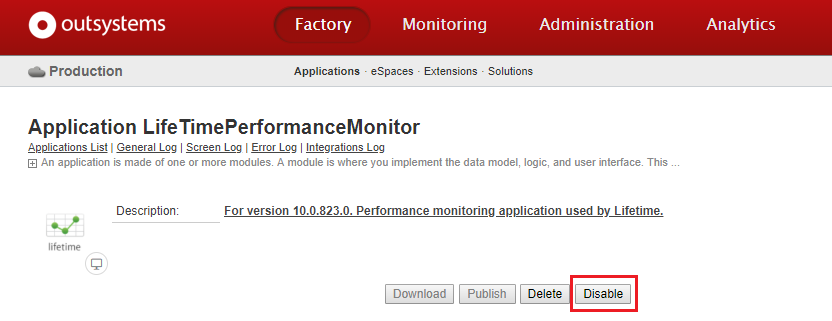
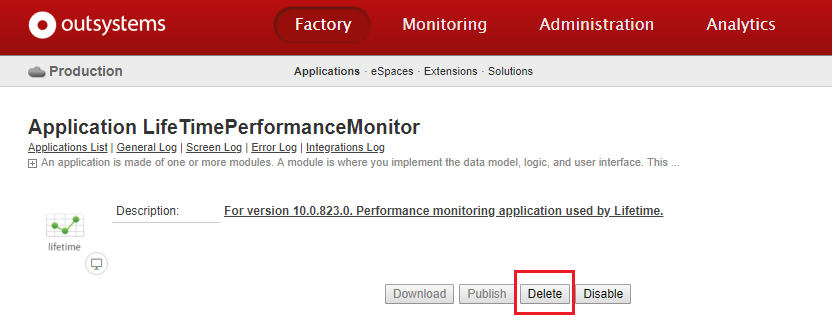
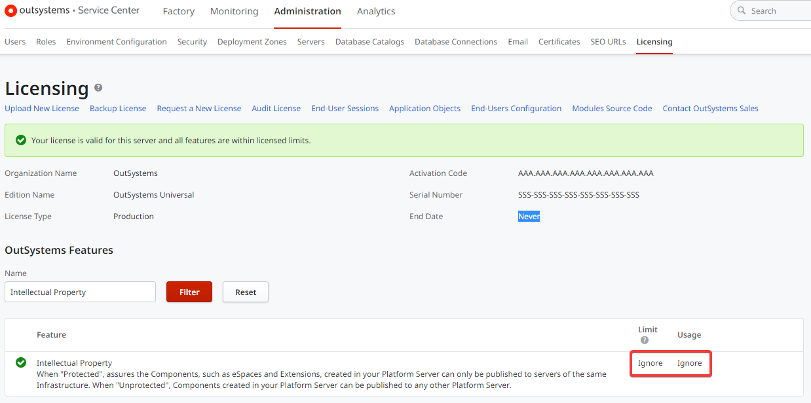
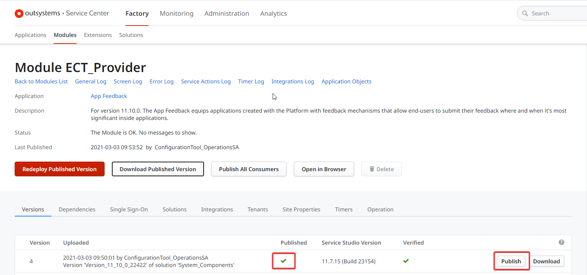
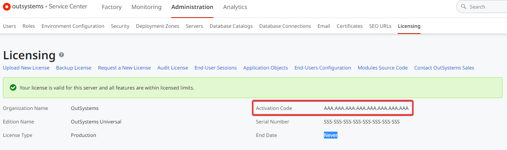

# Reinstall the infrastructure management console in a dedicated environment

This article describes how to remove the infrastructure management console (LifeTime) from a shared environment and installing it in a new dedicated environment.

This operation applies only to **on-premises installations**.

Once LifeTime is installed in an existing environment, reinstalling LifeTime in a dedicated environment will cause the loss of LifeTime specific data (Performance Monitor data, application tagging history and change log).

## Prerequisites

To reinstall LifeTime in a new dedicated environment the following requirements must be met:

* Have an **on-premises** installation.

* Have an [available licensing slot](https://www.outsystems.com/licensing) to register the new Lifetime dedicated environment.

* The **LifeTime version** you are installing must be able to manage the **Platform Server version** running in your OutSystems environments. [Check here](../upgrade/lifetime-versions.md) which versions of Platform Server can LifeTime manage.

* The operation is performed by a user with the built-in **Administrator** role in Service Center.

* All the environments registered in the original LifeTime (eg. Development, Test, Production) are **synchronized** and no synchronization is on-going.

* The original LifeTime environment must have **no LifeTime plugins installed**, otherwise, you might not be able to remove LifeTime’s applications.

## Remarks

* Reinstalling Lifetime in a different environment **keeps all application data in the environments controlled by LifeTime** (eg. Development, Test, Production).

* The following **LifeTime specific data will be lost**:

    * LifeTime Analytics data / Performance Monitor
    * Application tagging history
    * Change log

* During the whole LifeTime reinstall operation, guarantee that **no one executes the following actions**:

    * Stage applications using LifeTime.
    * Any operation within User Management (Users, Teams, Roles, Authentication Mode, Service Accounts).

* You will need to **manually configure** the following information in the new LifeTime dedicated environment:

    * Users Roles and Teams.
    * Authentication Mode and Service Accounts, if used.

* The migration of any **LifeTime plugin** you might have is **not in the scope of this operation**. Make sure to backup and remove any LifeTime plugin from the original LifeTime environment before you start this operation. You can install your LifeTime plugins again after LifeTime reinstall operation is completed.

* From version OutSystems 11 onwards, **LifeTime doesn't support farm configuration**. You must install a single server with both Deployment Controller and Server roles.

## Reinstall LifeTime in a Dedicated Environment

### Step 1. Prepare a new dedicated environment for LifeTime

1. Download the latest [LifeTime Management Console binaries](https://www.outsystems.com/goto/lifetime-installer) from the downloads area.

1. Follow [LifeTime's installation checklist](https://www.outsystems.com/goto/checklist-lifetime) to install LifeTime in a new dedicated environment. As LifeTime **doesn't support farm configuration**, you must select the combination "Deployment Controller + Server" in the checklist to install a single server with both roles.

1. Get a [license file](https://www.outsystems.com/licensing) for the new LifeTime dedicated environment and apply the license in the new environment.

We recommend you to install the latest LifeTime version. [Check here](../upgrade/lifetime-versions.md) which versions of Platform Server can LifeTime manage.

If you need to install LifeTime component of OutSystems 10 or previous version, you must download and install LifeTime from the Platform Server binaries.

### Step 2. Save original LifeTime configurations

1. Go to the original LifeTime, `https://<original-lifetime-environment>/lifetime`.

1. Login as Administrator.

1. Write down all your User Management configurations - it will be needed later to replicate the same structure in the new Lifetime dedicated environment:

    * Users, Roles and Teams
    * Authentication Mode
    * Service Accounts

Tip: You can use [LifeTime Services API](<https://success.outsystems.com/Documentation/10/Reference/OutSystems_APIs/LifeTime_Services_API>) to retrieve Users, Roles and Teams from the original LifeTime environment, making easier for you the task of writing down the needed information. Check [BackupLTPermissions](<https://www.outsystems.com/forge/4043/>) component in OutSystems Forge as an example on how to retrieve these data from LifeTime.

### Step 3. Disable LifeTime from the original environment

1. Go to the **INFRASTRUCTURE** tab and choose **Manage Environments**.

1. For all registered environments, choose **Edit** and select **Unregister environment**. After unregistering all environments, you will see the following screen:

    
 
1. Go to the Service Center console of the original LifeTime environment and log in as Administrator, `https://<original-lifetime-environment>/ServiceCenter`.

1. Go to the **Factory** section and choose **LifeTimePerformanceMonitor** application from the Applications list.

1. Disable **LifeTimePerformanceMonitor** application.

    
 
1. From the Applications list, choose **LifeTime** application and **Disable** it.

1. From the Applications list, choose **LifeTimeSDK** application and **Disable** it.

### Step 4. Configure new LifeTime dedicated environment

1. Go to the new LifeTime dedicated environment, `https://<new-lifetime-environment>/lifetime`.

1. Login as Administrator.

1. Go to the **USER MANAGEMENT** area and [create the Roles](<https://success.outsystems.com/Documentation/11/Managing_the_Applications_Lifecycle/Manage_IT_Teams/Create_an_IT_Role>) you had in the original LifeTime environment, configuring the corresponding permissions.

    

    Tip: If you used LifeTime Services API to retrieve the Roles from the original LifeTime environment, use the retrieved data to create the Roles in the new dedicated environment. Check [BackupLTPermissions](<https://www.outsystems.com/forge/4043/>) component in OutSystems Forge as an example on how to retrieve these data from LifeTime.
    
    

1. Go to the **INFRASTRUCTURE** area and [register all your OutSystems environments](<https://success.outsystems.com/Support/Enterprise_Customers/Installation/Configure_the_infrastructure_management_console>).

1. Now that all the environments are registered, configure your [Teams](<https://success.outsystems.com/Documentation/11/Managing_the_Applications_Lifecycle/Manage_IT_Teams/Create_an_IT_Team>) and [specific application Roles](<https://success.outsystems.com/Documentation/11/Managing_the_Applications_Lifecycle/Manage_IT_Teams/Grant_IT_Roles_for_a_Specific_Application>) as you had in the original LifeTime environment.

1. Configure the Authentication Mode setting and Service Accounts as you had in the original LifeTime environment.

### Step 5. Delete LifeTime’s applications from the original environment

If the original LifeTime environment version is **lower than Platform Server 10.0.804.0**, you will not be able to delete LifeTime’s applications. In this case, skip the steps below, leaving the applications disabled.  

If the original LifeTime environment version is **Platform Server 10.0.804.0 or upper**, do the following to delete LifeTime’s applications:

1. Go to the Service Center console of the original LifeTime environment and log in as Administrator, `https://<original-lifetime-environment>/ServiceCenter`.

1. Go to the **Factory** section and choose **LifeTimePerformanceMonitor** application from the Applications list.

1. Delete **LifeTimePerformanceMonitor** application.

    
 
1. From the Applications list, choose **LifeTime** application and **Delete** it. 

1. From the Applications list, choose **LifeTimeSDK** application and **Delete** it.

LifeTime is now reinstalled in a dedicated environment.

**START HERE**

# Introduction

During the lifecycle of an OutSystems customer, the need may come to replace the license of one existing infrastructure (a set of environments) from one activation code to another. This may arise for multiple reasons, such as organization splitting for example, where an end-customer is split into multiple companies, each licensing OutSystems separately.

Ensuring the change of licenses is done correctly ensures that downtime is avoided and the continued normal functioning of OutSystems.

This article covers a scenario where a full infrastructure, including LifeTime, will be migrated from a source activation code *AAA* to a destination activation code *BBB*. It also covers as a rollback procedure in case of any problems.

# Moving an entire infrastructure

In this scenario, we begin with a single infrastructure with the following environments:

* LifeTime
* Development
* Quality
* Production

    

This scenario still applies if you have more environments than the ones depicted, provided the requirements of the scenario are met:

* All environments for which you wish to change the activation code are controlled by the LifeTime of your infrastructure. 
* You change the activation code of all environments controlled by the LifeTime of your infrastructure. 
* You change the activation code of the LifeTime of your infrastructure. 

**Important** - Do not proceed if:
* there are other environments where you wish to change the activation code, and those are not controlled by the same LifeTime.
* you do not wish to change the activation code of one or more environments controlled by this LifeTime.
* you do not wish to change the activation code of the LifeTime environment.

## Migration procedure

Please read the complete procedure before starting to execute it. If you have any questions, please reach out to OutSystems Support ahead of execution. 
To move from the previous Activation Code (AAA in this text) to the new Activation Code (BBB in this text), please proceed as follows:

1.  Pause all deployments to the Production environment.

1.  For all environments, refresh the license file for the activation codes AAA with the new files. Let’s start with the Production environment:

    a. Go to www.outsystems.com/licensing and enter your old Production environment activation code AAA.
        
    b. Navigate to the serial number of the Production environment and obtain the license file. Keep the file for backup purposes.
        
    c. Upload the license file.In ServiceCenter for the Production environment - go to **Administration** -> **Licensing**, and choose **Upload a new License**. Upload the license file that you obtained in the previous step.
        
    d. Still in the Licensing page, filter for the feature **Intellectual Property**. If it reads **Ignore**, you are all good. If not, your license is not prepared for the migration, refer to the FAQ below.

    
            
    e. Repeat steps a. to d. for the remaining three environments.

    

    If you receive any IPP or Intellectual Property errors during the next step, **pause the procedure** for other environments and refer to the Rollback procedure below.

    

1.  Perform a test republish of an eSpace (e.g. ECT_Provider) in **each** environment. 
Go to **Factory** -> **Modules** and filter by ECT_Provider. Open the details of the eSpace, locate the version that is currently published and click **Publish** for that version.

    

## Rollback procedure

1.  Pause all deployments to the Production environment. 
Development activities within an environment other than Production may continue.

1.  For all environments that have licenses from activation code BBB, restore all license files with those backed up in step 3 above.

    a. In ServiceCenter for each particular environment, go to **Administration** -> **Licensing**, and choose **Upload a new License**. Upload each environment’s backed up license file.

    b. Confirm that the activation code displayed is the old activation code AAA.

    

    c. Perform a test republish of an eSpace (e.g. ECT_Provider) in each environment. 
    Go to **Factory** -> **Modules** and filter by ECT_Provider. Open the details of the eSpace, locate the version that is currently published and click **Publish** for that version.

1.  Contact OutSystems Support to report the issues and to obtain assistance to move forward.

# In case something unexpected happens

If something unexpected happens, refer to the Frequently Asked Questions below or reach out to OutSystems Support, providing this article and indicating the step at which something unexpected happened.

## FAQs

#### I cannot find the serial number of my environment in the old Activation Code

Please  contact OutSystems Support to obtain a license file in a different way. Before contacting Support, please confirm all environments which **do not** appear in the old Activation Code (AAA in the script) so you can ask for help for all those environments all at once.

#### The license I uploaded from the old Activation Code AAA is not prepared for the migration

Please contact OutSystems Support to obtain a license file in a different way. Before contacting Support, please finish uploading all licenses to the environments, so you can provide the complete list of environments that do not mention “Intellectual Property: Ignore” so we can help assist for all environments at once.

####  The license I uploaded from the new Activation Code BBB is not prepared for the migration
Please contact OutSystems Support so we can correct the license definition at our end. Following that, you will need to repeat the obtaining of the licenses for all environments under Activation Code BBB.
