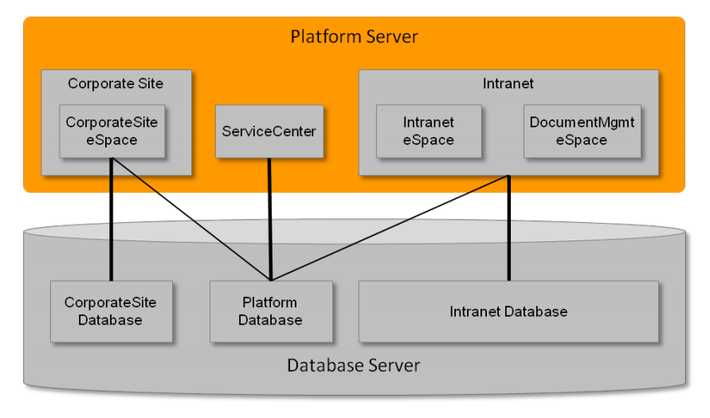
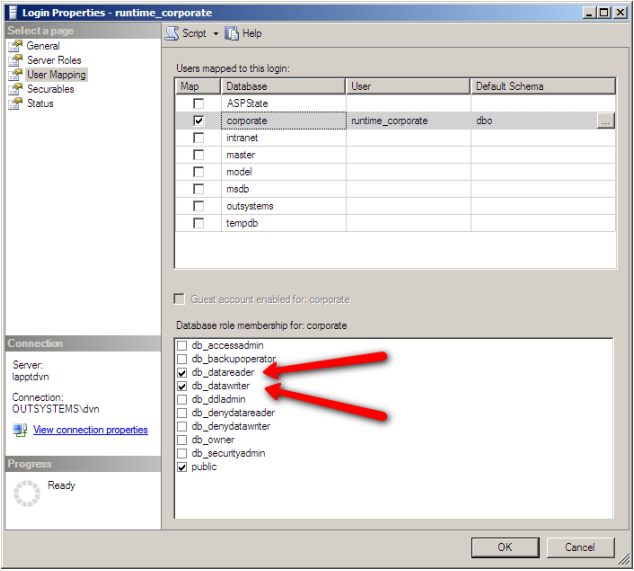
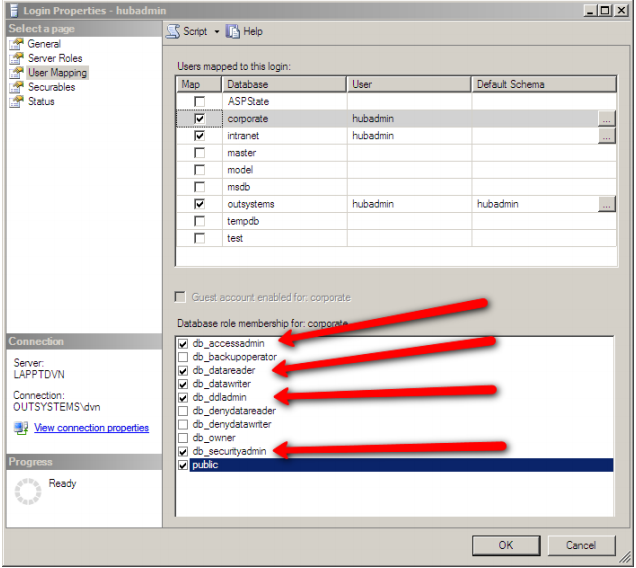
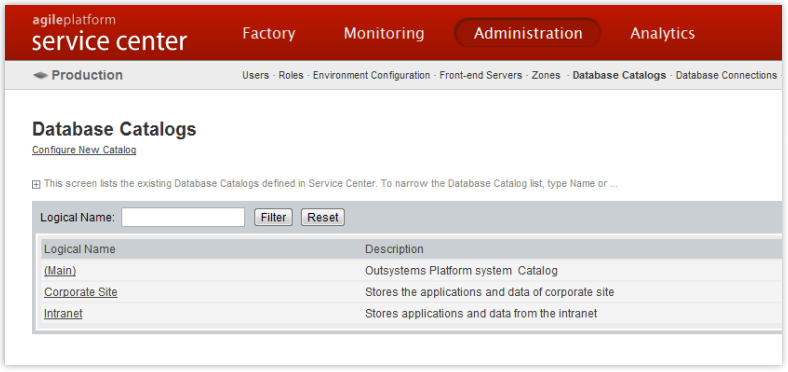
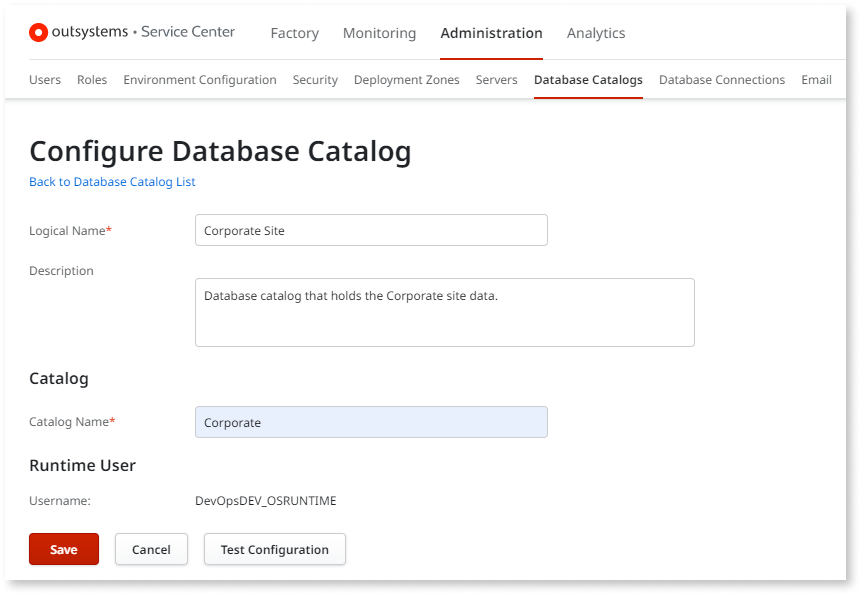
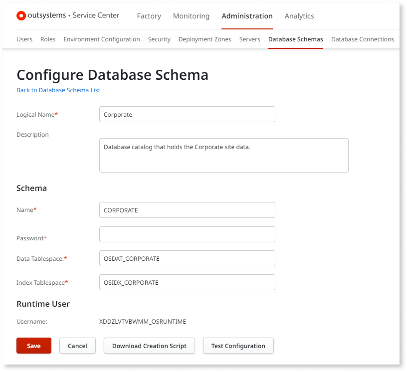

# Multiple Database Catalogs and Schemas

Enterprise applications often require thorough data separation down to database level, allowing for more granular storage management, database maintenance, or simply for organization purposes. The Multiple Database Catalogs and Schemas feature  allows you to meet these requirements by binding your modules to specific database catalogs or schemas.

This feature is only available for on-premise installations.

## Introduction

OutSystems supports both Microsoft SQL Server and Oracle. While these database management systems use different terminology, for a matter of simplicity this technical note uses the term ‘‘database‘‘ to refer to an SQL Server Catalog and Oracle Schema. 

## Why Use Multiple Database Catalogs and Schemas

Using Multiple Database Catalogs and Schemas improves the management and maintenance of your database's data, namely:

* Improved database backup policies per application. For example: by establishing different backup schedules depending on database size and importance;

* Improved database maintenance plans per application;

* Optimize I/O performance by splitting the application‘s data across storage systems. For example, data with higher I/O needs to be distributed by more performing hard disks;

* Smaller database sizes through data distributed by several databases, thus not having all information stored in the same place in big files;

* The possibility of restoring non-BPM databases without affecting other applications, if already using a database that is independent from the Platform Database (Main);

* The ability to have different database transaction logging policies.

## Usage Scenario

The following diagram depicts a typical scenario with three distinct databases: one for Intranet applications, one for Internet corporate applications, and the OutSystems database.

The OutSystems database must always exist to store:

* OutSystems Platform’s meta data;

* System Components specific data;

* Global data to support cross-application infrastructure such as: Single Sign-on, Permission Areas, etc;

## Steps to Create Multiple Databases

### Create a new Database (Catalog) in SQL Server

In SQL Server, the DBA must first create the database Catalog, and then set its permissions for both the Platform’s admin and runtime database users (set in the Configuration Tool).

The permissions should be set as follows:

**Runtime User:** must have read and write permissions for all tables.

**Platform’s admin user:** must have the permissions set for db_accessadmin, db_datareader, db_datawriter, db_ddladmin, and db_securityadmin.

Once the catalog is created in SQL Server, proceed to Service Center Adminitration tab and select Database Catalogs.

Then use the "Configure New Catalog" and add the catalog you previously created. Please test the configuration before saving it in order to ensure the permissions are correctly setup.

### Create a new Database (Schema) in Oracle

To create a new database Schema, go to Service Center, and in ‘Database Schemas’ select ‘Configure new Schema’.

Fill in the information for the new schema and download the configuration script. Then, execute the script (as DBA) in the Oracle database to effectively create the new Schema. To finish, test the newly created Database Schema in Service Center with the ‘Test Configuration’ button and save the schema.

The script to create the Schema already sets all required permissions.

## Publishing new modules

### Publishing a new module

In Service Studio, when you publish an module for the first time using Multiple Database Catalogs and Schemas you are asked to specify the catalog/schema where to publish that module. The module is published in the Platform Server, its database objects created in the specified catalog/schema, and permissions are set for the runtime user.

After publishing a module for the first time, you will no longer be asked about the catalog/schema for it: you can move a module  to another database in Service Center. Learn more about moving an module to another catalog/schema in the "Moving a module to Another Database Catalog/Schema" section further ahead.

In Service Center, the behavior of publishing a new module is the same as in Service Studio, that is, you’re asked to set the catalog/schema where the module is to be published.

### Publishing a Solution with new modules

When publishing a Solution with Multiple Database Catalogs and Schemas, either in Service Center or using the Solution Pack Tool, you are asked to set the catalog/schema for each one of the new modules found in the Solution.

For modules that were already published in the Platform Server, their catalog/schema is already set in the Platform Server, as for the others, the publishing proceeds as follows:

* No catalog/schema is set for the module in the Platform Server: the user is asked to set the catalog/schema for the module, as if it were a new module;

* A catalog/schema is set for the module in the Platform Server: the catalog/schema set in the Platform Server overrides the one that comes with the module in the Solution.

## Moving Modules to Different Databases

In a Multiple Database Catalogs and Schemas scenario, moving a  module from a database to another involves executing several steps which are described in this section.

### SQL Server

#### Moving a Module to a Different Database Catalog

To move a module to a different Catalog execute the following steps:

1. Backup the source and destination databases
 

2. Mark the module to be moved.

    1. Open Service Center.

    2. Open the edit screen of the module, select the Operation tab, and in the Catalog drop down select the Catalog where the module is to be moved to.

    3. Press the ‘Apply’ button: the module won’t be moved right away but marked for to be moved, therefore, it will still be operating with its old Catalog.
 

3. Copy the database data

| For Version 8 or lower| For Platform 9 or higher|
|-----|-----|
| a. Once the module is marked to be moved, go to the module  details screen, click the link ‘Download Data Copy Script’ to download the script that will copy the module data; | a. Once the module is marked to be moved, take offline the application that contains the module (using the ‘Take Offline’ button, on the application details screen);|
| b. Bring the application that contains the module offline using the ‘Take Offline’ button, on the application details screen; | b. Create a SQL script to copy the module data to the destination catalog (run it in SQL Server Management Studio); |
| c. Run the script in SQL Server Management Studio, to copy the module data. You must have the same privileges as the admin user of the Platform; | c. Ensure that the move operation was successful and the application is working properly.|
| d. The script creates the source tables and views into the destination Catalog, copies their data, and creates the constraints;| |
| e. Ensure that the move operation was successful and the application is working properly.| |
| f. In the source Catalog, tables are kept for any eventual data recovery situation, but are renamed with a ‘OLD_‘ prefix. To definitely delete them, use the commented (not executed) SQL commands at the end of the script;| |
| g. In case of moving large amounts of data, require the DBA assistance to examine data copy steps on the script, and possibly make them more efficient. |  |

4. Finish the module move

    a. In Service Center, publish the module.
    
    b. The Platform Server first checks that all tables of the module are created in the destination Catalog. Then it displays a ‘Use Matching Tables’ option that is to be selected, and continue with the publishing process;

    c. If the module has Consumer modules, republish them, or build a solution with all referenced modules and publish it in a single step.

    d. Bring the module online using the ‘Bring Online’ button on the module details screen.

    e. The module is now using the new Catalog.

#### Staging a Solution to Production with Moved Modules

To stage a Solution to a Production environment with modules  moved to a different Catalog, proceed as follows:

1. Make backups of the databases.
 

2. Stage the solution

    a. Open Service Center of the Production environment.

    b. In the Solution list screen, upload the solution.

    c. Because the solution contains moved modules, a table detailing them is displayed during the upload, and their move should be confirmed.
 

3. Copy the database data

| For Version 8 or lower| For Platform 9 or higher|
|------|--------|
| a. Once the module is marked to be moved, go the module details screen, click the link ‘Download Data Copy Script’ to download the script that will copy the module data;| a. Once the module is marked to be moved, take offline the application that contains the module (using the ‘Take Offline’ button, on the application details screen);|
| b. Bring the application that contains the module offline using the ‘Take Offline’ button, on the application details screen; | b. Create a SQL script to copy the module data to the destination catalog (run it in SQL Server Management Studio); |
|module data. You must have the same privileges as the admin user of the Platform; | c. Ensure that the move operation was successful and the application is working properly. |
| d. The script creates the source tables and views into the destination Catalog, copies their data, and creates the constraints;  |  |
| e. Ensure that the move operation was successful and the application is working properly. |   |
| f. In the source Catalog, tables are kept for any eventual data recovery situation, but are renamed with a ‘OLD_‘ prefix. To definitely delete them, use the commented (not executed) SQL commands at the end of the script;|  |
| g. In case of moving large amounts of data, require the DBA assistance to examine data copy steps on the script, and possibly make them more efficient.| |

4.  Finish the solution staging

    a. In Service Center, publish the solution;

    b. The Platform Server first checks that all tables (of the moved modules) are created in their destination Catalogs. Then it displays a ‘Use Matching Tables’ option that is to be selected, and continue with the publishing process;

    c. All Consumer modules should be republished. Republish them or build a solution and publish it in a single step;

    d. Bring modules online using the ‘Bring Online’ button on the detail screen of each application they belong to;

    e. The solution is now staged and all moved modules using their new Catalogs.

### Oracle

#### Moving a Module to a Different Database Catalog

To move an module to a different Schema execute the following steps:

1. Backup the source and destination databases
 

2. Mark the module to be moved

     a. Open Service Center;

    b. Go to the module details screen, select the Operation tab and select the Catalog where the module is to be moved to;

    c. Press the ‘Apply’: the module won’t be moved right away but marked to be moved, therefore, it will still be operating with its old Schema;
 

3. Copy the database data

| For Version 8 or lower | For Platform 9 or higher |
|----|------|
| a. Once the module is marked to be moved, go the module details screen, click the link ‘Download Data Copy Script’ to download the script that will copy the module data;  | a. Once the module is marked to be moved, take offline the application that contains the module (using the ‘Take Offline’ button, on the application details screen); |
| b. Bring the application that contains the module offline using the ‘Take Offline’ button, on the application details screen; | b. Create and run a SQL script to copy the module data to the destination Schema;  |
| c. Run the script to copy data in the Oracle SQL Developer with a dba user;  | c. Ensure that the move operation was successful and the application is working properly.  |
| d. The script uses the Oracle Data Pump to create the source tables and views into the destination Schema, copies their data, and creates the constraints; |     |
| e. In the source Schema, tables are kept for any eventual data recovery situation, but are renamed with a ‘OLD_‘ prefix. To definitely delete them, use the commented (not executed) SQL commands at the end of the script, but assuring that the move operation was successful and the application is working properly; |  |
| f. Usually Data Pump is efficient when moving large amounts of data, though the script can still be optimized by the dba for your specific case.|  |

4. Finish the module move

    a. In Service Center, publish the module;

    b. The Platform Server first checks that all tables of the module are created in the destination Schema. Then it displays a ‘Use Matching Tables’ option that is to be selected, and continue with the publishing process;

    c. If the module has Consumer modules, republish them, one by one. Yet, if they are too many, it’s more efficient to build a solution with them and publish that solution in a single step;

    d. Bring the modules online using the ‘Bring Online’ button on the application details screen that contain the modules moved;

    e. The module is now using the new Schema.

#### Staging a Solution to Production with Moved modules

To stage a Solution to a Production environment with modules moved to a different Schema, proceed as follows:

1. Make backups of the databases in question.
 

2. Stage the solution

    a. Open Service Center of the Production environment.

    b. In the Solution list screen, upload the solution.

    c. Because the solution contains moved modules, a table detailing them is displayed during the upload, and their move should be confirmed.
 

3. Copy the database data

| For Version 8 or lower | For Platform 9 or higher |
|------|---------|
| a. Once the module is marked to be moved, go the module details screen, click the link ‘Download Data Copy Script’ to download the script that will copy the module data; | a. Once the module is marked to be moved, take offline the application that contains the module (using the ‘Take Offline’ button, on the application details screen); |
| b. Bring the application that contains the module offline using the ‘Take Offline’ button, on the application details screen;| b. Create and run a SQL script to copy the module data to the destination Schema;|
| c. Run the script to copy data in the Oracle SQL Developer with a dba user;| c. Ensure that the move operation was successful and the application is working properly. |
| d. The script uses the [Oracle Data Pump](https://www.oracle.com/technology/products/database/utilities/htdocs/data_pump_overview.html "https://www.oracle.com/technology/products/database/utilities/htdocs/data_pump_overview.html") to create the source tables and views into the destination Schema, copies their data, and creates the constraints;|  |
| e. In the source Schema, tables are kept for any eventual data recovery situation, but are renamed with a ‘OLD_‘ prefix. To definitely delete them, use the commented (not executed) SQL commands at the end of the script, but assuring that the move operation was successful and the application is working properly; | |
| f. Usually Data Pump is efficient when moving large amounts of data, though the script can still be optimized by the dba for your specific case.|  |

4. Finish the solution staging

    a. In Service Center, publish the solution;

    b. The Platform Server first checks that all tables (of the moved modules) are created in their destination Schemas. Then it displays a ‘Use Matching Tables’ option that is to be selected, and continue with the publishing process;

    c. All Consumer modules should be republished. If the solution doesn’t contain them all, republish them individually or within another solution;

    d. Bring the modules online through the ‘Bring Online’ button on the details screen of each of the application that contains the modules moved;

    e. The solution is now staged and all moved modules using their new Schemas.

