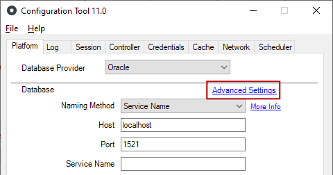
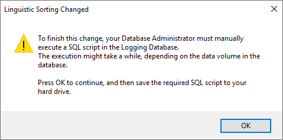
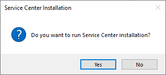

# Configuring linguistic sorting in an OutSystems environment using an Oracle database

Only available in OutSystems on-premises installations.

This document explains how you can configure linguistic sorting for character data in an OutSystems environment using an Oracle database. 

Different countries have different ways of sorting characters, and Oracle provides mechanisms for the Database Administrator to configure and control the database string sorting behavior. Check [Oracle's documentation](https://docs.oracle.com/cd/B28359_01/server.111/b28298/ch5lingsort.htm#i1009059) for more information on Oracle linguistic sorting settings.

In OutSystems, in Platform Server versions before 11.7.0, all Oracle databases must have the following configuration:

* NLS_LANGUAGE: **AMERICAN**
* NLS_TERRITORY: **AMERICA**
* NLS_CHARACTERSET: **AL32UTF8** (Unicode support) or **WE8MSWIN1252** (no Unicode support)
* NLS_DATE_FORMAT: **DD-MON-RR**

However, with this configuration, there might be a few unexpected query results. One of the issues has to do with accented characters in languages like Japanese. 

For example, if you have the word "セト" (romanization: Seto) stored in the database and search for the word "ゼト" (romanization: Zeto), the query results will include the record containing "セト" (romanization: Seto) when using the configuration stated above. This record is included in the query results because the default string sorting algorithm for Oracle used by the platform is `BINARY_AI`, which is accent insensitive.

Starting with Platform Server 11.7.0, OutSystems system administrators can change the linguistic sorting configuration (the value of the `NLS_SORT` parameter) of the Oracle database from `BINARY_AI` (the default value) to `BINARY_CI` on the OutSystems platform database. Changing this configuration requires you to republish applications for the setting to become active. 

You can also change the linguistic sorting configuration for the logging database, but this is not mandatory. This change only impacts the log searching capability of Service Center and any other applications that fetch information from log tables.

Check the next section for instructions on changing the linguistic sorting for the platform and logging databases.

## Configure linguistic sorting 

To change the linguistic sorting **for the platform database**, do the following:

1. Start the Configuration Tool, available at Start > Programs > OutSystems > Administration Tools.

1. In the **Platform** tab, click the "Advanced Settings" link in the "Database" section.

    

1. Select the desired linguistic sorting. The available options are:

    **BINARY_AI** – Collation-sensitive SQL operations use a binary sort that is accent-insensitive and case-insensitive.  
    **BINARY_CI** – Collation-sensitive SQL operations use a binary sort that is case-insensitive, but accent-sensitive.

    

1. Press **OK** to close the "Advanced Settings" dialog box, and then press **Apply and Exit**.

1. Republish all modules in your environment.

Optionally, you can also change the linguistic sorting for the **logging database**. In this case, the Configuration Tool provides a SQL script that your Database Administrator should execute, since rebuilding the database indexes might take some time, depending on the amount of log data in your logging database.

To perform this change in the logging database, do the following:

1. Start the Configuration Tool, available at Start > Programs > OutSystems > Administration Tools.

1. In the **Log** tab, click the "Advanced Settings" link.

1. Select the desired linguistic sorting. The available options are:

    **BINARY_AI** – Collation-sensitive SQL operations use a binary sort that is accent-insensitive and case-insensitive.  
    **BINARY_CI** – Collation-sensitive SQL operations use a binary sort that is case-insensitive, but accent-sensitive. 

1. Press **OK**. 

1. OutSystems warns you that your Database Administrator needs to execute a SQL script to apply this change to the logging database.  
    In the "Linguistic Sorting Changed" window, press **OK** and save the SQL script file.

    

1. Press **Apply and Exit**.

1. The Configuration Tool asks you to run Service Center installation. Click **Yes** to run the installation.

    

1. Ask your Database Administrator to execute the provided SQL script in the OutSystems logging database.  
    Note: The SQL script execution time depends on the amount of data present in the logging database. We recommend that your Database Administrator supervises the execution of this script.
