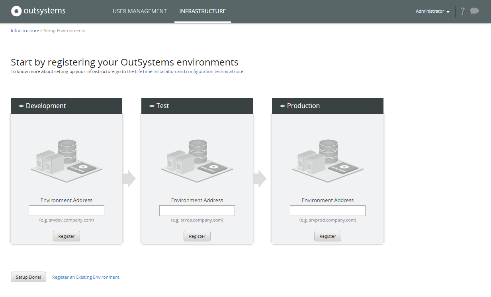
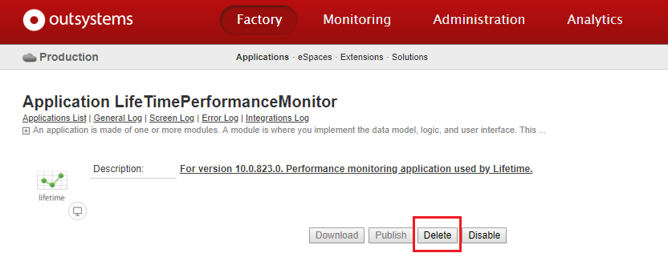
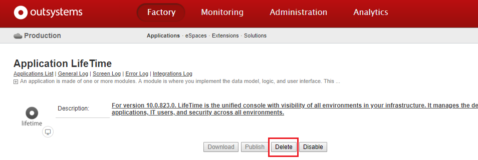
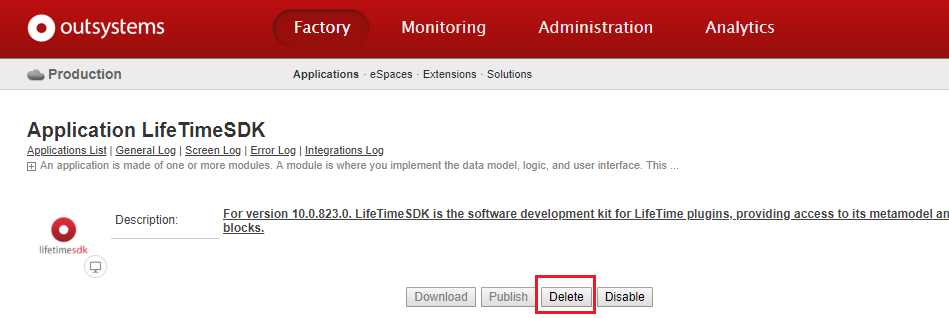

# Remove the infrastructure management console from an environment

This article describes how to remove OutSystems infrastructure management console (LifeTime) from an environment where you don’t need it anymore. This operation applies only to **on-premises installations**.

Removing LifeTime from an environment implies **deleting LifeTime's applications** in the environment. This operation does not delete any table or data from the database. 

## Prerequisites

To remove LifeTime from an environment the following requirements must be met:

* Have an **on-premises** installation.

* The environment version is **Platform Server 10.0.804.0 or higher**. If you have a previous Platform Server version, you will not be able to remove LifeTime from the environment, although you can [disable LifeTime's applications](https://success.outsystems.com/Support/Enterprise_Customers/Maintenance_and_Operations/Remove_the_infrastructure_management_console_from_an_environment#Disable_LifeTime's_Applications). If you really need to remove LifeTime from the environment, you must update the environment to Platform Server 10.0.804.0 or higher.

* The operation is performed by a user with the built-in **Administrator role** in Service Center.

## Remove LifeTime from an Environment

To remove LifeTime from an environment you need to:

* Unregister all environments from LifeTime.

* Delete LifeTime's applications.

### Step 1. Unregister all environments from LifeTime

1. Login as Administrator in the LifeTime of that environment, `http://<lifetime-to-remove>/lifetime`.

2. Go to the **INFRASTRUCTURE** tab and choose **Manage Environments**.

3. For all registered environments, choose **Edit** and select **Unregister environment**.

After unregistering all environments, you will see the following screen:

### Step 2. Delete LifeTime's applications

1. Having no environments registered in LifeTime, go to the Service Center console of the environment from where you want to remove LifeTime and log in as Administrator, `http://<lifetime-to-remove>/ServiceCenter`.

2. Go to the **Factory** section and choose **LifeTimePerformanceMonitor** application from the Applications list.

3. Delete **LifeTimePerformanceMonitor** application.

 

4. From the Applications list, choose **LifeTime** application. Delete **LifeTime** application.

 

5. From the Applications list, choose **LifeTimeSDK** application. Delete **LifeTimeSDK** application.

 

After you delete these three applications, LifeTime is no longer installed in your environment. Please note that you must delete the applications by the order indicated in the procedure above.

Deleting LifeTime’s applications in Service Center does not delete any table or data from the database. This operation sets the applications as deleted in the platform’s database and removes the applications from your application server.

## Disable LifeTime's Applications

If the environment version is lower than **Platform Server 10.0.804.0**, you will not be able to delete LifeTime's applications from the environment. Alternatively, you can disable LifeTime's applications by following [Remove LifeTime from an Environment](https://success.outsystems.com/Support/Enterprise_Customers/Maintenance_and_Operations/Remove_the_infrastructure_management_console_from_an_environment#Remove_LifeTime_from_an_Environment) procedure and choosing to **Disable** LifeTime's applications instead of deleting them.

