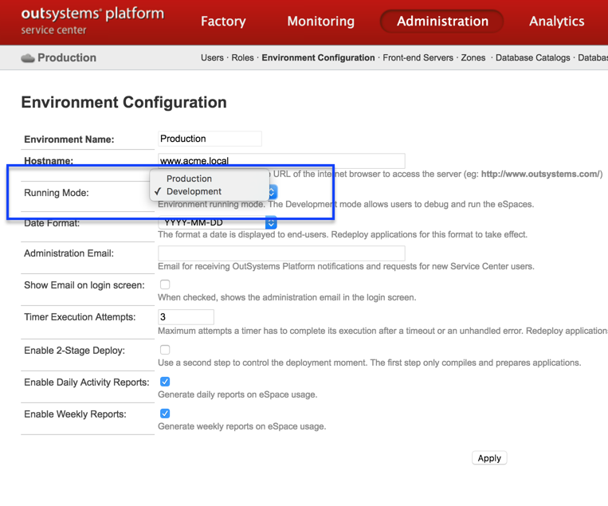
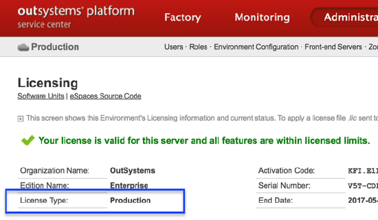
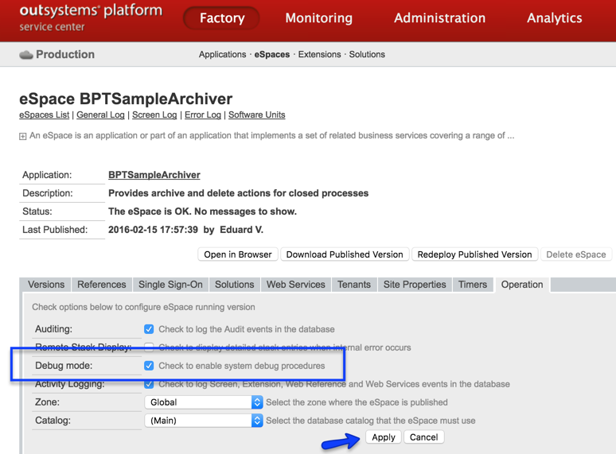

---
summary:
en_title: "OutSystems running modes: Development vs Production mode"
---

# OutSystems running modes: Development vs Production mode - what is the difference?

This article applies only up to OutSystems 10.

## Overview

OutSystems allows you to configure your environments to run in two distinct modes: Development and Production. The differences between each mode are not obvious, and switching between modes is not a simple on-off change.

In this topic, we explain the differences between modes, the restrictions that apply when choosing a mode, and how to switch between modes.

## What is the running mode of OutSystems?

Running mode is a setting in OutSystems that defines how the platform makes certain decisions regarding how applications are published to the environment. It also affects the availability of certain development-time features when a developer is connected to the environment with Service Studio.

### Development time

At this level, the running mode influences the availability of the following features:

**Test Query -** this affects both the ability to test queries using the SQL tool and also the ability to view entities data in Service Studio.

**Run and Debug in the Personal Area**

**Debug**

These operations are available in Development running mode but are not available in Production running mode.

### Application publish

When in Production mode, the following decisions are made by the platform:

* When you are publishing an eSpace module for the first time, its **Debug Mode** is set according to the running mode: if you are in Production running mode, it is left off; if you are in Development running mode, it is left on;

* On top of this, when publishing an eSpace **every time**, the platform decides how to generate code:

    * if the environment is in Production running mode, it generates the code without debugging code needed to debug from Service Studio;

    * if the environment is in Development running mode, it decides based on the Debug Mode flag mentioned in the previous bullet: if Debug Mode is on, debugging code is present; if Debug Mode is off, debugging code is not present - the code is generated equal to Production running mode.

## How to change the platform running mode

Changing the running mode is made in Service Center, under Administration -> Environment Configuration.

Note that changing the mode does not change prior decisions made by the platform regarding application code generation - it only affects decisions made from now on.

## I get a licensing error when changing from Development to Production mode. Why?

Only licenses of type Production allow setting an environment in Production running mode. You can find your license type in Service Center, under Administration -> Licensing. 

 

If your license is of type Development, you can only set your environment in Development running mode. If your license is of type Production, you may opt for both modes.

Note that customers are usually allowed to run environments of both types. Each customer will have a set of licenses that allow Production mode (usually 1) and a set of licenses allowing Development mode only (usually 2 or 3).

## How to completely change an environment from Development mode to Production mode (and vice versa)?

To completely change an environment from Development to Production mode, one needs to:

1. Change the running mode (see the previous section);
 

2. If you changing to Development mode, you need to correct the Debug Mode flag in all eSpaces. For this, under Factory -> eSpace, access **every** eSpace and, in the Operation tab enable Debug Mode. Don't forget to apply the change.
If you are changing to Production mode you can skip this step - Production mode always generates code without Debug Mode.

 

3. Create a solution with all the modules (eSpaces and Extensions) and publish it. This is needed to update the generated code for all eSpaces to reflect the new mode.
Without this step, the change is **not effective**.

## What running mode should I use for each of my environments?

The below is a recommended best practice - depending on your use case, other combinations may apply.

For a healthy development practice with OutSystems, customers need to be able to debug and have all available development functionality in the development environment. In production, however, one needs the fastest code possible, and to avoid the interference from developers. But these are the extreme points of a factory - in the middle, it depends on how many environments you have, and your development practices. 

Assuming you have 4 environments (Development, Quality, Pre-Production, Production) these would be the recommended practices:

* **Development**: this is where developers create apps. For this purpose, it should be running in Development mode and have Debug Mode on for all eSpaces;

* **Quality**: this is where developers test their applications, where demos are made, and the functional testing is performed. For this reason, debugging will still be needed, so it should be configured the same way as Development: Development mode with Debug Mode on for all eSpaces;

* **Pre-Production**: this is where your business users do full testing of the applications, where load tests and penetration tests are run, and where you expect to have an environment as similar to Production as possible. As such, all apps must be compiled the same way as in Production.
Depending on your licensing, either have the environment in Production mode or in Development mode with Debug mode **off** for all eSpaces.

* **Production:** this is where your end-users access the applications. It should be running in Production mode, though you may need to switch it to Development mode to debug rare problems you only observe in Production.

