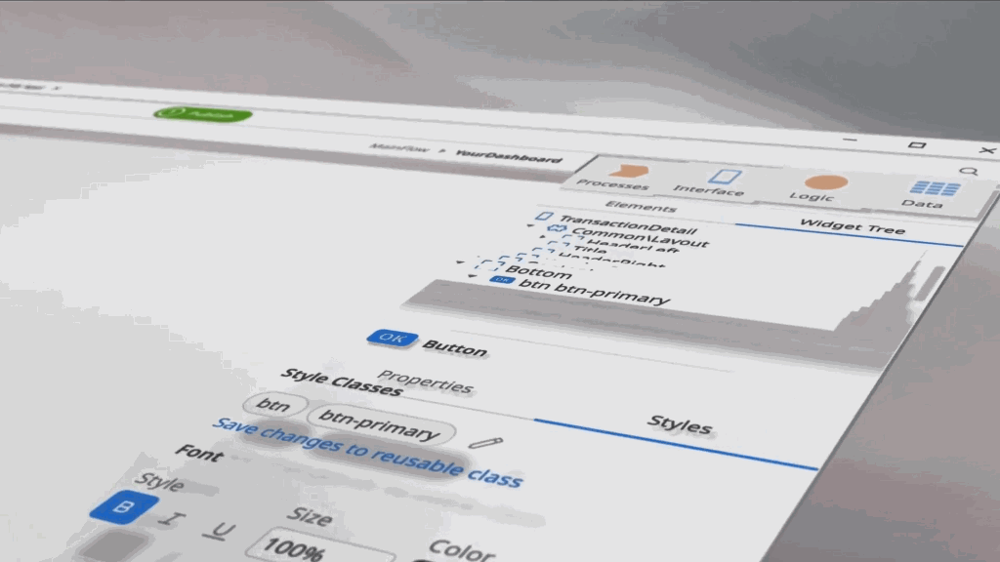
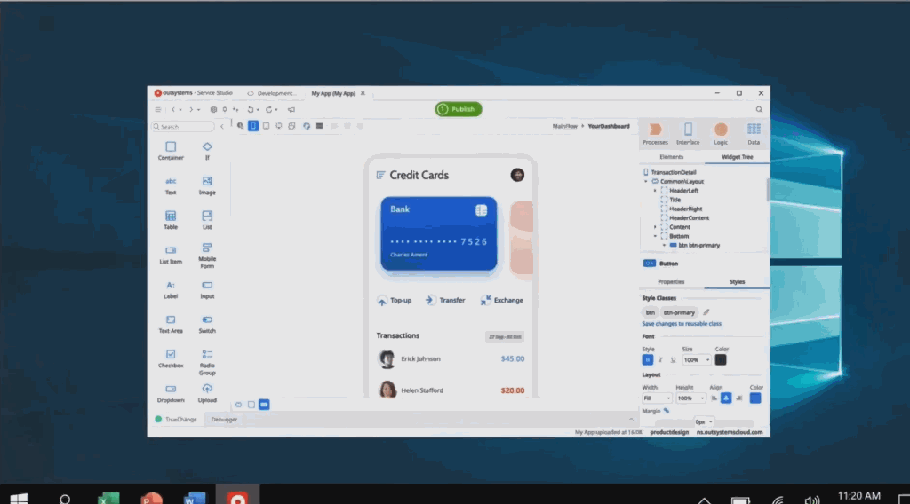

# OutSystems Service Studio for Mac

Service Studio is being rebuilt to ensure you have a native experience whether you use macOS or Windows.

The new cross-platform Service Studio is available for macOS in the [OutSystems Downloads]((https://www.outsystems.com/Downloads/).Download it now to start using the next generation of Service Studio that includes the following improvements:

* Native experience for macOS.

    

* New design with better usability and support for dark and light modes.

    

* New productivity features all-around such as New CSS and JavaScript editors with improved highlighting and autocomplete, and easy inline Edit Data support.
