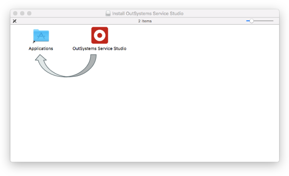
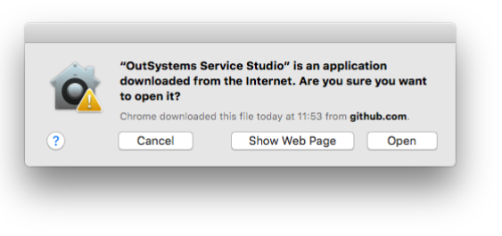
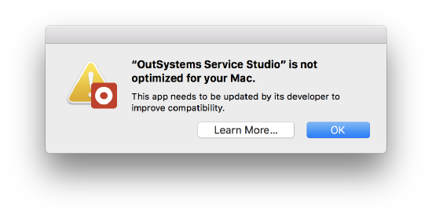

---
summary:
---

# Technical Preview - OutSystems Service Studio 11.6.1 for Mac

Note that this technical preview doesn't support macOS Catalina. Check the [Technical Preview - OutSystems Service Studio for macOS Catalina](tp-service-studio-mac.md)

OutSystems is excited to offer a technical preview of its Development Environment for Mac users! Because this is an experimental version, some quirks may happen from time to time. You can check the ["Known Limitations" section](#known-limitations) for a list of all the known issues you might encounter.

[Click here to download the technical preview.](https://www.outsystems.com/Downloads/ScreenDetails.aspx?MajorVersion=11&ReleaseId=19351&ComponentName=Development+Environment)

## Installation

After you download OutSystems Service Studio for Mac, you'll get a file called `OutSystems.Service.Studio-<version>.dmg`. Double-click the file to open, and drag and drop OutSystems Service Studio into Applications. Note that you need MacOS Sierra or higher to open the DMG.

After this, you can launch Service Studio. The first time you launch Service Studio, a couple of warnings show up that you can safely accept:

When you see this warning, click Open. It's just a reminder that you downloaded this software from the internet.

You'll also get a warning that Service Studio isn't optimized. This is normal, and just means that this technical preview is not built for 64 bits.

## Known Limitations

The technology preview of OutSystems Service Studio for Mac has the following limitations:

* You need macOS Sierra, macOS High Sierra, or macOS Mojave to install Service Studio for Mac. macOS Catalina isn't supported in this version.

* No support for multiple displays, but we will warn you it won't work if you open the IDE and you have multiple monitors connected.

* No debugging of mobile apps. We have a really cool mobile debugger that spans the client and back-end; we are really bummed you can't see it yet.

* Some font and UI glitches (for example, dented fonts).

* It's not possible to open extensions from Service Studio. You probably won't need this, but just in case, we wanted you to know.

* If you share your computer with other users, Service Studio only works for the first user that launches it.

* The navigation shortcuts don't work, and some shortcuts require you to use Ctrl instead of the Command key.

* In addition to this IDE, we have another tool called Integration Studio that is used to create extensions to OutSystems. This tool hasn't been ported to Mac yet, so you are still required to use Windows, either on a PC or on a Virtual Machine installed on your Mac.

## Support

Submit any issues you have as you normally would but, because this is a technical preview release, note that resolution times are not guaranteed.
