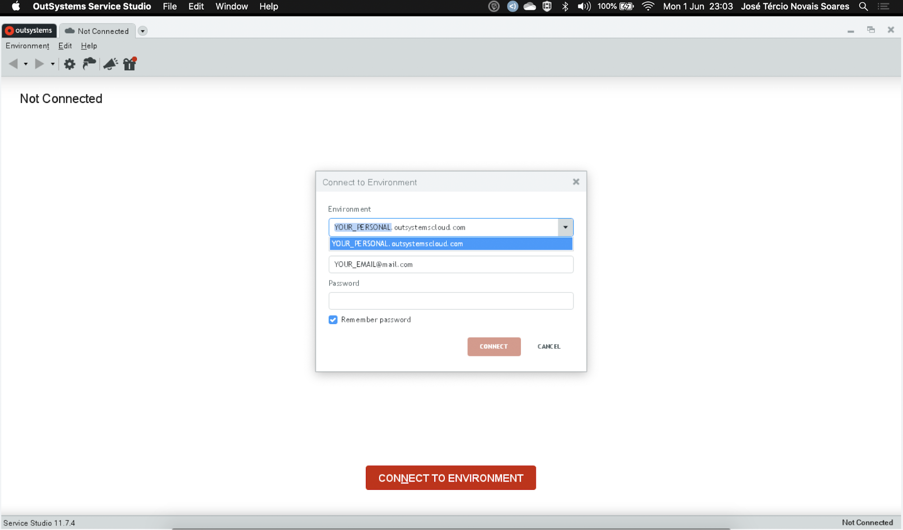

---
summary:
---

# Technical Preview - OutSystems Service Studio for macOS Catalina

The technical preview of Service Studio for macOS is an experimental version, some quirks may happen from time to time. Check the [Known Issues section](#known-issues) for a list of all the known issues you might encounter.

## Prerequisites

Before setting up Service Studio for macOS make sure that your computer meets the following requirements:

### Operating System

* macOS Catalina

* If you use macOS Big Sur, use one of the other options listed in [OutSystems Service Studio for Mac](service-studio-mac.md).
* If you have a previous version of macOS, check out [Technical Preview - OutSystems Service Studio 11.6.1 for Mac](tp-service-studio-mac-older.md).

### Hardware

* 1.8 GHz dual-core processor (or better)
* 2 GB of RAM (4 GB recommended)
* 1 GB of free disk space

### Additional software

* If you want to do client-side debugging in Service Studio using a desktop browser, you need the latest stable version of Google Chrome.

### Network

* You need an internet connection to install Service Studio with a minimum speed of 1 Mbps for both downloading and uploading. You need an internet connection even when installing Service Studio on a virtual machine.

## How to set up

To install Service Studio in your Mac, follow these steps:

If you have a previous version of Service Studio for macOS installed, start by [uninstalling Service Studio](#how-to-uninstall).

1. Download [OutSystems Service Studio-11.7.4 (Build 17634).dmg](https://www.outsystems.com/goto/service-studio-mac-download-page).

1. After the download, install Service Studio by double-clicking the **OutSystems Service Studio-11.7.4 (Build 17634).dmg** file and then doing one of the following:

    * Drag the icon to your **Applications** folder.

    

    or

    * Right-click the **OutSystems Service Studio-11.7.4 (Build 17634).dmg** file, select **Open**, and then select **Move to Applications Folder**.

    

    

    

    During setup, the Service Studio installer downloads and installs the .NET Framework.

    

After the installation is complete, Service Studio opens and you are ready to log in to your environment.

## How to uninstall

If you face some problem installing Service Studio or have a previous version installed on your Mac, uninstall Service Studio and then perform a clean install.

To uninstall Service Studio follow these steps:

1. Delete the **OutSystems Service Studio** application by selecting **Move to Bin**.

    

1. In the **Finder**, select **Go** > **Go to Folder...**

    

1. Go to **~/Library** folder by enterting `~/Library` and selecting **Go**

    

1. In the **Application Support** folder, select the **OutSystems Service Studio** folder and delete it by selecting **Move to Bin**.

    

1. Logout from your account and log in again or reboot your Mac.

After uninstalling Service Studio, continue with the [setup of Service Studio](#how-to-set-up).

## Known issues

* If you have multiple displays, Service Studio only responds if it's in the display it launched from.

* Some font and UI glitches, for example dented fonts.

* The navigation shortcuts don't work, and some shortcuts require you to use **Ctrl** instead of the **Command** key.

* If you have on your Mac some apps/fonts that weren't notarized, when you launch Service Studio you see the following type of warnings:

    

    

    It means that the app/font wasn't notarized, and Apple couldn't scan the app/font for known malicious software. Check <https://support.apple.com/en-us/HT202491> for more details on the issue.

    To solve this issue:

    * Install an updated version of the app/font that's notarized.
    * Install an alternative app/font that is notarized.
    * As a workaround, select **Cancel** in the warning messages.

## Limitations

* No debugging of mobile apps.

* It isn't possible to open extensions with Service Studio. Integration Studio, the tool used for creating and editing extensions, is only available for Windows.

* If you share your computer with other users, Service Studio only works for the first user that launches it.

## Support

You can submit issues you have in the support portal but OutSystems doesn't guarantee resolution times because the macOS version of Service Studio is a technical preview.
