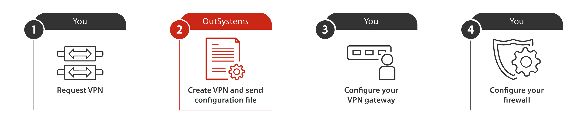

# Set up a VPN using LifeTime 11.6.0 or earlier

This topic describes the procedure to set up a site-to-site VPN (virtual private network) connection to your OutSystems Cloud when running **LifeTime Management Console 11.6.0 or earlier**.

Before proceeding, check the [Set up a VPN to your OutSystems Cloud](vpn-support.md) to understand the **details of a VPN connection** between OutSystems Cloud and your on-premises network, and the **specifications** for that VPN.

## Set up the first VPN to your OutSystems Cloud { #setup-procedure }

The procedure below applies only to OutSystems Cloud running **LifeTime Management Console 11.6.0 or earlier**. For LifeTime 11.6.1 or later, follow the procedure in [Set up a VPN to your OutSystems Cloud](vpn-support.md#setup-procedure).

### Before you begin { #before-begin }

Before you begin setting up your VPN, make sure you comply with the requirements and that you gather the necessary information to proceed:

#### Check the VPN gateway requirements

Your VPN gateway can be a physical or software device. Check [the list provided by AWS](https://docs.aws.amazon.com/vpc/latest/adminguide/Introduction.html#DevicesTested) to know if AWS tested your VPN gateway with the site-to-site VPN. If your VPN gateway isn't in the previous list, it must meet the following requirements:

* Maintains the same static public IP address.

* Establishes IKE v1 or IKE v2 Security Association using pre-shared keys.

* Establishes IPSec Security Associations in Tunnel mode.

* Uses IPsec Dead Peer Detection (DPD).

* Uses AES128-bit or AES256-bit encryption function.

* Uses the SHA-1 or SHA-256 hashing function.

* Uses the Diffie-Hellman Perfect Forward Secrecy in groups 2 (1024 bit), 5 (1536 bit), 14-18 (2048 bit), 22, 23, or 24 (2048 bit).

#### Gather the necessary information

Before requesting a VPN connection, make sure you have the following information:

* The public IP of your VPN gateway. If your VPN gateway is behind a network address translation (NAT) device that's enabled for NAT traversal (NAT-T), use the public IP address of your NAT device.

* The brand, model, and software version of your VPN gateway.

* The internal IP range of the on-premises network that will access the VPN.

* The type of routing that your VPN gateway supports: if the gateway supports Border Gateway Protocol (BGP), use dynamic routing, otherwise use static routing.

#### Check your on-premises network

Your on-premises network internal IP address range must not overlap with the internal IP address range of your OutSystems Cloud. Check out how to [find out internal IP address range of your OutSystems Cloud](../ip-range-cloud.md)

#### Make sure you have the necessary permissions

To request a VPN you must have the **Administrator role** in **LifeTime**.

An [**Infrastructure Administrator**](https://success.outsystems.com/Support/Enterprise_Customers/OutSystems_Support/Managing_Your_Company_Permissions_on_outsystems.com#What_are_your_access_levels.3F) must approve the VPN request in the **Support Portal**.

### Setup overview

Make sure you read [the previous section](#before-begin) before you continue.

### Step 1. Request the first VPN

To request the first VPN to your OutSystems Cloud follow these steps:

1. Open **LifeTime** by accessing `https://<lifetime_environment>/lifetime`, where `<lifetime_environment>` is the address of your LifeTime environment.

1. Select the **ENVIRONMENTS** tab, open **Options** and select **Activate VPN**.

1. Fill in the form by entering the values for each field:

    * Your email address.

    * The email address of the Network Engineer. If you are the Network Engineer enter your email.
    
    * The public IP of your VPN gateway. If your VPN gateway is behind a network address translation (NAT) device that's enabled for NAT traversal (NAT-T), use the public IP address of your NAT device.
    
    * The internal IP range of the on-premises network that will access the VPN.
    
    * The brand, model, and software version of your VPN gateway.
    
    * The type of **Routing** that your VPN gateway supports. If your VPN gateway supports Border Gateway Protocol (BGP), select **Dynamic** routing, otherwise select **Static** routing.

1. To send your request for a VPN, select **Activate VPN Service**. This creates a support ticket with the information you provided in the form.

### Step 2. OutSystems creates the VPN connection and contacts you

After validating all the required information, OutSystems creates the VPN connection on your OutSystems Cloud. When the VPN connection is ready, OutSystems sends you the VPN Peer Address and the information needed to configure the VPN gateway on your on-premises network, including a configuration file created by AWS.

The type of configuration file you receive depends on your VPN gateway:

* If your device is on the [list of VPN gateways tested by AWS](https://docs.aws.amazon.com/vpc/latest/adminguide/Introduction.html#DevicesTested), your configuration file contains a step by step guide on how to configure your device. Check [an example configuration from AWS for a Cisco IOS Device without BGP](https://docs.aws.amazon.com/vpc/latest/adminguide/Cisco_NoBGP.html#Cisco_NoBGP_details).  

* If your device isn't in the previous list, your configuration file contains a generic guide on what to configure in your VPN device. Check [an example configuration from AWS for a generic VPN gateway using BGP](https://docs.aws.amazon.com/vpc/latest/adminguide/GenericConfig.html#DetailedViewCustomerGateway5).

### Step 3. Configure your VPN gateway

This step must be performed by your Network Engineer.

After receiving the required information to set up your VPN connection, complete the configuration of your VPN gateway by following the instructions in the communication sent by the OutSystems Support and in the configuration file.

During the VPN gateway configuration you should use the values provided in the configuration file.

If you want to use your own configuration, make sure your VPN gateway configuration values respect the following AWS requirements:

Phase 1 Parameters | |
---|---
Protocol | IKE v1 or IKE v2
Authentication Method | Pre-shared Key
Protocol Communications | Encapsulated UDP port 500, NAT-T (UDP port 4500)
Encryption Algorithm | AES-128, AES-256
Diffie-Hellman Group | 2 (1024 bit), 14-18 (2048 bit), 22, 23, and 24 (2048 bit)
Perfect Forward Secrecy (PFS) | Yes
Hashing Algorithm for Integrity | SHA-1,  SHA-256
Re-negotiation time | 28800 seconds
Mode | Main

Phase 2 Parameters| |
---|---
Protocol | IKE Phase II (IPSEC SA)
IPSec Protocol | ESP; UDP port 500; NAT-T is supported on your side
Encryption Algorithm | AES-128, AES-256
Encryption Mode | Tunnel
Diffie-Hellman Group | 2 (1024 bit), 5 (1536 bit), 14-18 (2048 bit), 22, 23, and 24 (2048 bit)
Hashing Algorithm for Integrity | SHA-1,  SHA-256
Lifetime Measurement | Time
Time Lifetime | 3600 seconds

### Step 4. Configure your firewall

This step must be performed by your Network Engineer.

If your on-premises network includes a firewall between the Internet and your VPN gateway, implement the following rules in the firewall:

* Allow **UDP** traffic on port **500** between your VPN gateway and each of the VPN tunnels to the OutSystems Cloud to enable the transmission of IKE packets. There should be four rules: a pair of inbound and outbound rules for each VPN tunnel.

* Allow Encapsulating Security Payload (**ESP**) traffic - IP protocol number 50 - between your VPN gateway and each of the VPN tunnels to the OutSystems Cloud to enable the transmission of IPSec packets containing the encrypted network traffic. There should be four rules: a pair of inbound and outbound rules for each VPN tunnel.

* If your OutSystems Cloud needs to access systems on your on-premises network add other inbound and outbound firewall rules. Make sure to create inbound and outbound rules for each of the VPN tunnels.  
For example, to access a **SQL Server** database, allow **TCP** traffic on port **1433**, and to access an **Oracle** database, allow **TCP** traffic on port **1521**.  

* If you are using **NAT-T** on your VPN gateway, allow **UDP** traffic on port **4500**. Add outbound and inbound firewall rules.

## Requesting additional VPN connections to your OutSystems Cloud

If you need additional VPN connections, contact your Account Manager to obtain more information.

## Troubleshooting

Check the [VPN connectivity and troubleshooting guide](../../troubleshooting/vpn-troubleshooting-guide.md)
