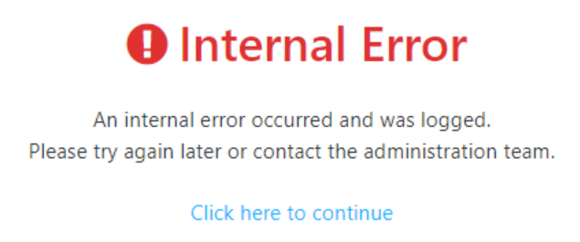
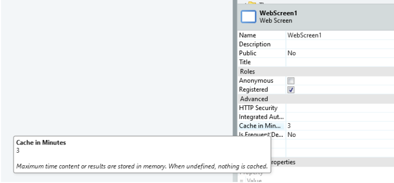

# Troubleshooting Error Deserializing ViewState - Cannot decrypt the content error

## Introduction to viewstate

<div class="info" markdown="1">
This article applies only to Traditional Web Applications
</div>

 
The view state is used by the OutSystems underlying technology (ASP.NET). This mechanism is used to preserve the client-side state of a web page when a postback occurs. The view state stores the values and controls of the page between requests. 
 
A postback is commonly used in pages that contain forms, for example. When a user adds or edits information in the form and clicks on submit, a POST request is performed to the server and the page is reloaded. The view state guarantees the values of the form are kept stored and will re-populate the inputs, radio buttons, etc.
 
The view state is a hidden field in the HTML of the web page. Its value property stores the view state encoded information. It's a good practice to encrypt the view state and avoid using it to store sensitive information. To prevent performance degradation,  it's not recommended to store large amounts of information in the view state.
 


Check the [Microsoft documentation](https://docs.microsoft.com/en-us/dotnet/api/system.web.ui.control.viewstate?view=netframework-4.8) for more information about the view state.


### Encrypting the view state

Because a page's view state can contain sensitive information (such as the inputs a user added on a form) it's a good practice to encrypt the view state.

Since Platform Server 9.1.501.0 it’s possible to encrypt the view state using the supported Forge component [Factory Configuration](https://www.outsystems.com/forge/component-overview/25/factory-configuration). 

Check [here](https://success.outsystems.com/Documentation/11/Managing_the_Applications_Lifecycle/Secure_the_Applications/Encrypt_web_apps_view_state) how to do it (also available for [OutSystems 10](https://success.outsystems.com/Documentation/10/Managing_the_Applications_Lifecycle/Secure_the_Applications/Encrypt_web_apps_view_state)).

## Underlying cause

When the cookies sent in the request and stored in the view state differ, the Platform Server throws the error ```Error Deserializing ViewState: Cannot decrypt the content```. The **osVisitor** cookie value is only regenerated for the same session if the cookie in the request to the server is either empty or not a valid GUID.


## Symptoms 

The most common symptom when navigating on the web application is this error is displayed on the screen:



In .NET the following will be logged in the Service Center error logs:

```Error Deserializing ViewState of page "ASP.login_aspx". Cannot decrypt the content At OutSystems.RuntimeCommon.Cryptography.SymmCryptHelper.DecryptThenMacWithAESDotNet(...)  at utSystems.HubEdition.WebWidgets.OSPageViewStateCompressed.DeserializeViewState(...)```


Note that the error stack and message can differ slightly depending on the cause and the page.

In Java, the message logged in the error logs is the following:

```java.lang.NullPointerException.```

To test how the manipulation of the view state can cause this error, inspect the source code of a web page and manipulate the value of the view state. After performing a postback, the “Error Deserializing ViewState” will occur. You can make the same test by changing the value of the **osVisitor** cookie.

## Possible causes

Because this message is generic, it can be difficult to correlate with its cause.
This error can be caused by several factors, which need to be verified and analyzed in detail. We will include next a list of known causes.


### Cookie caching in an intermediate network component

When “Use Session Token to Encrypt Viewstate” is enabled, cookie caching can negatively affect the view state decryption. Considering that, in this case, the **osVisitor** cookie is required to decrypt the view state, an outdated cached cookie value can lead to an error decrypting the view state. Cookie caching is common with reverse proxies or CDNs (content delivery networks). 

#### Solution 
In case a reverse proxy has caching enabled, a solution can be to disable caching. If there is cookie security or management set through a web application firewall in a reverse proxy, the solution can be setting the ‘Cookie Max Age’ to 0 hours. 
This article doesn’t cover all possible caching mechanisms. The investigation and troubleshooting of caching mechanisms should be performed by your network administrators.

### View state / cookies manipulation in the intermediate network
Sometimes, a network component, such as a firewall, can manipulate the view state and/ or cookies, causing this error. 

#### Solution

To confirm if a network component is manipulating the view state or cookies, one can access the page in a browser directly from the server (via remote desktop). This guarantees the requests won’t pass by any network component. If the error doesn’t happen, it’s a strong indicator that a network component is manipulating the view state / cookies. As such, OutSystems advises customers to reach out to the network administrator of their infrastructures in order to review the network configurations. This doesn’t apply to environments hosted in the OutSystem Cloud as we ensure network elements won’t manipulate the viewstate or cookies.

### Secure cookies in applications accessible via HTTP

When an environment has both **Use Session Token to Encrypt Viewstate** and **Secure Session Cookies** enabled in Factory Configuration or LifeTime, the “Error Deserializing ViewState” will occur when accessing the application via HTTP.
Securing session cookies forces the **osVisitor** cookie to be included in requests made through HTTPS. As the request is made through HTTP, the cookie isn’t sent to the server and it will invalidate the view state.

#### Solution

To prevent this, you can [Enforce HTTPS Security](https://success.outsystems.com/Documentation/11/Managing_the_Applications_Lifecycle/Secure_the_Applications/Enforce_HTTPS_Security) to guarantee the users always access the applications through HTTPS.
Check [Secure Cookies: How to enable secure session cookies and set application cookies as secure](https://success.outsystems.com/Support/Enterprise_Customers/Maintenance_and_Operations/Secure_Cookies%3A_How_to_enable_secure_session_cookies_and_set_application_cookies_as_secure) for additional reference.

### Cookie manipulation in the application logic

Cookies can be manipulated by application logic either by javascript code or using the [SetCookie action of the HTTPRequesthandler API](https://success.outsystems.com/Documentation/11/Reference/OutSystems_APIs/HTTPRequestHandler_API#SetCookie). When the option “Use Session Token to Encrypt Viewstate” is enabled, the manipulation of [cookies created by OutSystems](https://success.outsystems.com/Support/Enterprise_Customers/Maintenance_and_Operations/Cookie_usage_in_OutSystems_applications#Cookies_created) will cause the error we are addressing.

#### Solution

Cookies automatically created by the OutSystems Platform Server shouldn’t be manipulated in application logic. If that’s the case, we advise reviewing the logic not to manipulate [these](https://success.outsystems.com/Support/Enterprise_Customers/Maintenance_and_Operations/Cookie_usage_in_OutSystems_applications#Cookies_created) OutSystems created cookies.

### Requests performed by an old browser session 

When a user has an old session opened on the browser and the OutSystems Platform Server is updated or upgraded, the view state can be affected and consequent requests invalidated by the server. This can also happen with new deployments of the applications.  These operations create an incompatibility between the objects that were cached in the view state (in the browser) and the new version of those objects in the server.

#### Solution

An increase of these errors immediately after those operations is expected and common due to any browser sessions that were previously opened. In these situations, the applications will need to be reloaded.

### Browser blocking the request to osVisitor cookie

Some browsers may block the request to the **osVisitor** cookie.
This was identified in scenarios where SSO (Single Sign On) is used in third-party applications, or when using OutSystems embedded in third-party applications using iFrames.
 
As the osVisitor cookie doesn’t specify the SameSite attribute, it can happen that the browser uses its default value. This default value may set SameSite to a value that makes the browser block the cookie when requested in the context of a third-party application.
 
#### Solution

According to the recommendations in [Upcoming changes in cookie handling in Google Chrome](https://success.outsystems.com/Support/Enterprise_Customers/Maintenance_and_Operations/Upcoming_changes_in_cookie_handling_in_Google_Chrome):
To make sure that the OutSystems content works properly when embedded in a third-party site, you must have the new OutSystems patch installed and set the new "SameSite" setting to "None", so that the platform-generated cookies include the SameSite=None attribute.

### Browsers that manipulate cookies and view state

In case the browsers are manipulating the cookies or the View State, one must review the settings in order to prevent it.

### When using the personal area

This happens when a developer is debugging an application in their [personal area](https://success.outsystems.com/Documentation/11/Developing_an_Application/Troubleshooting_Applications/Debugging_Applications/Public_and_Personal_Areas) and switches to the publicly deployed app. This happens because it’s not possible to distinguish between both scenarios, and the view state from one is invalid on the other. This is more likely in non-production environments where the personal area is more frequently used.

#### Solution

This is an expected behavior, reloading the publicly deployed app will overcome the error.

### Post requests from web screens with cache

This error can happen when performing a postback in a screen that has a value set in Cache in Minutes.



The view state is cached with the page, so when opening the same screen on a new browser session (e.g. incognito window), the cached View State cannot be decrypted using the osVisitor cookie of the new session.

#### Solution

OutSystems is aware of this behavior and intends to fix it in the future. Until then, our advice is to remove the Cache in Minutes from pages that perform PostBacks.


## Temporary mitigation strategy

In case none of the previous cases helps to mitigate the errors and they are having a considerable impact on end-users, one can disable Encrypt ViewState feature in the Factory Configuration.

<div class="warning" markdown="1">
This should only be considered as a temporary mitigation strategy and applied in situations with a high impact. Consider that unencrypted view state information (including sensitive information) can be intercepted and read by an attacker.
</div>
