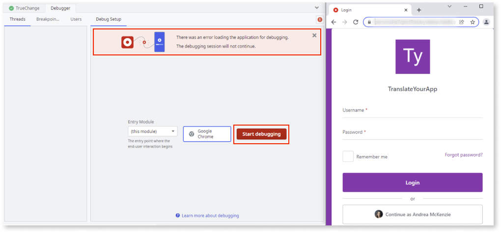
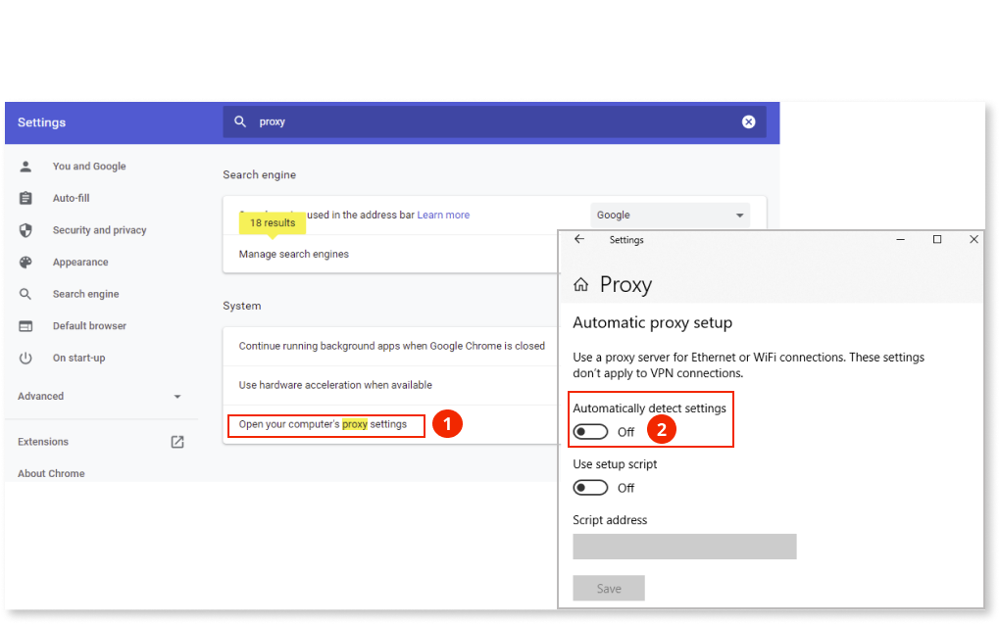

# Debugger in Service Studio isn't working

Check the following sections to understand and solve different issues and errors that can occurs while using the debugger in Service Studio.

## The debugger hangs or stops working

### Symptoms

* In a debug session, the debugger never reaches a breakpoint.
* In the middle of a debug session, the debugger just hangs.
* The debugger stops working.

### Cause

During a debug session, Service Studio contacts the environment where the app is deployed. During the session it communicates back and forth several times with the environment. To keep communications fast,  Service Studio keeps an open connection to the environment.

Depending on your anti-virus, firewall, or other network elements you might have in place, it's possible that these elements abruptly close the connection between  Service Studio and the environment.

And that's when the debugger hangs.

### Solution

Configure Service Studio so that it establishes a new connection for each request made to the environment.

In **Edit** menu, under **Preferences**, check the **Use One Connection per Request in Debugger** option.

By activating this option, it's possible that the debugger feels slower since it's establishing new connections on each request.

## The server has stopped the debug session

### Symptoms

* In a debug session, Service Studio shows the error: **The server has stopped the debug session**.
* Checking the Service Studio error report, it shows the following error message: `There was an error while contacting the server: HTTP Forbidden`.

### Cause

This usually occurs in self-managed environments that have additional network elements (such as load balancers or reverse proxies) that aren't trusted by the OutSystems Platform Server.

### Solution

Configure your OutSystems environment to trust the addresses for that inject X-Forwarded-For headers.
To do so, follow these steps:

1. Access Service Center.
1. Go to **Administration** > **Security** > **Network Security**.
1. In the **Trusted proxy addresses** field, add the IP addresses or IP ranges of all network elements.

### More information

There might be other problems affecting your debug session. Check [other reasons](http://www.outsystems.com/forums/discussion/10962/tip-service-studio-is-not-always-stopping-in-my-breakpoints/) for the debugger to misbehave.

## Error loading the application for debugging - debugging session will not continue

### Symptoms

When you start debugging a Reactive Web app in Service Studio, a Chrome window opens with the following error message:

`There was an error loading the application for debugging. The debugging session will not continue.`

### Cause

This error occurs when there is a delay connecting Service Studio and Chrome. This delay usually occurs when the user has a proxy server configured on their machine.

### Solution

You can solve this problem in one of the following ways:

* Don't close the Chrome window and click the **Start Debugging** button again. The Chrome window is reused and you can start debugging on the **Debug** tab in **Service Studio**.

* Go to [chrome://settings/?search=proxy](chrome://settings/?search=proxy) and click **Open your computer's proxy settings** then disable Automatically detect settings. 

    

    What does this setting do? Proxy auto-detect works via DNS queries. It finds out where to fetch JavaScript files that run on every hit that the browser loads to determine the correct way to retrieve what it needs. By disabling it, it takes less time to create the connection between Service Studio and Chrome, allowing the debug session to start successfully.
