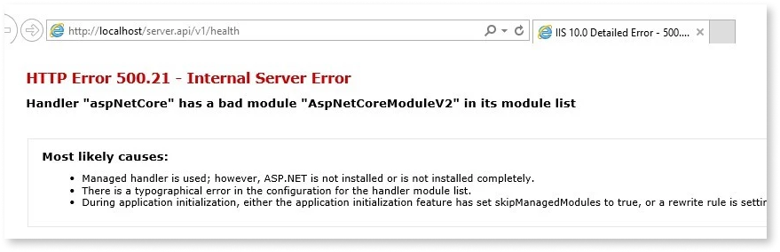
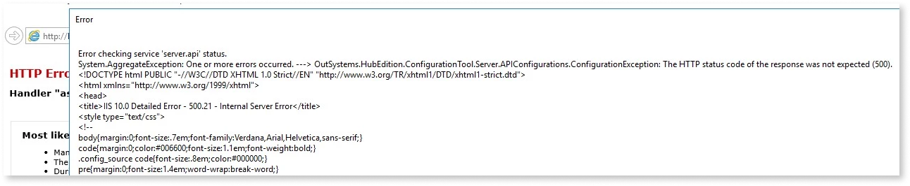
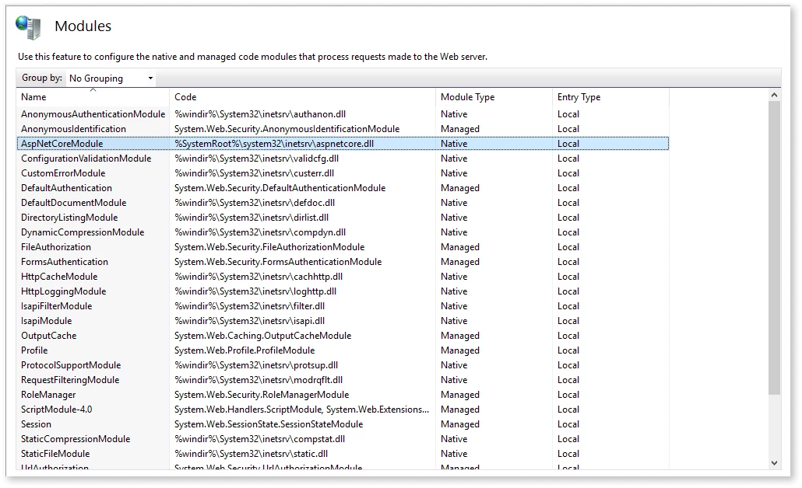
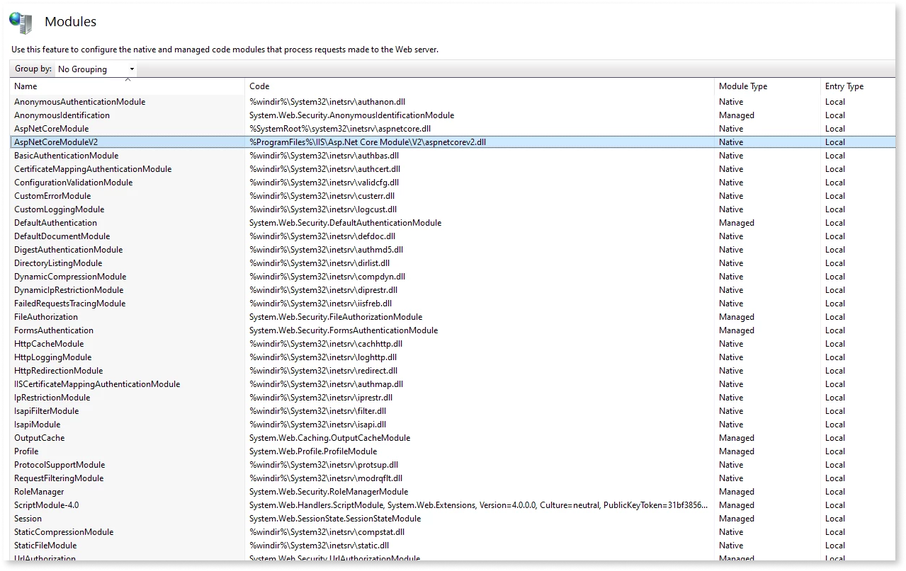

# Server.API and Server.Identity fail to initialize after upgrading to Platform Server 11.12.2 or later

## Symptoms

In a self-managed environment, Server.API and Server.Identity services fail to initialize after upgrading to Platform Server 11.12.2 or later.

You get the following errors:

* When performing a health check to Server.API or Server.Identity services via any browser, you get an error code 500. Executing the request via localhost, you see the following message: `Handler "aspNetCore" has a bad module "AspNetCoreModuleV2" in its module list`.

    

* You get an error when initializing Server.API or Server.Identity service through the Configuration Tool:

    

## Cause

This problem occurs when **.NET Core 3.1** isn't installed in the environment.

As of **Platform Server 11.12.2**, .NET Core 3.1 Runtime & Hosting Bundle for Windows is part of the [system requirements](https://success.outsystems.com/Documentation/11/Setting_Up_OutSystems/OutSystems_system_requirements#Additional_Software_Requirements), replacing the previously used .NET Core 2.1, that's reaching the end of support in August 2021. See the [Microsoft communication](https://devblogs.microsoft.com/dotnet/net-core-2-1-will-reach-end-of-support-on-august-21-2021/) for further details.

To confirm that .NET Core 3.1 isn't installed in the environment, execute the following validations:

* Run the [Configuration Tool](https://success.outsystems.com/Documentation/11/Reference/Configuration_Tool). When clicking **Apply and Exit**, you get the following error:

    

* In [IIS Manager > Modules](https://docs.microsoft.com/en-us/iis/get-started/introduction-to-iis/iis-modules-overview), you only see the module **AspNetCoreModule** in the list of modules:

    

    You don’t have the module **AspNetCoreModuleV2**:

    

* In `C:\Program Files\IIS\Asp.Net Core Module\V2`, you don’t have the **aspnetcorev2.dll** file.

## Resolution

After confirming that .NET Core 3.1 isn't installed in the environment, do the following:

1. Make sure you follow the [OutSystems systems requirements](https://success.outsystems.com/Documentation/11/Setting_Up_OutSystems/OutSystems_system_requirements#Additional_Software_Requirements) by installing the **.NET Core 3.1 Runtime & Hosting Bundle for Windows** in the environment. You can use the OutSystems Platform Server installation package to [install it automatically](https://success.outsystems.com/Documentation/11/Setting_Up_OutSystems#prerequisites) or install the [.NET Core 3.1 Runtime & Hosting Bundle for Windows](https://dotnet.microsoft.com/download/dotnet/thank-you/runtime-aspnetcore-3.1.14-windows-hosting-bundle-installer) directly from Microsoft. If you are doing an [offline installation](https://success.outsystems.com/Documentation/11/Setting_Up_OutSystems/Unattended_Installation_and_Upgrade), use the switch `/InstallPrerequisites=True` to install the prerequisites automatically.

1. Repeat the upgrade of the Platform Server.
