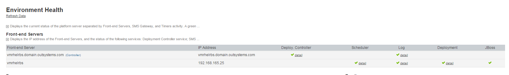

# Environment Health shows a Deployment controller twice

## Symptom

The Environment Health screen shows the same Deployment Controller or Front-End server shows up twice, under different IP addresses or host names.

In the example below, the same Front-end Server appears listed as vmrhelrbs, 192.168.165.25, and vmrhelrbs.domain.outsystems.com.

## Cause

The duplication happens when the front-end server is registered with a different name than the Deployment Controller Hostname defined in Configuration Tool. The issue can happen in any version of Service Center.

## Resolution

The name in the list of Front-End Servers must match the name configured as Deployment Controller Hostname. Do one of the following actions:

* On the Configuration Tool, configure the name shown under Front-end Servers as the Deployment Controller Hostname. If the Deployment Controller has a fixed IP address, use the IP address.

* Change the name of the Front-end Server to match the Deployment Controller Hostname,

See the [Configuration Tool documentation](https://success.outsystems.com/Documentation/11/Reference/Configuration_Tool) for more information on its menus and options.

