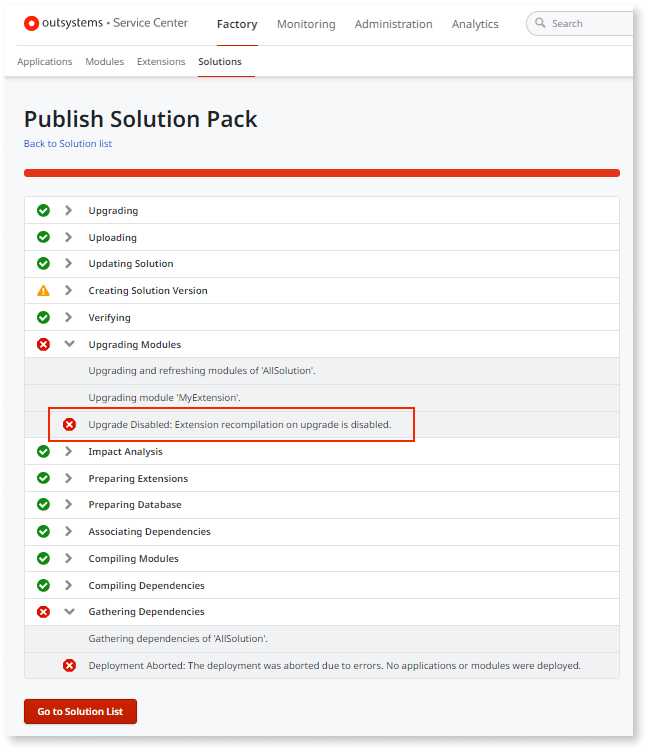

# Publish error: Extension recompilation on upgrade is disabled

## Symptoms

You are executing a publishing operation that requires the Platform Server to automatically upgrade and recompile an extension, and you get the following error:

`Upgrade Disabled: Extension recompilation on upgrade is disabled.`

This error can occur in environments running **Platform Server 11.14.0 or later**, under one of the following scenarios:

* Publishing an application or solution that includes an extension created in an earlier OutSystems major version (for example, publishing an OutSystems 10 extension in an environment running OutSystems 11).

* Installing from Forge an extension created in an earlier OutSystems major version.

* Publishing an extension after upgrading the Platform Server to a later major version (for example, from OutSystems 10 to OutSystems 11).

## Cause

Starting from **Platform Server 11.14.0**, the automatic upgrade and recompilation of extensions is blocked on the server-side by default to prevent unattended and unwanted modifications of code.

See more details [here](../../upgrade/extension-recompilation/extension-recompilation.md).

## Solution

To prevent unattended and unwanted modifications of code when publishing the extension, do the following:

1. [Upgrade and recompile the extension in a secure way](../../upgrade/extension-recompilation/extension-recompilation.md#secure-upgrade).

1. Repeat the publishing operation.

### Accepting the risk

If you trust the origin of the extension that needs to be upgraded, you can choose to [accept the risk](../../upgrade/extension-recompilation/extension-recompilation.md#accept-risk) of unattended and unwanted modifications of code for that specific upgrade operation. Do the following:

1. [Enable automatic upgrade and recompilation of extensions](../../upgrade/extension-recompilation/extension-recompilation.md#enable-disable) **temporarily** in your environment. This operation must be performed by a Service Center administrator.

2. Repeat the publishing operation.

3. [Disable the option](../../upgrade/extension-recompilation/extension-recompilation.md#enable-disable) again afterward. This operation must be performed by a Service Center administrator.
