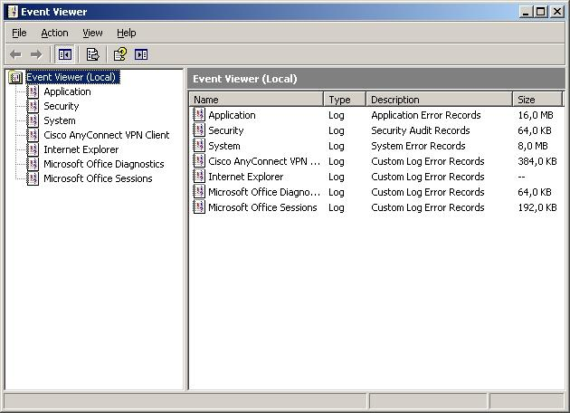
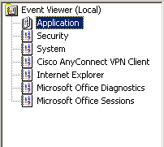

---

summary:

---

# Information Logged by OutSystems Platform

OutSystems Platform components and services use the Windows logging mechanisms to log entries about their status and operations status.

## Logged Entries

### Looking Up the Logged Entries

The logged entries generated by the OutSystems Platform components can be viewed using the Windows Event Viewer. To access it, simply open the Windows Start menu and under the ‘Settings’ entry chose the ‘Control Panel’ option. Then, doubleclick on the ‘Administrative Tools’ item and double-click again on the ‘Event Viewer’ item. The Event Viewer window will be displayed:

Click on the ‘Application’ folder to see the logged entries of the OutSystems Platform.

### Types of Logged Entries

The log entries can be classified in one of three types:errors,warnings andinformation.  Anerror corresponds to a malfunction of the application or service that eventually might need a user action to fix it.  A warning doesn’t have the gravity of an error but you should investigate what is happening because it might originate future errors. Finally, the information type is used solely to inform the user of some fact but no user action should be needed.

### Log Sources

The logged entry may be generated by one of the following sources:

* OutSystems Configuration Tool

* OutSystems Platform

* OutSystems Service Center Installer

* OutSystems Deployment Controller Service

* OutSystems Deployment Service

* OutSystems Log Service

* OutSystems Scheduler Service

* OutSystems SMS Connector Service

### Log Contents

The logged entry content depends on the OutSystems Platform’s component or service that generates it.

#### Common to All Components and Web Applications

There are logged entries that all the components of the OutSystems Platform can generate:

* Errors and warnings related to database connectivity problems

* Errors related to the configuration of the message queue logging mechanism.

#### OutSystems Applications

Information about configuration of **performance counters** and **synchronous/asynchronous logging** can be logged when OutSystems generated applications are being initialized.

#### OutSystems Services

Information about configuration of **performance counters** and **synchronous/asynchronous logging** can be logged when OutSystems generated services are being initialized.

#### OutSystems Log Service

OutSystems Log Service can, in particular, log some additional information, namely about:

* Bulk logging insert errors;

* Generic database errors;

* Miss-configured messages warnings.

#### Configuration Tool

This OutSystems Platform component logs entries for all OutSystems schema database upgrade errors.

### Examples

Following are some examples of log entries for errors, warnings and information.

#### Errors

| Event Source                             | Event Description                                                                                                                                                                                                                                                                                                                                                                                                                                                            |
|------------------------------------------|------------------------------------------------------------------------------------------------------------------------------------------------------------------------------------------------------------------------------------------------------------------------------------------------------------------------------------------------------------------------------------------------------------------------------------------------------------------------------|
| OutSystems Deployment Controller Service | Error sending log: System.FormatException: String was not recognized as a valid Boolean.    at System.Boolean.Parse(String value)    at OutSystems.HubEdition.RuntimePlatform.Log.RuntimeLogger.get_ApplicationMonitoring()    at OutSystems.HubEdition.RuntimePlatform.Log.RuntimeLogger.Log(GeneralLog log)   For more information, see Help and Support Center at  http://go.microsoft.com/fwlink/events.asp.                                                             |
| OutSystems Deployment Service            | Initialization error: System.Net.Sockets.SocketException: No connection could be made because the target machine actively refused it 127.0.0.1:12000   Server stack trace:    at System.Net.Sockets.Socket.DoConnect(EndPoint endPointSnapshot, SocketAddress socketAddress)    at System.Net.Sockets.Socket.Connect(EndPoint remoteEP)  …                                                                                                                                   |
| OutSystems Log Service                   | Initialization error: System.Data.SqlClient.SqlException: Cannot open database "outsystems_express" requested by the login. The login failed.  Login failed for user 'OSRuntime'.    at System.Data.ProviderBase.DbConnectionPool.GetConnection(DbConnection owningObject)    at System.Data.ProviderBase.DbConnectionFactory.GetConnection(DbConnection owningConnection)    at System.Data.ProviderBase.DbConnectionClosed.OpenConnection(DbConnection outerConnection,  … |
| OutSystems Platform Service              | Error openning connection to the database: An error has occurred while establishing a connection to the server.  When connecting to SQL Server 2005, this failure may be caused by the fact that under the default settings SQL Server does not allow remote connections. (provider: Named Pipes Provider, error: 40 - Could not open a connection to SQL Server) The retrying was unsuccessful.   …                                                                         |
| OutSystems Scheduler Service             | Initialization error: System.Net.Sockets.SocketException: No connection could be made because the target machine actively refused it 127.0.0.1:12000   Server stack trace:    at System.Net.Sockets.Socket.DoConnect(EndPoint endPointSnapshot, SocketAddress socketAddress)    at System.Net.Sockets.Socket.Connect(EndPoint remoteEP)  …                                                                                                                                   |
| OutSystems SMS Connector Service         | Error processing inbound queue: System.Messaging.MessageQueueException: Message Queue service is not available.   at System.Messaging.MessageQueue.Create(String path, Boolean transactional)   at System.Messaging.MessageQueue.Create(String path)   at OutSystems.HubEdition.SMSConnector.SMSConnector.#Em(String queuePath, Boolean create)   at OutSystems.HubEdition.SMSConnector.SMSConnector.#Rm()   …                                                               |

#### Warnings

| Event Source                             | Event Description                                                                                                                                                                                                                                                                                                                                                                                                                                                                             |
|------------------------------------------|-----------------------------------------------------------------------------------------------------------------------------------------------------------------------------------------------------------------------------------------------------------------------------------------------------------------------------------------------------------------------------------------------------------------------------------------------------------------------------------------------|
| OutSystems Deployment Controller Service | Error opening connection to the database: Timeout expired.  The timeout period elapsed prior to completion of the operation or the server is not responding. Cleaning the connection pools.     at System.Data.ProviderBase.DbConnectionPool.GetConnection(DbConnection owningObject)    at System.Data.ProviderBase.DbConnectionFactory.GetConnection(DbConnection owningConnection)  …                                                                                                      |
| OutSystems Deployment Service            | Error opening connection to the database: Cannot open database "outsystems_express" requested by the login. The login failed.  Login failed for user 'OSRuntime'.  Retrying...     at System.Data.SqlClient.SqlInternalConnection.OnError(SqlException exception, Boolean breakConnection)  …                                                                                                                                                                                                 |
| OutSystems Log Service                   | Error opening connection to the database: Cannot open database "outsystems_express" requested by the login. The login failed.  Login failed for user 'OSRuntime'.  Retrying...     at System.Data.SqlClient.SqlInternalConnection.OnError(SqlException exception, Boolean breakConnection)  …                                                                                                                                                                                                 |
| OutSystems Platform Service              | Front-end Server pcjfv OutSystems Scheduler Service Status: Error: Timeout while attempting to connect to 127.0.0.1:12002/OutSystemsScheduler   Message generated by eSpace ServiceCenter.   For more information, see Help and Support Center at  http://go.microsoft.com/fwlink/events.asp.                                                                                                                                                                                                 |
| OutSystems Scheduler Service             | Error openning connection to the database: An error has occurred while establishing a connection to the server.  When connecting to SQL Server 2005, this failure may be caused by the fact that under the default settings SQL Server does not allow remote connections. (provider: Named Pipes Provider, error: 40 - Could not open a connection to SQL Server)  Retrying...     at System.Data.SqlClient.SqlInternalConnection.OnError(SqlException exception, Boolean breakConnection)  … |
| OutSystems SMS Connector Service         | Error openning connection to the database: Cannot open database "outsystems_express" requested by the login. The login failed.Login failed for user 'OSRuntime'.Cleaning the connection pools.                                                                                                                                                                                                                                                                                                |

#### Information

| Event Source                             | Event Description                                                                                                                                          |
|------------------------------------------|------------------------------------------------------------------------------------------------------------------------------------------------------------|
| OutSystems Deployment Controller Service | Service started successfully. Waiting for initialization...For more information, see Help and Support Center at http://go.microsoft.com/fwlink/events.asp. |
| OutSystems Deployment Service            | Service initialized successfully.For more information, see Help and Support Center at http://go.microsoft.com/fwlink/events.asp.                           |
| OutSystems Log Service                   | Service started successfully. Waiting for initialization...For more information, see Help and Support Center at http://go.microsoft.com/fwlink/events.asp. |
| OutSystems Scheduler Service             | Service initialized successfully.For more information, see Help and Support Center at http://go.microsoft.com/fwlink/events.asp.                           |
| OutSystems SMS Connector Service         | Service started successfully. Waiting for initialization...For more information, see Help and Support Center at http://go.microsoft.com/fwlink/events.asp. |

## See also

As mentioned in the above sections, you might need to learn more about the [OutSystems Platform architecture](https://www.outsystems.com/evaluation-guide/outsystems-architecture/).

