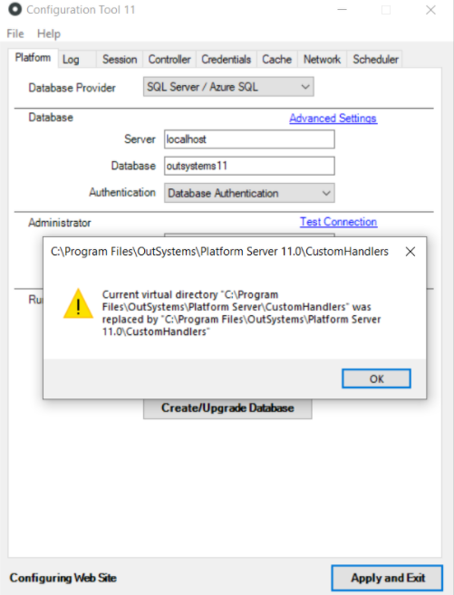

# Known issue in 11.10.0 - possible downtime after running Configuration Tool
## Issue description

Starting in Platform Server 11.10.0, the Configuration Tool (CT) writes settings in some configuration files, including the machine.config file. With this change, CT no longer validates existing settings and overwrites them.

If the path to the Platform Server folder has a symbolic link, it’s possible to execute the Configuration Tool from different locations. The following scenario is an example of this type of configuration:

1. Platform Server is installed at ```F:\Program Files\OutSystems\Platform Server```
1. At ```C:\Program Files\OutSystems\```, there is a symbolic link pointing to the path mentioned in point 1.

From Platform Server 11.10.0 onwards, clicking **Apply and Exit** in the CT will overwrite settings in configuration files with paths pointing to the same path in which Configuration Tool was launched.
If the values are changed afterwards, this may cause some DLL files to be deleted, thus leading to runtime issues on deployed apps.

## Impact

This known issue has a **very high impact**:  application downtime that starts about half an hour after clicking **Apply and Exit** in the Configuration Tool. You may notice that not all applications are affected at once, it can be gradual as DLLs are progressively deleted.

## How to confirm if you’re affected

* When executing the Configuration tool you can see warnings like:
    
    ```Current virtual directory "C:\Program Files\OutSystems\Platform Server\CustomHandlers" was replaced by "C:\Program Files\OutSystems\Platform Server 11.0\CustomHandlers"```

    

* The typical symptoms on application runtime are the following:

    * 500 internal errors in requests to the application server 
    * missing assembly errors in Service Center error logs:

        ```Could not load file or assembly '<module>ReferencesProxy, Version=0.0.0.0, Culture=neutral, PublicKeyToken=null' or one of its dependencies. The system cannot find the file specified.```


These behaviors should only occur in the front ends servers where **Apply and Exit** was used in the Configuration Tool and changed the paths. To confirm which servers are affected, access one of the affected applications in each server individually (instead of reaching the load balancer hostname).
For example: if *ApplicationX* is one of the modules where you are experiencing issues, the hostname to access it directly in the FE server would look like: *https://front-end_hostname/ApplicationX*.


## Mitigation

### Immediate mitigation to lower impact on end-users

This issue will typically affect only front end (FE) servers and not all servers in a farm. To immediately mitigate the impact and prevent end-users from being affected:

1. Identify which FE servers are being affected
1. Remove the affected FE servers from the load balancer

Now it’s time to recover the environment by applying a corrective measure.


### Corrective measure

Republish all the modules of your factory by [creating and publishing an "all components" solution.](https://success.outsystems.com/Support/Enterprise_Customers/Maintenance_and_Operations/Creating_and_using_an_%22All_Components%22_solution)


### Avoid recurrence

Always execute the Configuration Tool from the same path. For example, if you used to run it on the path ```C:\Program Files\OutSystems\```, you should ensure it’s not run on a different path.

## Resolution

A fix for this issue will be available in future Platform Server releases. When fixed, the issue will be identified with RPM-776 in the [Platform Server release notes](https://success.outsystems.com/Support/Release_Notes/11/Platform_Server). To avoid using the suggested workarounds, update to a version with the fix as soon as possible.


