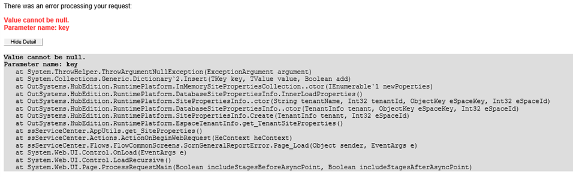

# Known issue after update to 11.10.2 - value cannot be null error installing Service Center 
## Issue description { #issue-description }

This issue occurs upon an upgrade of the Platform Server on an environment that is meets all the following conditions:

* The initial installation of Platform Server (PS) was on version 5 of lower.
* The environment is now being upgraded to PS 11.10.2 or higher.
* It can happen regardless of whether there were intermediate upgrades between version 5 and 11.10.2 or not.

During the upgrade process, and after clicking **Apply and Exit** on the Configuration Tool, Service Center installation follows. During this process, you’ll see the error: ```Value cannot be null.Parameter name: key```. The same error message may also appear when accessing apps on the browser or the device.



This error occurs because in OutSystems 11.10.2 introduced a validation mechanism for Site Property IDs that can’t parse Site Properties that have a non-standard format.
Before OutSystems version 5, Site Properties had a non-standard composite key in format: [string-denoting-object-type][GUID] (for example.: site-1234abcd). This format was changed in OutSystems version 5 to always be represented by a RFC 4122 GUID.

When upgrading to OutSystems version 5, **active** Site Property identifiers were properly upgraded to the new GUID format. However, those that were deleted (that marks then as inactive in the database) weren’t upgraded in OutSystems 5, which means they remained with the old non-standard format.
When the new validation mechanism attempts to parse “old” Site Properties, it will fail with the above error message.


## Impact

The impact is **very high** in both situations in which the errors can occur:

* If during Service Center installation - it prevents the installation of Service Center, and the conclusion of the update process.
* If at runtime - may prevent using the application.

## How to confirm if you’re affected

Check if the environment you’re upgrading meets the conditions under the [Issue description](#issue-description). If your environments were never in that version you can disregard this known issue.

If you're not sure your environment meets those conditions you can confirm if your environment will be affected even before the update to 11.10.2. Ideally, this validation should be made before the update to avoid experiencing issues.
Running the following queries will list the Site Properties with the old key format that can cause problems (please make sure that you run the queries in the correct catalog/schema):

* ```SELECT * FROM ossys_Site_Property where SITE_PROPERTY_DEFINITION_ID in (select id from ossys_Site_Property_Definition where is_active = 0 and ss_key like 'site%')```
* ```SELECT * FROM ossys_Site_Property_Shared where SITE_PROPERTY_DEFINITION_ID in (select id from ossys_Site_Property_Definition where is_active = 0 and ss_key like 'site%')```

If any of the queries returns results, the environment is or will be affected by this known issue.

If you already updated to 11.10.2, in addition to analyzing the results of the queries, you can find the following error in the error logs or during Service Center installation:
```Value cannot be null.Parameter name: key```.


## Resolution

To resolve this, you'll need to delete the Site Properties with old IDs directly in the database. As these Site Properties were already removed from Service Center, this won’t have any impact on your running apps. And that can be done by following these steps:

1. Delete site properties with the old key format by running the following queries:

    ```DELETE FROM ossys_Site_Property where SITE_PROPERTY_DEFINITION_ID in (select id from ossys_Site_Property_Definition where is_active = 0 and ss_key like 'site%')```


    ```DELETE FROM ossys_Site_Property_Shared where SITE_PROPERTY_DEFINITION_ID in (select id from ossys_Site_Property_Definition where is_active = 0 and ss_key like 'site%')```


1. Only after deleting the Site Properties, delete their definitions:

    ```DELETE FROM ossys_Site_Property_Definition where is_active = 0 and ss_key like 'site%' ```


