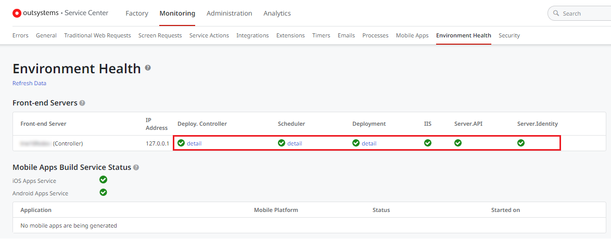

# Unable to deploy applications using LifeTime

There are some situations that might prevent you from using LifeTime to deploy your applications from a **source** to a **target** environment (for example, from Development to QA).

Some examples:

* LifeTime is incorrectly considering the dependencies are incompatible.
* LifeTime isn't showing the version last published in the source environment.
* The deployment gets stuck in one of the steps.
* The synchronization of the source or target environment [is stuck](lifetime-sync-stuck.md).

## Troubleshooting

When you aren't able to use LifeTime to deploy your applications, follow the validations below to troubleshoot a potential issue.

### Check the network connectivity between environments (on-premises only)

If you have on-premises environments, make sure there is bidirectional communication between LifeTime and both source and target environments:

1. [Test the connectivity](../test-env-connectivity.md) from **LifeTime** to the **source environment**.

1. [Test the connectivity](../test-env-connectivity.md) from the **source environment** to **LifeTime**.

1. [Test the connectivity](../test-env-connectivity.md) from **LifeTime** to the **target environment**.

1. [Test the connectivity](../test-env-connectivity.md) from the **target environment** to **LifeTime**.

### Check the antivirus configuration in LifeTime server (on-premises only)

You can confirm if antivirus or other third party software is interfering with the deployment. When that's the case, the deployment fails, check the details at [Publish error: the process cannot access the file](https://success.outsystems.com/Support/Enterprise_Customers/Troubleshooting/Publish_error%3A_the_process_cannot_access_the_file).

### Check the status of OutSystems services

Check the status of the OutSystems services in both **source** and **target** environments to guarantee they're working correctly:

1. Go to the Service Center console of the **source** environment (`https://<source_server>/ServiceCenter`).

1. Go to **Monitoring** » **Environment Health**. A green checkmark means the service is working correctly.

1. Do the same for the **target** environment.

### Check the status of LifeTime Processes

Environments synchronization in LifeTime is based on [OutSystems Business Process Technology](https://success.outsystems.com/Documentation/11/Developing_an_Application/Use_Processes_(BPT)).

Check the status of the Processes for potential issues:

1. Go to the Service Center console of your LifeTime environment (`https://<LifeTime_server>/ServiceCenter`).

1. Go to **Monitoring** » **Processes**. You should have **no Suspended Instances** and **no Active Instances with Errors**. If you get any of these, [open a support case](https://www.outsystems.com/SupportPortal/CaseOpen/) to get help from OutSystems Support.

## Still having problems?

If the above validations didn't help you to solve the issue and you need further assistance, [open a support case](https://www.outsystems.com/SupportPortal/CaseOpen/) to get help from OutSystems Support.

If you have a critical need to deploy an application to an environment, you can try to [deploy the application through Service Center](../deploy-apps-sc.md) as a workaround.
