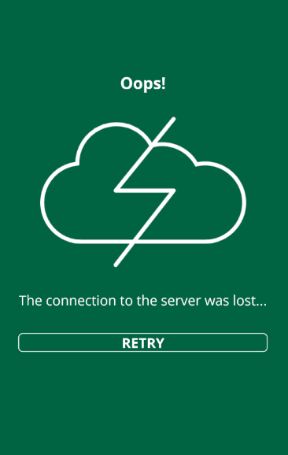

# 2017-05-15 - Mobile Builds Issue - Server deployments may render Android apps unusable

## Executive Summary

OutSystems has found a **critical issue** on the native template that is used to generate mobile apps using our Mobile Apps Builder Service (MABS). The issue may cause end users to be unable to use the mobile app on Android devices after a new version of the app is staged to the OutSystems production environment. This issue was already fixed on May 10th 2017 at 1:40PM UTC+1 and all mobile builds generated after that time will not present this problem.

### What is the experienced behavior?

After staging a new version of the app to the environment and the device updates the local version successfully everything appears to be working as expected. However, after the application is closed ("killed" and not minimized), when the user opens it again a message related with network issues will be seen and the application will be unusable:

### What may lead to this issue?

**This issue may be experienced when screens are deleted from the application.** Additionally, this only happens on versions 10.0.200.0 of OutSystems and later, and only on Android mobile applications. Other complex conditions based on previous versions of the application and the version of the mobile app the user has installed on the device will have to be met for the issue to be experienced. **Nevertheless, this will only happen when the version of the app present in the server is updated on the device and a screen was removed when comparing to the previous version on it.**

### How can the end users recover from this?

To recover a device experiencing the issue from this state, an end user will have to comply with one of these options:

1. Update the version of the mobile app to a more recent one where the issue was fixed (you will have to publish a new build on the store, built after the fix was included on MABS - May 10th 2017 at 1:40PM UTC+1)

2. Clear the local application data on the device

3. Uninstall and reinstall the application on the device

### What can you do to avoid this issue?

At this point, the safest way to avoid this issue is to avoid deleting screens between eSpace versions. If the mobile build running on the device is from after the fix was included on MABS the issue will not be experienced, but users running older versions may experience the issue and we cannot force the store update of the mobile application.

### How can I test if my next deployment will cause this issue?

First of all, you can compare the eSpaces using Service Studio’s "Compare and Merge" feature to confirm if a screen was removed. If it was not, the deployment can safely proceed.

Nevertheless, tests that can be done (and can be included on the usual test set you perform before staging an app to production) are:

1. Have a non production environment (usually pre production) in the same version as the production environment.

2. Have a mobile build from that non production environment that is equal (in terms of eSpace versions when built) to the one on the store.

3. Install that older build on a device and open the app to update the resources to the most recent ones on the environment.

4. Close the app.

5. Stage the version intended for production to the non production environment.

6. Update the application on the device by opening it while online and navigating a bit (a blue message should be shown indicated the application was successfully updated).

7. Close the app (not minimize it) and opening again.

If you do not have a build from the non production environment similar to the one on the store the test cannot be fully trustworthy. On this situation you should avoid deleting screens on your mobile eSpace until a new version of the app is in the store.

Should you have any further questions related with this matter, please feel free to contact [OutSystems Support](https://success.outsystems.com/Support/Enterprise_Customers/OutSystems_Support/01_Contact_OutSystems_technical_support).

