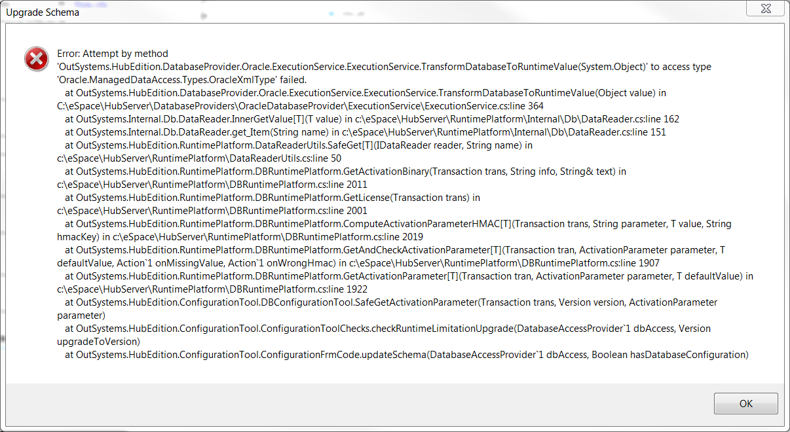
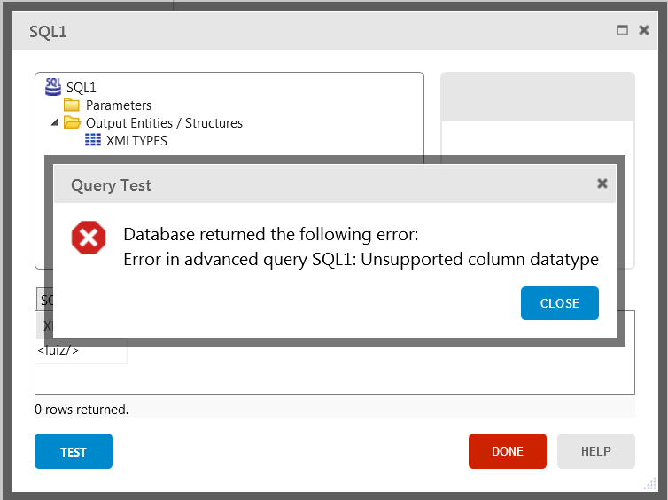
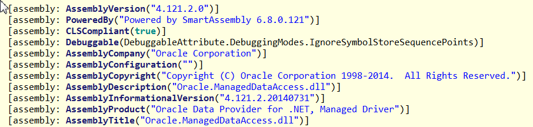
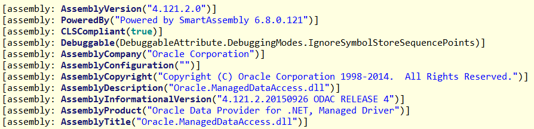
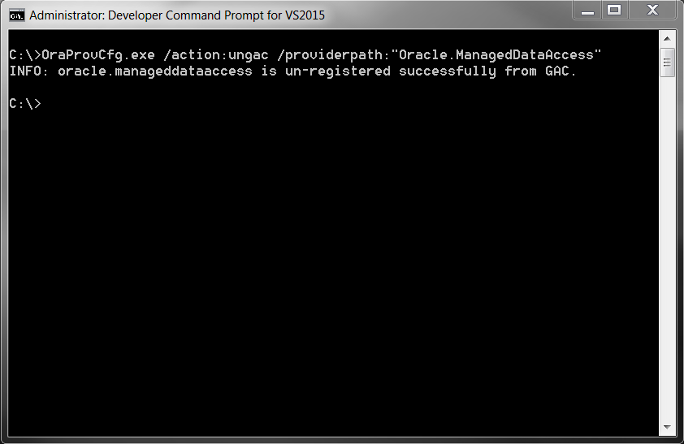

---
tags:
summary: Troubleshoot Oracle Data Provider for .NET (ODP.NET) issues when using Configuration Tool and Service Studio. 
locale: en-us
guid: 529e7c9a-0497-4041-a583-1682bdbaead4
app_type: traditional web apps, mobile apps, reactive web apps
---

# Oracle Data Provider for .NET driver issues

## Symptoms

OutSystems developers may encounter some issues when using Configuration Tool and Service Studio. Some errors can occur if the GAC of the machine running the platform server has a version of the `ODP.NET` driver other than the one used by OutSystems platform.

### Example error message 1: Error during the application runtime

Unsupported column datatype

```
   at OracleInternal.TTC.TTCExecuteSql.ReceiveExecuteResponse(Accessor[]& defineAccessors, Accessor[] bindAccessors, Boolean bHasReturningParams, SQLMetaData& sqlMetaData, SqlStatementType statementType, Int64 noOfRowsFetchedLastTime, Int32 noOfRowsToFetch, Int32& noOfRowsFetched, Int64& queryId, Int32 longFetchSize, Int64 initialLOBFetchSize, Int64[] scnFromExecution, Boolean& bAllPureInputBinds, DataUnmarshaller& dataUnmarshaller, MarshalBindParameterValueHelper& marshalBindParamsHelper, Int64[]& rowsAffectedByArrayBind, Boolean bDefineDone, Boolean& bMoreThanOneRowAffectedByDmlWithRetClause, Boolean bLOBArrayFetchRequired)

   at OracleInternal.ServiceObjects.OracleCommandImpl.ExecuteReader(String commandText, OracleParameterCollection paramColl, CommandType commandType, OracleConnectionImpl connectionImpl, OracleDataReaderImpl& rdrImpl, Int32 longFetchSize, Int64 clientInitialLOBFS, OracleDependencyImpl orclDependencyImpl, Int64[] scnForExecution, Int64[]& scnFromExecution, OracleParameterCollection& bindByPositionParamColl, Boolean& bBindParamPresent, Int64& internalInitialLOBFS, OracleException& exceptionForArrayBindDML, Boolean isDescribeOnly, Boolean isFromEF)

   at Oracle.ManagedDataAccess.Client.OracleCommand.ExecuteReader(Boolean requery, Boolean fillRequest, CommandBehavior behavior)

   at Oracle.ManagedDataAccess.Client.OracleCommand.ExecuteDbDataReader(CommandBehavior behavior)

   at OutSystems.HubEdition.DatabaseProvider.Oracle.ExecutionService.ExecutionService.ExecuteReader(IDbCommand cmd)

   at OutSystems.Internal.Db.ManagedCommand.ExecuteReader(String description, Boolean isApplication, Boolean transformParameters, Boolean skipLog)

   at OutSystems.Internal.Db.DatabaseAccessProvider`1.ExecuteQuery[T](Command cmd, GenericRecordList`1 rl, String description, Boolean transformParameters, Boolean skipLog)

   at OutSystems.Internal.Db.DatabaseAccessProvider`1.ExecuteQuery[T](Command cmd, GenericRecordList`1 rl, String description)

   at ssXmlTypeApp.Flows.FlowMainFlow.ScrnHomeScreen.FuncssPreparation.datasetGetXmltypes(HeContext heContext, Int32 maxRecords, IterationMultiplicity multiplicity, Int64& outParamCount)

   at ssXmlTypeApp.Flows.FlowMainFlow.ScrnHomeScreen.Preparation(HeContext heContext)

   at ssXmlTypeApp.Flows.FlowMainFlow.ScrnHomeScreen.Page_Load(Object sender, EventArgs e)

   at System.Web.UI.Control.OnLoad(EventArgs e)

   at System.Web.UI.Control.LoadRecursive()

   at System.Web.UI.Page.ProcessRequestMain(Boolean includeStagesBeforeAsyncPoint, Boolean includeStagesAfterAsyncPoint)

 ```

### Example error message 2: Error while using the Configuration Tool

```
Error: Attempt by method 'OutSystems.HubEdition.DatabaseProvider.Oracle.ExecutionService.ExecutionService.TransformDatabaseToRuntimeValue(System.Object)' to access type 'Oracle.ManagedDataAccess.Types.OracleXmlType' failed.

at OutSystems.HubEdition.DatabaseProvider.Oracle.ExecutionService.ExecutionService.TransformDatabaseToRuntimeValue(Object value)in c:\Go\GoAgent2\pipelines\NRDevelopment\b10_0_0\HubServer\DatabaseProviders\OracleDatabaseProvider\ExecutionService\ExecutionService.cs:line 354
```



### Example error message 3: Service Studio Advanced Query

"Database returned the following error:

Error in advanced query SQL1: Unsupported column datatype."



Figure 1 - Error in Advanced query

## Cause

OutSystems 10 uses a new version of the ODP.NET driver that adds support for XML types (among other minor changes). This upgrade is a minor revision and therefore it should not raise any issues.

Unfortunately, the version metadata did not change between the two assemblies (v4.121.2.0) and the CLR assembly resolve process cannot distinguish between them. Since the exposed API of the assembly has changed, some problems may arise.

Figures 2 and 3 show the metadata of the assembles for both drivers.



Figure 2 - The previous ODP.NET driver metadata
 


Figure 3 - The new ODP.NET driver metadata 

## Resolution

If this happens, do the following:

1. Check if there are applications using the Oracle.ManagedDataAccess.dll in the GAC (This is not an easy task. You can try using [fuslogvw](http://msdn.microsoft.com/en-us/library/e74a18c4%28VS.71%29.aspx) or [process explorer](https://technet.microsoft.com/en-us/sysinternals/bb896653.aspx), but they will only show the assemblies that were/are loaded in memory).

2. If there are applications using the DLL in the GAC, copy the DLL from the GAC to the APPBase directory of those applications.

3. Remove the DLL from the GAC. You can do it using the Oracle OraProvCfg.exe (this application can be downloaded in the Oracle website and is part of the [Oracle Data Access components](http://www.oracle.com/technetwork/database/windows/downloads/utilsoft-087491.html)) command below (Open the Command Prompt as Administrator);

```
OraProvCfg.exe /action:ungac /providerpath:"Oracle.ManagedDataAccess"
```



Figure 4 - Remove Oracle.ManagedDataAccess.dll from the GAC

Alternatively, you can update the DLL in the GAC with the one used by our platform (also included in the installation).

```
OraProvCfg.exe /action:gac /providerpath:"Oracle.ManagedDataAccess.dll"

```


Figure 5 - Update/Add Oracle.ManagedDataAccess.dll to the GAC

