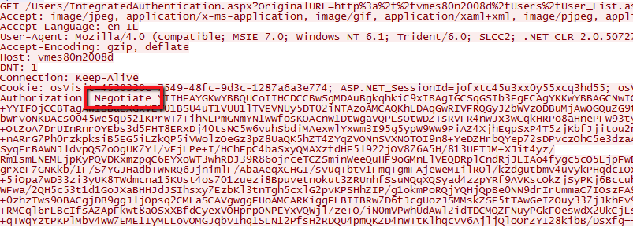

# Issues logging in with Integrated Authentication in Internet Explorer or Edge

## Symptoms

When accessing a web page in the OutSystems platform that requires Windows Integrated Authentication (WIA), you aren't able to login by using Internet Explorer and/or Microsoft Edge. You are able to login using other browsers (Chrome, Safari, Firefox, etc).

The problems happens as follows:

* You are inputting the correct username and password;

* When using another browser, you are able to log in at first attempt;

* When using Internet Explorer and/or Microsoft Edge, the password is never accepted. After a few attempts, an error message **401 Unauthorized** occurs.

## Cause

This is a known-issue caused by having the NEGOTIATE protocol enabled for Windows Integrated Authentication. It happens when trying to access with a computer that's either not connected to the same Windows domain as the servers running OutSystems or a computer with intermittent connectivity to said domain.

The NEGOTIATE protocol uses a Kerberos ticket for authentication. This requires that all computers involved (the client computer and the server) be able to communicate with the Windows domain controller. In situations where such communication is impossible (or doesn't make sense - for example, for external users) the NEGOTIATE protocol can't be used.

By default, Internet Explorer and Microsoft Edge favor using NEGOTIATE rather than NTLM for Windows Integrated Authentication; which means that an Internet Information Services (IIS) with NEGOTIATE protocol active causes that misbehavior.

Other browsers (Chrome, Safari, Firefox) usually don't have NEGOTIATE active, so they use NTLM by default - which causes authentication to work. 

### Confirm the cause

Disable NEGOTIATE protocol in the client workstation to confirm the issue is the one described.

1. Open the Registry Editor (start - run - regedit.exe)

2. Navigate to `HKEY_CURRENT_USER\Software\Microsoft\Windows\CurrentVersion\Internet Settings\`

3. Locate the registry entry EnableNegotiate

4. Change the value to 0

5. Restart the client workstation.

After performing the steps above, authentication should start working in Internet Explorer / Microsoft Edge in the client workstation where the change was performed.

## Solution: disable the NEGOTIATE protocol in IIS

The solution for this is to disable the NEGOTIATE protocol in IIS, so that NTLM is always use. In sporadic situations, or to confirm the problem, you may want to disable NEGOTIATE in the client workstation.

1. Access IIS Manager;

2. Expand `<server>` Sites Default Web Site;

3. In the IIS group, choose Authentication;

4. Click Windows Authentication. On the side bar, option Providers shows up; if not, first activate Windows Authentication so it does show up;

5. Remove NEGOTIATE provider.

6. If you added Windows Authentication on step 4, deactivate it again;

7. Do an IISReset

After performing the steps above, authentication should start working in Internet Explorer / Microsoft Edge.

## More information

If you look into the HTTP communications for the scenario above, when authentication fails you will see an initial response from the server with the headers as shown below:

Internet Explorer / Edge responds with something similar to the below (using Negotiate as protocol):

Which causes the problem (NEGOTIATE fails in scenarios where communication with the Windows domain controller is impossible).
