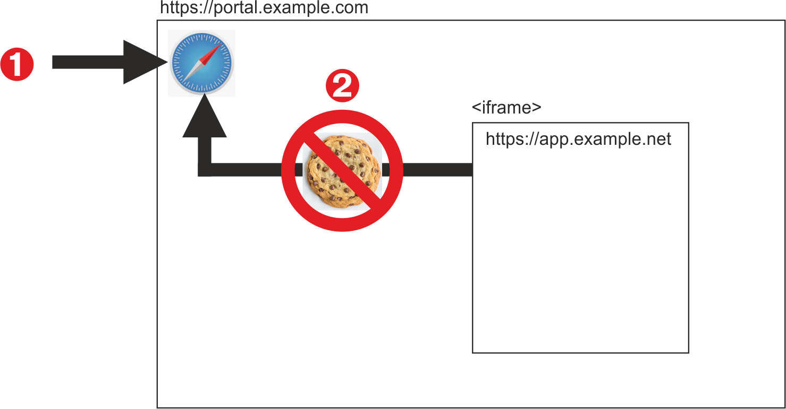
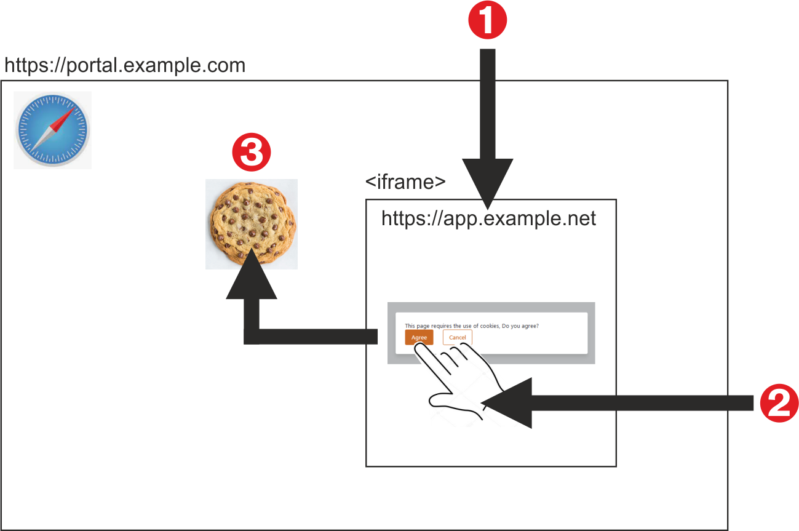

# Known issue - Safari browser blocks OutSystems apps in iframes

With the [version 2.3](https://webkit.org/blog/9521/intelligent-tracking-prevention-2-3/) release of Apple’s Webkit Intelligent Tracking Prevention (ITP) in 2017, the Safari browser blocks all cookies for cross-site resources by default. This means that users of Safari on iOS 13 and iPadOS beta, and Safari 13 on macOS, cannot access a reactive **OutSystems** app  that is hosted on a different domain which is embedded in an iframe element.

An example of this behavior is shown below:

1. An end-user logs into a portal page ([https://portal.example.com](https://portal.example.com)) which has authentication mechanisms to create first-party cookies.
1. An **OutSystems** app in an HTML iframe ([https://app.example.net](https://app.example.net)), which is on a different domain, attempts to create third-party cookies. The Safari browser blocks all access to the domain/application that is consuming the first party cookies. The content in the iframe is not rendered.



## Background information

First-party cookies are created by the domain a user is visiting; they keep the session open and store relevant information. Third-party cookies are created by other domains, typical uses being social media buttons and chat popups.

Since third-party cookies have also been exploited for [login fingerprinting](https://blog.jeremiahgrossman.com/2008/03/login-detection-whose-problem-is-it.html) and[ cross-site request forgery](https://en.wikipedia.org/wiki/Cross-site_request_forgery), major browsers, including Chrome and Firefox, give users the option to restrict access to cross-site resources. Safari blocks them by default.

You can read more about this issue in the [Safari Blocks Third-Party Cookies by Default](https://www.infoq.com/news/2020/04/safari-third-party-cookies-block/) InfoQ newsletter.


## Implementing the Apple Webkit solution

In March 2020, Apple published a blog post ([Full Third-Party Cookie Blocking](https://webkit.org/blog/10218/full-third-party-cookie-blocking-and-more/)) that suggested two workarounds to address developer concerns about legitimate third-party cookies, such as those used by **OutSystems** to store login and session information. 


### OAuth 2.0 Authorization

One method requires the end-user to authenticate third-party apps (such as [https://app.example.net](https://app.example.net) in an iframe) to forward an authorization token to a hosting website which can then establish a first-party login session.

For more information about implementing this solution see the following documents:


* [OAuth 2.0 Authorization](https://tools.ietf.org/html/rfc6749) 
* [Secure and HttpOnly cookie](https://developer.mozilla.org/en-US/docs/Web/HTTP/Cookies#Secure_and_HttpOnly_cookies)
* [Manage cookies and website data in Safari on Mac](https://support.apple.com/en-gb/guide/safari/sfri11471/mac)


### Storage Access API

A second method relies on Apple’s Webkit [Storage Access API](https://webkit.org/blog/11545/updates-to-the-storage-access-api/) that protects end-user privacy and prevents cross-site request forgeries by asking users to consent to giving access to their cookies from one domain to another.

The following workflow uses Storage Access API as follows:

1. A navigation/redirect moves users from a portal page ([https://portal.example.com](https://portal.example.com)) to the **OutSystems** app ([https://app.example.net](https://app.example.net)) in the iframe.
1. The user interacts with the **OutSystems** app as the first party. The example shown in the illustration prompts the user to log in and then accept the use of cookies. Once this is done, the browser knows that the user has seen and used the site. 
1. A first-party cookie is created by the third-party app. This establishes the website in the iframe as visited for the purposes of the underlying Storage Access API cookie policy.




Designers may use the following guidelines as a basis for designing a natural end-user workflow that presents minimal friction using Storage Access API.

<div class="info" markdown="1">

Change URLs in the code snippets to reflect the actual project addresses. 

</div>


#### Portal page

Include the following elements on the portal page ([https://portal.example.com](https://portal.example.com)):


* A sandbox within the iframe element. Sample text is shown below: 

```HTML
    <iframe
      frameborder="0"
      style="border:0"
      class="responsive-iframe"
      src="https://app.example.net"
      sandbox="allow-storage-access-by-user-activation allow-scripts allow-same-origin">
    </iframe>
```
* A script that checks if the browser supports Storage Access API, sets cookie properties, and then navigates to the hosted **OutSystems** app in the iframe.

```javascript
<script>
     // Check if the browser (i.e. Safari) supports the Storage Access API by checking if the document.requestStorageAccess method is defined.
     if (document.requestStorageAccess) {
         // See if cookie exists (https://stackoverflow.com/a/25617724/1502448)
         if (!document.cookie.match(/^(.*;)?\s*fixed\s*=\s*[^;]+(.*)?$/)) {
             // Set cookie to maximum (https://stackoverflow.com/a/33106316/1502448)
             document.cookie = 'fixed=fixed; expires=Tue, 19 Jan 2038 03:14:07 UTC; path=/';
             // Navigate to interaction screen at the first party. In our case, the screen with the button that created the cookie
             window.location.replace("https://portal.example.com");
        }
    }
 <script>
```


#### iframe app

The hosted **OutSystems** app in the iframe element ([https://app.example.net](https://app.example.net)) should begin with a mechanism for the user to authorize the use of cookies.


#### Workflow

When the user goes to the portal page ([https://portal.example.com](https://portal.example.com)) the following happens:


1. The script checks that the browser supports Storage Access API, meaning that the user is on the Safari browser. Cookie properties are set. The user is then sent to the login screen in the **OutSystems** app ([https://app.example.net](https://app.example.net)) hosted in an iframe of the portal.
2. If no cookies have been previously created for the app in the iframe the user is asked to give consent. 

<div class="info" markdown="1">

If consent had been given on a previous visit, only a **Continue** button appears.. 

</div>

3. Once consent is given, the consent button is hidden and the **Log in** button is shown.
4. The user logs in and is directed to the portal application. The iframe app is now functional.

See [Introducing Storage Access API](https://webkit.org/blog/8124/introducing-storage-access-api/) for a detailed explanation about implementing this solution.
