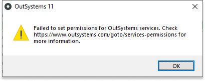
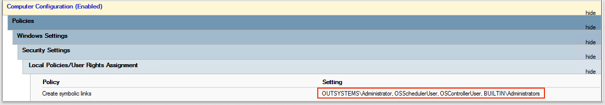

# Service permissions error when installing or upgrading to Platform Server 11.12.0 or later

## Symptoms

In a self-managed environment, installing or upgrading to Platform Server 11.12.0 or later fails. You see the message: ``Failed to set permissions for OutSystems services.``

## Cause

In earlier versions, the Platform Server runs the Deployment Controller Service and the Scheduler Service in the context of the Windows Local System account. This account has higher permissions than these services require. Starting with Platform Server 11.12.0, installation includes a powershell script that creates two new user accounts with lower permissions. The Deployment Controller and Scheduler Services then run within the context of these lower-privilege accounts, which improves security. See the [table below](#Service-and-user-details) for account details.

Active Directory settings can block the installation script from creating users and from changing policies associated with them. If the script finds that these services run with the Local System account, and it can't create new accounts, you see this error message. 

## Resolution

Change your Active Directory settings through the Group Policy Management console. For example, a user with global admin permissions can change settings on the domain controller as follows:

1. Go to **Group Policy Management**. 
2. Create a new group policy. 
3. In **Policies** > **Security Settings** > **User Rights Assignment**, select **Create symbolic links** to open the Properties dialog box.
4. Select **Define these policy settings**, and click **Add Users or Groups**.
5. In the **User and group names field**, type the users **OSControllerUser** and **OSSchedulerUser** and click **Apply**. The users you added should appear in the **Policy Setting** column. 

The following screen shows where **OSControllerUser** and **OSControllerUser** appear in **Security Settings**.

### Notes 

* The Deployment Service requires higher privileges and continues to run in the context of the Local System account. 
* To check your current settings, open the Windows Services application and locate the Deployment Controller Service and Scheduler Service. Check the account name in the **Log On As** column. 
* In your current environment, if the Deployment Controller Service and Scheduler Service don’t run in the context of the Local System user, then the script doesn't try to create new users. It assumes you’ve already changed permissions manually, and the installation completes. 

## Service and user details
The following table summarizes permissions for the new user accounts for each impacted service:

 OutSystems Service   |      New user associated with service      |  User permissions |
|----------|:-------------:|------|
| Deployment Controller Service |  OSControllerUser | Full control on the platform folder  Local policies added:<ul><li>Log on as service</li><li>Log on as batch job</li><li>Create symbolic links</li></ul>  |
| Scheduler Service |    OSSchedulerUser   | Full control on the platform folder  Local policies added:<ul><li>Log on as service</li><li>Log on as batch job</li><li>Create symbolic links</li></ul>  | |

