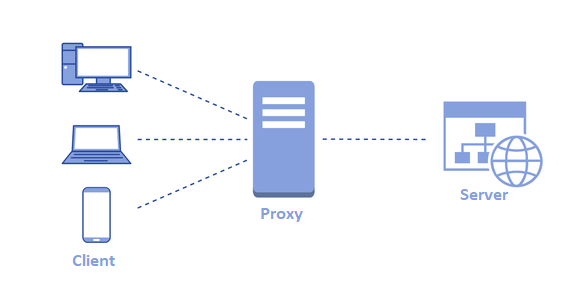

# Troubleshooting HTTP 502 (bad gateway) errors

In this article we'll explain what an HTTP 502 error code is and how you can troubleshoot it.

## What's an HTTP 502

An HTTP 502 - bad gateway server error response code indicates that the server, while acting as a gateway or proxy, received an invalid response from the upstream server.

In typical Production scenarios, there are reverse-proxy or load-balancers in front of the server(s). 
Imagine that a client sent a request to the Server. However, the client can't do this directly, so it connects to the proxy, establishing the client > proxy connection. 
Then, the proxy creates the connection proxy-server. The HTTP 502 - bad gateway error occurs when either:

* The timeout of the proxy was reached prior to the request completion.
* If the connection proxy > server drops.
* When the response from the server is invalid.

## Most common causes

### Proxy timeout

The issue may occur if the proxy has a shorter timeout than the server for that request. Imagine that for a particular request we set the server timeout to 5 minutes but the proxy server has a defined timeout of 3 minutes. If the request takes longer than the 3 minutes timeout defined at proxy level,  the proxy will issue a 502 to the client.

#### Confirming a proxy timeout

To confirm whether there was a proxy timeout (or a timeout on any other network element), check the server access logs. In IIS access logs, you can see the **Status Code** of the message. If the **Status Code** isn't 502 on the server side, then this means that the 502 was issued by a network element.

To validate if the problem was a timeout, check the **Duration** of that same request and validate whether any of the network elements has a smaller timeout than what you observed.

### Connection proxy > server dropped

If the Proxy > Server connection is dropped during the execution of the request, the 502 errors will occur. In this scenario, you may not see an entry for the request on the server-side in IIS access logs. It’s common to see errors related to either network or an application pool recycle/crash.

#### Confirming a dropped connection between the proxy and the server

* Check IIS access logs to confirm whether that request was served.
* Check Windows event viewer to validate whether there was any network-related error or an application pool recycle/crash. This will be under Windows logs > System.

### Queued requests

The last (and typically harder to find) reason occurs when the requests aren't getting served because the timeout was reached while they're queued and/or have a small duration.

When there is a temporary and abnormal burst of requests, it may happen that the server(s) are unable to cope with such a big demand. Eventually, requests can become queued and the timeout of the proxy is reached without serving the request or the request has a very small duration of execution (at least, smaller than the timeout).

#### Confirming queued requests

The easiest way to prove this is by checking the access logs of both proxy and server. On those logs, you’ll see that the request duration in the proxy is much higher (and reached the proxy timeout) than the one from the server (there may not even be an entry for the request on the server).

Also, with monitoring tools, it’s possible to see the number of requests queued. Do note that queued requests don’t necessarily mean there will be 502 errors. This is why it’s recommended to check IIS access logs to confirm this hypothesis.

