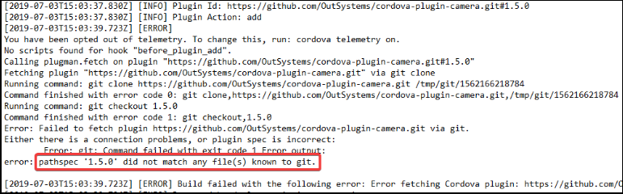
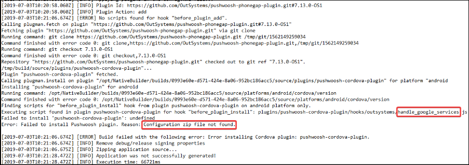
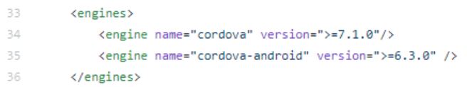

# Troubleshooting the mobile Apps generation

This article contains information that's intended to help in the troubleshooting of issues when generating mobile apps to native platforms.

**Note**: 

* In this article, the [the MABS versions article](https://success.outsystems.com/Support/Release_Notes/Mobile_Apps_Build_Service_Versions) is used to troubleshoot some of the issues. If you need to know more about MABS, you can [read this article](https://success.outsystems.com/Documentation/11/Delivering_Mobile_Apps/Mobile_Apps_Build_Service).

* If you have upgraded to MABS 5.0, check also some upgrade-specific issues in [this article](mabs/troubleshoot-issues-with-mabs-5.md).

## Common issues

This section contains frequent issues with solutions, to help you in troubleshooting generation of mobile apps.

### Build fails due to the plugin version incompatibility

If there's a mismatch between the version of any of the plugins in the app and the plugin versions required by MABS, the build fails with the following message:

```
In Android on [date] at [time] - Generation failed due to plugin version incompatibility with MABS. We recommend that you review the following plugin(s) and retry building the app:

[plugin name] version [version detected] must be equal or greater than [version required]
(...)
```

**Fix the build errors by updating the plugins from Forge to the latest versions.**

The error message contains this information:

* Plugin name. The name of the plugin as identified in the git repository. The name in Forge is similar to it.
* Version. The version information refers to the OutSystems git repository and tags that OutSystems uses to build the plugin. Note that this is **not** the Forge version of the plugin.


### Error Installing via QR Code in iOS 13

When scanning a QR Code to install an application on Safari, it generates an error if the operating system is iOS 13.

To resolve this issue, update the Platform Server to version 10.0.1016 or 11.0.539.

If a Platform Server update isn't an option, one workaround is to turn off the Disable Web SQL feature in Safari:

1. Go to **Settings > Safari Options** 

1. Go to **Advanced > Experimental Features** 

    

1. At the end turn off the option that says **Disable Web SQL**

### Cannot install IPAs on iPadOS with iOS 13

When using the new iPadOS, it won’t be possible to install an IPA file from the OutSystems Store. iOS 13 changed the way Safari treats downloads in iPadOS and, instead of installing the IPA on the device, it simply downloads the IPA. This is because Safari in the device now acts as a desktop browser, so you get the same behavior as in a desktop browser. [Check this link](https://github.com/microsoft/appcenter/issues/543) for further information.

To overtake this issue you can **Request Mobile Website** (see the image below) to get the same behavior as with iPadOS.


### UIWebView warning when submitting to Apple Store

When publishing to Apple Store an app built with a MABS 6.0 and earlier, the following message is presented:

`Apple will stop accepting submissions of apps that use UIWebView APIs.`

This happens because Apple is deprecating the UIWebView. Apple accepts app update submissions with this warning until December 2020. New app submissions will no longer be accepted starting April 2020.

There are three things you should do to fix this:

1. Switch to MABS 6.1 or later.
1. Update any Forge components to their latest versions. All the supported Forge components were updated to remove UIWebView references and additionally, our community has also updated many of the commonly used components.
1. Find any remaining references for UIWebView on the rest of your plugins and remove them.
    
    The reason why this message shows, even after switching to MABS 6.1 or later, is due to the remaining UIWebView references detected by Apple and their code analysis after you submit the app. 

    For example, if your app is using a Cordova plugin, the app can have references to UIWebView. You can find them by searching for `UIWebView` in the plugins source code (on a macOS you can use `grep -ri UIWebView [plugin folder]`). Detecting references in a plugin library (for example, in CocoaPods) requires you to use a [blank Cordova app](#reproduce-in-a-clean-cordova-project) before searching for references. Alternatively, you can also check the documentation of those libraries.

### Using an invalid iOS certificate 

Sometimes there are issues with the iOS certificates that can block the mobile app generation. Check the log files and one of the following situations may be happening:

* The certificate entered in Service Studio isn't compatible with the provisioning profile also introduced in Service Studio.    
We recommend following the steps in [this article](https://success.outsystems.com/Documentation/10/Delivering_Mobile_Apps/Generate_and_Distribute_Your_Mobile_App/More_Information_on_Generating_and_Distributing_Mobile_Apps#For_iOS).

* The certificate isn't valid for code signing.    
    Check if the certificate was revoked or has expired.

### Targeting the wrong version of a native SDK

Each MABS version used to generate a mobile app targets a given native SDK version, in both iOS and Android. At the same time, plugins can depend on different versions of these native SDKs.

In the following example (in the Extensibility Configurations of the module), we're using some Cordova preferences to change the native SDK in an app to target Android SDK 22.


In this case we were using MABS 5.0 and its specifications in [MABS versions](https://success.outsystems.com/Support/Release_Notes/Mobile_Apps_Build_Service_Versions) tells us that the version 28 of the Android SDK is required. So, we must change the `value` to version 28 to be able to submit the app to the Play Store.

Although there are Cordova preferences to force the version of the native SDKs, the best option is to adapt the plugin to the target SDK version of the MABS specifications. 

### Not using a tagged Version of a plugin

It’s recommended that we use a tagged version of a plugin. If not, we’ll be always using the latest version of the master branch directly. It means that we’ll be consuming a version of the code that's not stable, because developers might be constantly pushing changes to the main branch.

For instance, with GitHub repositories we should use `<GitHubLink>#<TagVersion>` as the following example shows in the Extensibility Configurations of the module: 


### Not using tagged versions of plugin dependencies

If the plugin dependencies aren't targeting a specific version of a library, the latest version of that library is fetched, and the outcome of the native generation is inconsistent.

For example, a Google Analytics plugin is using `play-services-analytics`, but allows any version to be used, as it can be seen in the following section of its `plugin.xml` file:


The “+” sign allows the latest version available to be used when generating the app, but if major changes are done to `play-services-analytics`, it might become incompatible with [the MABS  requirements](https://success.outsystems.com/Support/Release_Notes/Mobile_Apps_Build_Service_Versions) or other plugins.

Keeping these entries with a working version will ensure that results are predictable. 

This is just one example, but you may find more entries also used with the same purpose (of obtaining a plugin dependency) using the "+" in their specification. This includes other `dependency` entries in the same `plugin.xml` file and `dependency` blocks in Gradle files.

### Defining the same meta-data tag more than once

Sometimes a meta-data tag can be defined more than once with different values. A typical situation happens with plugins when they create or modify the `AndroidManifest.xml` file and, in there, redefine and override the value of a meta-data tag with the same key.

As an example, this log file shows a conflict caused by a plugin overriding the value of the SOME_APP_KEY meta-data tag, which was already defined by its own library as a string resource:

```
* What went wrong:
> Manifest merger failed : Attribute meta-data#SOME_APP_KEY@value value=(1234567890) from AndroidManifest.xml:18:54-130
    is also present at [com.some.some:library:1.2.3] AndroidManifest.xml:22:13-47 value=(@string/some_app_key).
    Suggestion: add 'tools:replace="android:value"' to <meta-data> element at AndroidManifest.xml:18:9-133 to override.
```

In this case, a solution would be reviewing the plugin implementation and fixing the override of the value of the meta-data tag. 

### Conflict with AndroidX support libraries

When building an app with a plugin (or a plugin dependency) that's using an AndroidX support library, the support library may not be compatible with the MABS version.

In this type of issues, the log file can contain something like:

```
* What went wrong:
Execution failed for task ':app:processReleaseManifest'.
> Manifest merger failed : Attribute application@appComponentFactory value=(android.support.v4.app.CoreComponentFactory) from [com.android.support:support-compat:28.0.0] AndroidManifest.xml:22:18-91
  	is also present at [androidx.core:core:1.0.0] AndroidManifest.xml:22:18-86 value=(androidx.core.app.CoreComponentFactory).
  	Suggestion: add 'tools:replace="android:appComponentFactory"' to <application> element at AndroidManifest.xml:5:5-20:19 to override.
```

To fix this issue you can enable AndroidX for your app. It's available since MABS 6.3. To enable AndroidX, see [Building apps with AndroidX](https://success.outsystems.com/Documentation/11/Delivering_Mobile_Apps/Mobile_Apps_Build_Service/Building_apps_with_AndroidX).

Alternatively you can review the implementation of your plugins and look for Gradle dependencies that may be using AndroidX. 

Some of these situations can happen with dependencies to Google when the version isn't locked, like for example:

    implementation "com.google.android.gms:play-services-maps:+"`

This means it will use the latest version, which can be AndroidX.
To fix this kind of issue, find the plugin(s) originating dependencies to AndroidX and lock their version so that they will use a non-AndroidX version. 

In case you are using a plugin version that needs AndroidX to work, consider upgrading or downgrading that plugin to a version that doesn't use AndroidX.

### Incompatibility between Android support libraries

Building an app that uses Android support library dependencies targeting different versions can cause mobile generation issues.

Here's an example of the log message when using multiple support libraries with different versions that define different values for the `android.support.VERSION` meta-data tag:

```
* What went wrong:
> Manifest merger failed : Attribute meta-data#android.support.VERSION@value value=(25.4.0) from [com.android.support:exifinterface:25.4.0] AndroidManifest.xml:25:13-35
    is also present at [com.android.support:support-v4:26.1.0] AndroidManifest.xml:28:13-35 value=(26.1.0).
    Suggestion: add 'tools:replace="android:value"' to <meta-data> element at AndroidManifest.xml:23:9-25:38 to override.
```

To resolve this issue upgrade (or downgrade) plugins that can be causing the incompatibility. Alternatively, change MABS to a version that makes it compatible with the Android support libraries used by the MABS built-in plugins.

If the issue remains, modify the plugin(s) implementation to make the problematic dependency versions compatible.

### Issues with Google Services configuration files

An app that uses Google Services needs to be correctly configured with specific JSON (for Android) or Plist (for iOS) configuration files located in the correct directories. For the plugins that use Google Services, you need to have the configuration files added as Resources in Service Studio.

For example, when using the Google Services plugin and the `google-services.json` file wasn't found in the correct directory, the log message is:

```
Execution failed for task ':app:processDebugGoogleServices'.
> File google-services.json is missing. The Google Services Plugin cannot function without it.
```

Or, another example, this time with the `google-services.json` in the correct directory but, in its content, the package name in the JSON doesn't match the package name of the application:

```
Execution failed for task ':app:processDebugGoogleServices'.
> No matching client found for package name 'com.some.some'
```

To solve this issue:

* Check the plugins documentation to make sure they're being correctly configured
* Make sure the content of the JSON or Plist files has the right information

If the issue remains:

* Try using different versions of the plugins, or
* If MABS was upgraded to version 5.0, modify the plugins to comply with the Cordova-android directory changes described in [Troubleshoot the Upgrade to MABS 5.0](mabs/troubleshoot-issues-with-mabs-5.md).

In the specific case of PushWoosh, a Forge community plugin, it requires a ZIP file with the configuration JSON file for Android. Read [the plugin documentation](https://success.outsystems.com/Documentation/Development_FAQs/How_to_Use_Push_Notifications_with_Pushwoosh) for more information.

### Incompatible versions of Google Play Services

When building an app that uses multiple dependencies of Google Play Services, their versions can conflict with each other, causing issues in the app generation.

In this example, the log file contains an error message when generating an app with plugins using at least two Google Play services library dependencies that aren't compatible:

```
Failed to capture fingerprint of input files for task ':app:preDebugBuild' property 'compileManifests' during up-to-date check.
> In project 'app' a resolved Google Play services library dependency depends on another at an exact version (e.g. "[11.0.
  0]", but isn't being resolved to that version. Behavior exhibited by the library will be unknown.
```

To resolve this issue update the plugins to versions that use compatible versions of Google Play services libraries.

Or, if the issue remains, modify the plugins to force the versions of the dependencies to become compatible.

### Issues with editing a missing XML node

Some plugins try to change the AndroidManifest.xml file. If the node they're trying to edit doesn't exist, then the build fails. These configuration changes according to the values in plugin.xml file.

MABS 6 raises the Cordova-android version used from 8.0.0 to 8.1.0, which removes the uses-sdk element from the AndroidManifest.xml file. Therefore, the apps with plugins that try to edit this configuration fail to build in MABS 6. Here is an example of a change that causes the build to fail in MABS 6:

```
<edit-config file="AndroidManifest.xml" target="/manifest/uses-sdk" mode="merge">
    <uses-sdk android:minSdkVersion="19" />
</edit-config>
``` 

In the log files you can find errors similar to this:

```
> Error: Unable to graft xml at selector "/manifest/uses-sdk" from ".../platforms/android/app/src/main/AndroidManifest.xml" during config install
```

Or:

```
> Error: Unable to graft xml at selector "/manifest/application/some-tag" from ".../platforms/android/app/src/main/AndroidManifest.xml" during config install
```

To solve this issue you can try to update the plugin to the latest version. If this doesn't solve it, look for edit-config tags in the plugin.xml file. If you find a suspicious tag, change it or delete it. The uses-sdk tag, in particular, isn't required for MABS 5 or MABS 6.

## Some troubleshooting techniques

This section describes some techniques that can help in troubleshooting mobile generation issues:

* [Check the Logs](#check-the-logs)

* [Check the Plugins](#check-the-plugins)

### Check the logs

One way of troubleshooting is to look for issues in the log files.

#### 1. Get the log file

<div class="mt-contentreuse-widget" data-page="Support/Enterprise_Customers/Troubleshooting/How_to_get_logs_for_troubleshooting_purposes" data-section="Mobile App Generation Logs" data-show="false">

<pre class="script">
wiki.page("Support/Enterprise_Customers/Troubleshooting/How_to_get_logs_for_troubleshooting_purposes", "Mobile App Generation Logs")</pre>

</div>

#### 2. Look for issues in the log file

Open the log file and look for the lines with errors. To narrow the search, look for the lines with the timestamp closer to when the error occurred.

Find below a couple of troubleshooting examples.

#### Examples of troubleshooting with the logs

##### Example 1

While generating the mobile app, the “Error fetching Cordova plugin” error is raised.

By checking the logs there’s a more detailed message:



It shows that the 1.5.0 tag defined in the plugin doesn't exist in GitHub.

The plugin implementation should be reviewed to use the right tag.

##### Example 2

Like before, the “Error fetching Cordova plugin” error is raised.

By checking the logs we can see a more detailed message:



In this case the log shows that a configuration archive is missing for the Pushwoosh plugin. The instructions for the plugin state that a “google-services” archive must be included, which ties in with the name of the Cordova hook that failed.

### Check the plugins

When using plugins in mobile apps, they can sometimes be the source of issues. This section provides some guidelines on how to troubleshoot possible issues related with plugins.

#### Make sure that plugins comply with MABS

When using plugins, make sure that their implementation complies with [the MABS version requirements](https://success.outsystems.com/Support/Release_Notes/Mobile_Apps_Build_Service_Versions) or, otherwise, they may be a source of problems.

For example, if the `plugin.xml` file contains engine entries like in the image below, make sure they're compatible with Cordova CLI or Android/iOS Engines:



#### Find the plugins causing issues

When troubleshooting an app that has plugins, start by finding a plugin that's the root cause of the issues. By setting the focus on a single plugin, it can facilitate the analysis.

This section introduces some techniques to find out which plugin (or plugins) are causing issues.

##### Reproduce in a clean OutSystems app 

This is the low-code way to try to reproduce issues with plugins. It's typically used when we have a strong hint of which plugin or plugins may be causing problems.

Create a clean app and add plugins, one by one, as follows:

1. Create a new Mobile app in Service Studio;

2. Add a plugin to the app and generate the mobile app;

3. If the problem is reproduced, stop and use the logs to troubleshoot the problem;

4. Add another plugin and repeat from step 2.

##### Reproduce in a clean Cordova project

This method implies knowledge about working with Cordova projects and a bit of setup work. However, it can reveal to be better than the previous method if working with several plugins and there’s no clue of which one or ones are causing issues, mainly because it’s faster to generate the mobile app.

Create a Cordova project and add plugins, one by one, as follows:

1. Set up the Cordova environment following the [Cordova instructions](https://cordova.apache.org/docs/en/latest/guide/cli/index.html) for the Cordova CLI version found in [the MABS version requirements](https://success.outsystems.com/Support/Release_Notes/Mobile_Apps_Build_Service_Versions).    
**Note**: In the case of iOS, you must use a macOS environment;

1. Create the Cordova project

        cordova create <app_name>

1. Go to the Cordova project folder to execute the command

        cd <app_name>

1. Add a platform:

        cordova platform add <platform>@<engine version>

    Where:    
    `<platform>`: is either 'android' or 'ios'    
    `<engine version>`: is the engine version [required by the MABS version](https://success.outsystems.com/Support/Release_Notes/Mobile_Apps_Build_Service_Versions).

1. Add a plugin and build the project

        cordova plugin add <plugin_repo_url>

        cordova build <platform> 

1. If the problem is reproduced, stop and use the logs to troubleshoot the problem

1. If the problem isn't yet reproduced, repeat from step 5.

This method allows testing your plugins against the Cordova Android/iOS Engine of a MABS version. However, mobile apps generated by OutSystems have a native shell with [built-in plugins](https://success.outsystems.com/Documentation/11/Extensibility_and_Integration/Mobile_Plugins#built-in-plugins) that OutSystems uses internally. This means that this method won’t allow detecting any incompatibility between your plugins and the built-in plugins because they're not installed.

##### Remove a plugin and generate again

Another way of finding out which plugins may be causing issues is removing one by one and generating the app at each removal. If the problem disappears, you found the plugin that's causing the issue.

## Still having problems?

If none of the approaches in this document helped troubleshooting the issue, consider [opening a support case](https://www.outsystems.com/SupportPortal/CaseOpen/) to get help from the OutSystems Support.
