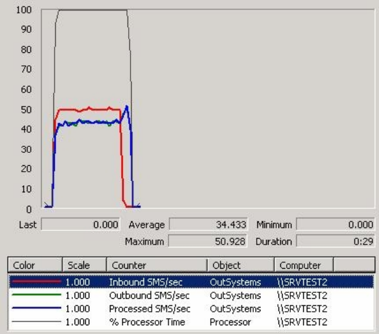

# Troubleshooting the OutSystems Platform Server

This article applies to self-managed OutSystems installations.

This article describes known techniques for troubleshooting OutSystems Platform Server in the presence of system malfunction. You will learn how to obtain error information and, for every known error, what was the cause and which recovery actions should be taken.

## How to obtain error information

Effective error tracking, monitoring and alert strategies can be put in practice using the standard OutSystems Platform Server configuration.

Error tracking is achieved via Service Center, accessing Monitoring tab. Check [here](https://success.outsystems.com/Documentation/11/Managing_the_Applications_Lifecycle/Monitor_and_Troubleshoot/View_the_Environment_Logs_and_Status#Monitoring_Area) the details about each screen of the Monitoring area.

The same information can be accessed directly in the OutSystems Log Database, accessing data in tables named as *os_log_log_kind_n *(e.g. *os_log_screen_1*). Due to rotation purposes, there are 10 distinct tables for each kind of log. Nevertheless, a specific view exists for current data, as presented in Service Center. These views are named, simply as *os_log_log_kind*.

Error alerts are based on the Windows Event Viewer entries. The OutSystems Platform Server produces Windows Event Viewer entries in the Application Log every time a severe error condition or every time any other type of error occurs several times in a period of time. Error alerts are issued based on its source and description.

## Windows Performance Counters

OutSystems Platform Server produces its own performance information, compliant with the Microsoft Windows System Performance Monitor, thus allowing integrated system performance monitoring in every Server. Along with common CPU, memory and hard disk access information, OutSystems Platform Performance Monitor provides accurate information about:

* Asynchronous Jobs Execution

* Application Error Rates

* Web and Mobile Web Screen Access

* Web Service Access

## Errors, causes and recovery actions

### OutSystems Deployment Controller service errors

**"OutSystems Deployment Controller Service Stopped. Please Restart"**

**"OutSystems Deployment Controller Service Status: No connection could be made because the target machine actively refused it"**

|Cause| The "OutSystems Deployment Controller Service" is stopped at the *Deployment Controller Server| 
|-----|-----|
| **Resolution / Recovery Action**| <ol><li>Login to Deployment Controller Server and go to Windows Services.</li><li>Confirm that "OutSystems Deployment Controller Service" is not Started. Start it.</li><li>If it is running, check the network and communication conditions between the Deployment Controller Server and every Front-end Server.</li></ol>|

### OutSystems Deployment Service Errors

**"OutSystems Deployment Service Stopped. Please Restart"**

**"OutSystems Deployment Service Status: No connection could be made because the target machine actively refused it"**

|Cause| The "OutSystems Deployment Service" at the Front-end Server referred in the message is stopped.|
|-----|-----|
| **Resolution / Recovery Action** | <ol><li>Login to the corresponding Front-end Server and go to Windows Services</li><li>Confirm that "OutSystems Deployment Service" isn't Started. Start it.</li></ol>|

### OutSystems Scheduler Service Errors

**"OutSystems Scheduler Service Stopped. Please restart"**

**"OutSystems Scheduler Service Status: No connection could be made because the target machine actively refused it"**

|Cause|The "OutSystems Scheduler Service" at the Front-end Server referred in the message is stopped.|
|-----|-----|
| **Resolution / Recovery Action** | <ol><li>Login Front-end Server and go to Windows Services. </li><li>Confirm that "OutSystems Scheduler Service" is not Started. Start it. </li></ol>|

**"OutSystems Scheduler Service Status: Warning: Job Worker is in status Processing for more than n seconds"**

| Cause| The "OutSystems Scheduler Service" is waiting for the Front-end Server to complete the execution of a scheduled job. "n" may vary according to execution conditions.|
|-----|-----|
| **Resolution / Recovery Action**| <ol><li>Login to Service Center and go to the Monitoring tab. </li><li>Click on the corresponding Front-end Server Scheduler indicator in Frontend Servers section for details.</li><li>Check all "Job Worker" thread status and click on the Refresh Data link to confirm that the statuses are maintained. </li><li>If there are "Job Worker" threads not in "Processing" status, keep clicking on the Refresh Data link, checking thread status, until no threads are in "Processing" status for more than n seconds.</li><li>If they all become "Processing" for more than n seconds, check the detail columns for eSpace and timer info.</li><li>If the error is specific of a single eSpace, report the problem to the application owner. </li><li>If the error is observed in more than one eSpace: <ol><li>Login to the corresponding Front-end Server, go to Windows Services and restart the "OutSystems Scheduler Service".</li><li> In console mode execute "iisreset".</li></ol></li><li>Go back to Service Center's Monitoring tab and check in the Scheduler details if the problem persists.</li></ol>|

**"OutSystems Scheduler Service Status: Error: Job Worker is in status Error"**

| Cause | The "OutSystems Scheduler Service" could not start the Job execution.|
|-----|-----|
| **Resolution / Recovery Action** | <ol><li>Login to Service Center and go to the Monitoring tab. </li><li>Click on the corresponding Front-end Server Scheduler indicator in Frontend Servers section for details.</li><li>Check all "Job Worker" thread statuses and click on the Refresh Data link to confirm that the statuses are maintained.</li><li>If status is still "Error" for all: <ol><li>Login to the corresponding Front-end Server, go to Windows Services and restart the "OutSystems Scheduler Service".</li><li>In console mode execute "iisreset".</li></ol></li><li>Go back to Service Center's Monitoring and check in the Scheduler details if the problem persists.</li></ol> |

**"OutSystems Scheduler Service Status: Error: Jobs Producer is in status Error"**

| Cause | The "OutSystems Scheduler Service" cannot determine next jobs to execute. Possible error accessing database.|
|-----|-----|
| **Resolution / Recovery Action** | <ol><li>Login to Service Center and go to the Monitoring tab. </li><li>Click on the corresponding Front-end Server Scheduler indicator in Frontend Servers section for details.</li><li>Check all "Jobs Producer" thread status and click on the Refresh Data link to confirm that the statuses are maintained.</li><li>If status is still "Error" for "Jobs Producer": <ol><li>Login to the corresponding server and check network configuration and communication conditions between the Front-end Server and the Platform Database Servers.</li><li>Login to Platform Database Server and check SQL Server availability and runtime conditions (CPU, memory, etc.).</li><li>Execute any specific recovery action.</li></ol></li><li> If the problem persists, login to the corresponding Front-end Server, go to Windows Services and restart the "OutSystems Scheduler Service".</li><li> Go back to Service Center's Monitoring and check in the Scheduler details if the problem persists.</li></ol>|

**"OutSystems Scheduler Service Status: No connection could be made because the target machine actively refused it"**

**"OutSystems Scheduler Service Status: A connection attempt failed because the connected party did not properly respond after a period of time, or established connection failed because connected host has failed to respond"**

| Cause| The "OutSystems Scheduler Service" is waiting for the Front-end Server to complete the execution of a scheduled job or cannot access the database.|
|-----|-----|
| **Resolution / Recovery Action** |<ol><li>Login to Service Center and go to the Monitoring tab. </li><li>Click on the corresponding Front-end Server Scheduler indicator in Frontend Servers section for details.</li><li>Check "Jobs Producer" and "Jobs Worker" threads status and click on the Refresh Data link to confirm that the statuses are maintained.</li><li>If status are still "Error" for "Jobs Producer" or for any "Jobs Worker": <ol><li>Login to the corresponding Front-end Server and check network configuration and communication conditions between the Front-end Server and the Platform Database Servers.</li><li>Login to Platform Database Server and check SQL Server availability and runtime conditions (CPU, memory, etc.).</li><li>Execute any specific recovery action.</li></ol></li><li>If the problem persists, login to the corresponding Front-end Server, go to Windows Services and restart the "OutSystems Scheduler Service".</li><li> Go back to Service Center's Monitoring and check in the Scheduler details if the problem persists.</li></ol>|

**"Scheduled for execution at date time. Suspected to be blocked"**

| Cause| The scheduled timer execution was not started at the predefined date/time.|
|-----|-----|
| **Resolution / Recovery Action** |<ol><li>Login to Service Center and go to the Monitoring tab.</li><li>Check if the job is still pending for execution in the Timers section. Pending jobs will show a warning indicator.</li><li>If the problem persists, click on every Scheduler indicator for details about each of them.</li><li>Check all "Job Worker" thread statuses and click on the Refresh Data link to confirm that the statuses are maintained.</li><li>If there are "Job Worker" threads not in "Error" status, go back to the Monitoring page, refreshing data until the job is executed.</li><li>If they all become "Error": <ol><li>Login to the corresponding Front-end Server, go to Windows Services and restart the "OutSystems Scheduler Service".</li><li>Execute "iisreset" in console mode.</li></ol></li><li> Go back to Service Center's Monitoring and check in the Scheduler details if the problem persists.</li></ol>|

### OutSystems Log Service Errors

**"OutSystems Log Service Stopped. Please restart"**

**"OutSystems Log Service Status: No connection could be made because the target machine actively refused it"**

| Cause | The "OutSystems Log Service" at the referred Front-end Server or Deployment Controller Server is stopped|
|-----|-----|
| **Resolution / Recovery Action** |<ol><li>Login to the Front-end Server or Deployment Controller Server and go to Windows Services.</li><li>Confirm that the "OutSystems Log Service" is not Started. Start it.</li></ol>|

**"OutSystems Log Service Status: Warning: Log Queue has n items"**

| Cause| There are pending log items not yet in the database, in the "OutSystems Log Service" queue.|
|-----|-----|
| **Resolution / Recovery Action** |<ol><li>Login to Service Center and go to the Monitoring tab.</li><li>Click on the corresponding Front-end Server server Log indicator in Front-end Servers section for details.</li><li>Check Queue "log" size and "Logger Listener" thread status and click on the Refresh Data link to confirm that the statuses are maintained.</li><li>If the queue size doesn't decrease and the status isn't "Waiting for messages": <ol><li>Login to the corresponding server, go to Windows Services and restart the "OutSystems Log Service".</li><li>Restart "Message Queuing" service.</li></ol></li><li>Go back to Service Center's Monitoring and check in the Log details if the problem persists.</li></ol>|

**"OutSystems Log Service Status: Error: Logger Listener is in status SQL Exception"**

**"OutSystems Log Service Status: Error: Logger Listener is in status Error connecting to database"**

**"OutSystems Log Service Status: A connection attempt failed because the connected party did not properly respond after a period of time, or established connection failed because connected host has failed to respond"**

| Cause | The "OutSystems Log Service" cannot access the database.|
|-----|-----|
| **Resolution / Recovery Action** |<ol><li>Login to Service Center and go to the Monitoring tab. </li><li>Click on the corresponding Front-end Server Log indicator in Front-end Servers section for details.</li><li>Check "Logger Listener" thread status and click on the Refresh Data link to confirm that the statuses are maintained.</li><li>If the status is still "SQL Exception" or "Error": <ol><li>Login to the corresponding server and check network configuration and communication conditions between the Front-end Server and the Platform Database Servers.</li><li>Login to the Platform Database Server and check SQL Server availability and runtime conditions (CPU, memory, etc.).</li><li>Execute any specific recovery action.</li></ol></li><li> If the problem persists, login to the corresponding server, go to Windows Services and restart the "OutSystems Log Service".</li><li>Go back to Service Center's Monitoring and check in the Log details if the problem persists.</li></ol>|

### Windows Server Base Service Errors

**"Message Queue Service is not available"**

| Cause| Microsoft Message Queue Service is not available. The"OutSystems Log Service" may stop working. |
|-----|-----|
| **Resolution / Recovery Action** |<ol><li>Login to the corresponding server and go to Windows Services.</li><li>Confirm that the "Messaging Queuing" service isn't Started. Start it.</li></ol>|

**"IIS Status:The operation has timed-out"**

**"IIS Stopped. Please restart"**

| Cause | Microsoft Internet Information Server at the Front-end Server referred in the message is not responding or is stopped.|
|-----|-----|
| **Resolution / Recovery Action** |<ol><li>Login to Service Center and go to the Monitoring tab. </li><li>Check the corresponding Front-end Server IIS indicator status, in Frontend Servers section, and click on the Refresh Data link to confirm that the status is maintained.</li><li>If the indicator is not green: <ol><li>Login to the corresponding Front-end Server</li><li>In console mode execute "iisreset".</li></ol></li><li>Go back to Service Center's Monitoring and check if the problem persists.</li></ol>|

### Common application errors

**"SQL Exception: Timeout expired"**

**"OleDbException: Timeout expired"**

**"Error in advanced query" SQL statement ": timeout expired"**

| Cause| The Application timed out trying to access the database.|
|-----|-----|
| **Resolution / Recovery Action** |<ol><li>Login to Service Center and go to the Error Log in the Monitoring tab.</li><li>Refresh the page to check if the same error occurs several times.</li><li>If the error occurs repeatedly: <ol><li>Login to the corresponding server and check network configuration and communication conditions between the Front-end Server and the Platform Database Servers.</li><li>Login to the Platform Database Server and check SQL Server availability and runtime conditions (CPU, memory, etc.).</li><li>Execute any specific recovery action.</li></ol></li><li> Go back to Service Center's page Error Log, in Monitoring tab, and check if the problem persists.</li></ol>|

**"Error executing child request for node"**

**"Internal Server Error"**

| Cause| If any of the above is reported consecutively for every request to a specific application, possibly the ASP.NET Temporary Files are corrupted. (Microsoft known defect)|
|-----|-----|
| **Resolution / Recovery Action** |<ol><li>Login to Service Center and go to page Error Log in Monitoring tab.</li><li>Refresh the page to check if the same error occurs several times in a single server.</li><li>If the error occurs repeatedly: <ol><li>In Service Center, go to tab Factory and select the corresponding eSpace from the eSpaces list.</li><li>Press "Redeploy Published Version" button.</li><li>Go to the Monitoring tab and check the Deploy.Controller status and click on the Refresh Data link until the indicator turns green.</li><li>If the indicator doesn't turn green, go directly to step 5.1.</li></ol></li><li> Go to page Error Log again and refresh it.</li><li>If the error occurs repeatedly: <ol><li>Login to the corresponding server and go to Windows Services.</li><li>Stop all "OutSystems" services.</li><li>In `"Control Panel"->"Administrative Tools"->" Internet Services Manager"`, stop the "Default Web Site".</li><li>In console mode, run the command "iisreset".</li><li>Delete all the contents of the Temporary ASP.NET Files folder.</li><li>In "Control Panel"->"Administrative Tools"->" Internet Services Manager", start the "Default Web Site".</li><li>Start all OutSystems services.</li></ol></li><li>Go back to Service Center, refresh Error log page and check if the problem persists.</li></ol>|

