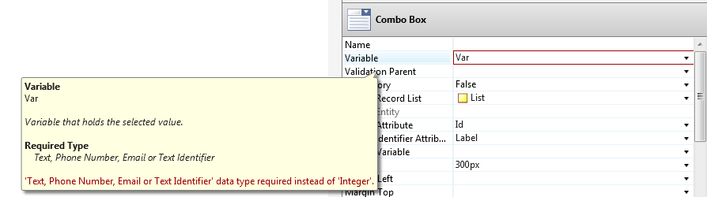
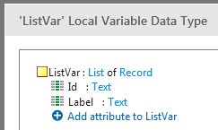
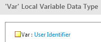
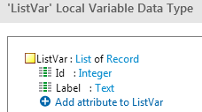
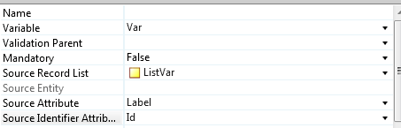

---
summary:
---

# TrueChange validation between ComboBox's Source Identifier and Variable types

In Service Studio 8.0.1.70, 9.0.1.65 and 9.1.501.0 OutSystems introduced a correction to TrueChange type validation that prevents runtime issues with combo boxes.

This change has caused some eSpaces to suddenly have TrueChange errors when the new Service Studio is used and brought questions from some customers. So this article was created in order to clarify what was done, why it benefits our customers, and what to do to correct these new errors

## Context

Prior to the fix, TrueChange didn’t properly validate the type of the variable against the type of the elements of the list.

This bug appeared due to the complexity of the ComboBox Widget where its properties need to be specified in order. For example, the list must be defined first, before defining the Label and Identifier attributes. At the end of this process, the variable was not properly validated.

## Why correct this

One of the stronger qualities of our platform is its TrueChange engine which ensures that, by strongly validating the types of the different objects and its usages, errors in runtime are avoided. It gives security to the developer when he publishes because, if there are no errors in TrueChange, there won’t be runtime errors.

Therefore having a validation that’s not performed, although it doesn’t cause runtime errors in some scenarios, is a major flaw to the security the developer has when the eSpace is free from TrueChange errors.

## What was done

In order to overcome the problem, after specifying the identifier attribute of the ComboBox and the variable that will store its value their types are validated to guarantee that a value of the type of the Identifier can safely be stored -without ever causing runtime errors- on a variable of the type of the ComboBox’s variable. If these types do not match, a TrueChange error appears.

## Why am I seeing errors

The most common cause for this error to appear is when trying to assign an Identifier of type Text to a variable of type Integer or Integer Identifier.

## How to fix such TrueChange errors

If the type of the Identifier Attribute is Text and the variable has a numeric type, change the type of the Identifier to be a numeric one.

Consider the following scenario:

* List type:

    

* Variable type:

    

* ComboBox Properties

    

 
### To resolve:

1. Simply change the type of the ID of the list to a numeric type:

    

1. Re-set the Identifier Attribute

1. And the error will disappear:

    

