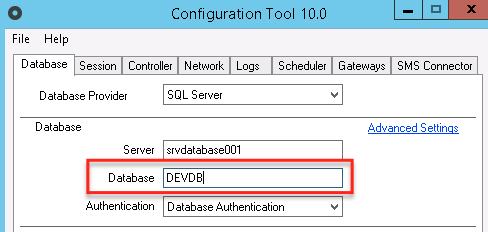
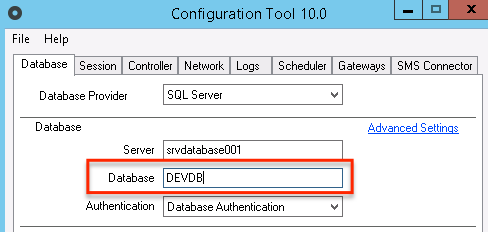

# Unable to register the Front-end Server. The server's connection string is different from the Deployment Controller's connection string

## Symptoms

You are performing one of the following operations:
* Installing a farm environment (an environment with multiple front-ends).
* Adding front-ends to an existing environment.
* Changing values in the Configuration Tool, without making the same change in all servers of that environment.

In the front-end, you observe that the Deployment Service and/or Scheduler Service does not start.

When looking at the Event Viewer Logs (.NET stack) or the DeployService.log (Java stack) you encounter the following error:

--

In **.NET**, the error looks like:
```
Initialization error: System.InvalidOperationException: Invalid

Connection String : **Unable to register the Front-end Server. The server's**

**connection string is different from the Deployment Controller's connection**

**string.**

   at #47c.#f8c.#E0c()

   at #47c.#f8c.#eyb()

   at

#47c.#9Vc.#MZc()

Retrying in 30 seconds
```
--

In **Java**, the error looks like:
```
2017-01-23 13:26:34,123 ERROR [outsystems.hubedition.deployservice.Deploy - Thread-7] java.lang.IllegalStateException: Invalid Connection String : **Unable to register the Front-end Server. The server's connection string is different from the Deployment Controller's connection string.**

2017-01-23 13:26:34,123 ERROR [outsystems.hubedition.deployservice.Deploy - Thread-7]        at outsystems.hubedition.deployservice.Deploy.subscribe(Unknown Source)

2017-01-23 13:26:34,123 ERROR [outsystems.hubedition.deployservice.Deploy - Thread-7]        at outsystems.hubedition.deployservice.Service.reallyStart(Unknown Source)

2017-01-23 13:26:34,123 ERROR [outsystems.hubedition.deployservice.Deploy - Thread-7]        at outsystems.hubedition.servercommon.physicalservicebase.ServiceFunctions.$bnb(Unknown Source)

2017-01-23 13:26:34,123 ERROR [outsystems.hubedition.deployservice.Deploy - Thread-7]        at outsystems.hubedition.servercommon.physicalservicebase.ServiceFunctions.$bpb(Unknown Source)

2017-01-23 13:26:34,123 ERROR [outsystems.hubedition.deployservice.Deploy - Thread-7]        at outsystems.hubedition.servercommon.physicalservicebase.IIiIIiiiiIIiII.executeImpl(Unknown Source)

2017-01-23 13:26:34,123 ERROR [outsystems.hubedition.deployservice.Deploy - Thread-7]        at outsystems.hubedition.util.delegates.Action$Action0.execute(Unknown Source)

2017-01-23 13:26:34,123 ERROR [outsystems.hubedition.deployservice.Deploy - Thread-7]        at outsystems.hubedition.util.delegates.ThreadStart.run(Unknown Source)

2017-01-23 13:26:34,123 ERROR [outsystems.hubedition.deployservice.Deploy - Thread-7]        at java.lang.Thread.run(Thread.java:662)
```
--

## Cause

This happens because your front-end is being registered with a connection string to the database that does not match the one used in the Controller node, as indicated by the error message.

`Invalid Connection String : Unable to register the Front-end Server. The server's connection string is different from the Deployment Controller's connection string.`

The server's connection string is set in the Configuration tool. For example, the below could be a configuration for the Controller (screenshots below for .NET):



If your front-end does not have the exact same configuration, that message will appear. Note that the configuration is **case-sensitive**; the example below will cause the error:



As you can see in the example, the Controller node had database **devDB**; in this front-end, I wrote **DEVDB**, so I will have the error.

Note that this is just an example; if **any of the fields is different, the error will happen.**

## Resolution

As you can imagine, the solution for this problem is to have the configuration in all front-ends equal. The simplest way to do this is to do as the installation checklist suggest:

* In .**NET**, export the configuration file from the Controller, import it again in the front-end, and (if needed) change the Front-end Registration IP address in the Network tab.

* In **Java**, copy the server.hsconf from the controller into the front-end, run ./configurationtool.sh and (if needed) correct the Front-end Registration IP address.

## Properties

Applies to all versions of the OutSystems Platform (last reviewed with Platform 10).

Applies to both .NET and Java, and to all database stacks (SQL Server, Oracle and MySQL).

