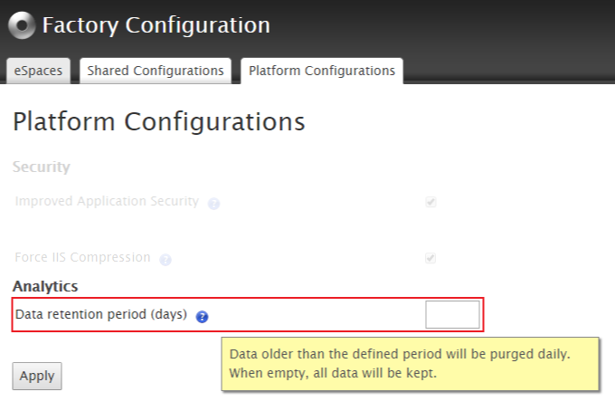
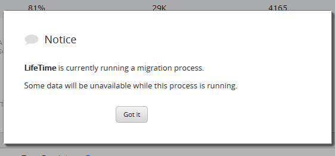
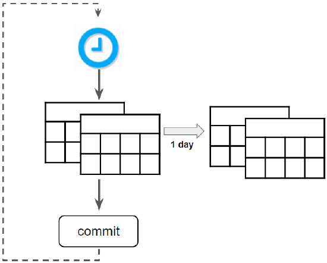

# Updating LifeTime Analytics to 10.0.804.0

This article describes LifeTime Analytics changes introduced with OutSystems Platform Server 10.0.804.0, the internal data migration process associated with those changes and the actions that an on-premises customer can take after updating from a previous version to OutSystems Platform Server 10.0.804.0 or later.

## Introduction

OutSystems Platform Server 10.0.804.0 brings a set of changes in LifeTime Analytics that will significantly improve its performance. These changes imply:

**Different data model**

Two new tables are created to hold LifeTime Analytics data, which requires LifeTime Analytics to run an internal process to migrate all the existing data to these new tables. This **data migration process** must run after LifeTime update because it enables you to access the old data using the new version of LifeTime Analytics.

**New retention policy**

Starting from Platform Server 10.0.804.0, LifeTime Analytics has the capability to hold data only for a specific period (eg. for one month or one year), instead of holding all the data. Data older than the defined period will be purged daily. If you have your own analysis tool, you can use the [Performance Monitoring API](https://success.outsystems.com/Documentation/11/Reference/OutSystems_APIs/PerformanceMonitoring_API) to collect the data from LifeTime Analytics and keep in LifeTime Analytics only the most recent data.

By default, LifeTime Analytics will hold all data, but the data retention period can be adjusted in the "Platform Configurations" Tab of the [Factory Configuration](https://www.outsystems.com/forge/25/) Application. 

Once you define a value for the data retention period in Factory Configuration, you will lose all data older than the defined period.

If you want to keep this data archive it in another table in your database before changing the data retention period.

## OutSystems Cloud

If you use OutSystems PaaS, you don’t need to take any action. When LifeTime is updated in your environment, LifeTime Analytics will automatically start the data migration process.

While the data migration process is running, when accessing LifeTime Analytics you will see the following notification:

During the migration period, the old data becomes available as it's being migrated, starting from the more recent data.

When the data migration process finishes, all the information is available again.

## OutSystems self-managed installations

There is no action you are required to do before installing this new version of LifeTime in your OutSystems on-premises installation.

When you install the new LifeTime version - which is performed when you publish LifeTime.osp solution shipped with the OutSystems Platform Server binary files - LifeTime Analytics creates the new tables and starts using them to collect new data. By this time, there is no impact on the existing data - all the previous data is saved in the old tables.

### After LifeTime update

After you update LifeTime in your environment, LifeTime Analytics needs to run the **data migration process**.

Since LifeTime Analytics holds large amounts of data, you should ensure that the execution of the data migration process has no impact on your daily operation. Validate with your Database Administrator that your database configuration can support the execution of this process, as described below. 

The data migration process **runs upon your request**. You’ll be able to start the process when you access the new version of LifeTime Analytics for the first time after LifeTime update. 

### Data migration process

LifeTime Analytics implements the data migration process **through the MoveDataProcess Timer**:

Each time the Timer runs, the following steps are executed:

1. One day of data is moved from table *OSLTM_REQUESTFACT* to table *OSLTM_REQUESTFACT_V2* through the Stored Procedure *MoveData_REQUESTFACT*:

    1. Select data from table *OSLTM_REQUESTFACT*;

    2. Insert fetched data into *OSLTM_REQUESTFACT_V2*;

    3. Delete copied data from *OSLTM_REQUESTFACT*.
 

2. One day of data is moved from table OSLTM_SERVERINVOCATIONFACT to table OSLTM_SERVERINVOCATIONFACT_V2 through the Stored Procedure MoveData_SERVERINVOCATIONFACT:

    1. Select data from table OSLTM_SERVERINVOCATIONFACT;

    2. Insert fetched data into OSLTM_SERVERINVOCATIONFACT_V2;

    3. Delete copied data from OSLTM_SERVERINVOCATIONFACT. 
 

3. Changes are committed in the database;
 

4. MoveDataProcess Timer is called to run again.

**MoveDataProcess Timer** will keep running until there is no more data in the old tables. When the process finishes, the old tables will be empty and the new ones will hold the old data in a new format.

### Run the data migration process

After you update LifeTime and access LifeTime Analytics for the first time, you'll see a popup that enables you to decide when the data migration process starts to run:

You can choose one of the following options:

**Decide Later**

The data migration process won't run and you''ll see with the popup when you access LifeTime Analytics again.

**Start Migration**

The data migration process will start running. Make sure you have validated with your Database Administrator that the process will have no impact on your daily operations. This option requires your acknowledgment.

While the data migration process is running, when accessing LifeTime Analytics you will see the following notification:

During the migration period, the old data becomes available as it's being migrated, starting from the more recent data.

**Skip Migration**

The data migration process won't run. Data collected before this LifeTime update won't be available in LifeTime Analytics. However, this old data won't be removed from the old tables (OSLTM_REQUESTFACT and OSLTM_SERVERINVOCATIONFACT) and you can decide how to handle it. You can delete it with no other consequences than losing the ability to see it in LifeTime Analytics. This option requires your acknowledgment.

 

