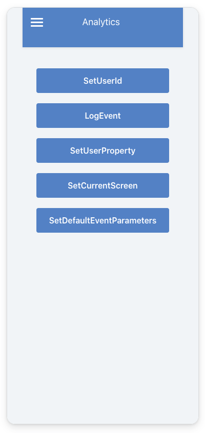
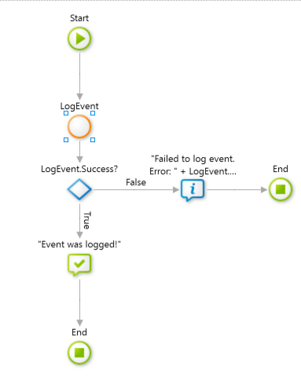
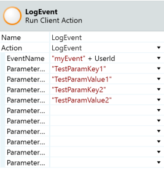

# Migrating to the supported Firebase Analytics mobile plugin

This plugin lets you to understand user behavior and view live usage data with real-time reporting. Analytics reports help you understand clearly how your users behave (with event logging and user property setting), which enables you to make informed decisions regarding app marketing and performance optimizations. This plugin is an integration with Google Analytics for Firebase. Firebase is a Google mobile development platform. It speeds up many of the common development patterns for mobile apps.

## Setting the plugin

In order to function properly the plugin needs to be set up in the Google console as well as in your app. See the instructions in [Firebase Plugins](https://success.outsystems.com/Documentation/11/Extensibility_and_Integration/Mobile_Plugins/Firebase_Plugins) to set up your plugin.

## Sample app

Install Firebase Sample App from Forge and open the app in Service Studio. The sample app contains logic for common use cases, which you can examine and recreate in your apps. For example, the sample app shows how to:

* Log an application custom event (e.g. user logs in).
* Set the UserId property.
* Set a user property like for example the user’s language.
* Set the current screen name, which specifies the app’s visual context.
* Sets the parameters that will be sent with every event logged from the device, including automatic events.

    

## Logging an Event

You can log events anywhere inside a logic flow. To log an event, drag and drop the action provided by the plugin “LogEvent” where you want the event logged.

You can also set associated parameters to capture additional information and get metrics from the google console dashboard.

## Migration from unsupported versions

The Analytics functionality in this plugin is similar to the unsupported  [Firebase Mobile Plugin](https://www.outsystems.com/forge/component-overview/4991/firebase-mobile)  version. This version offers better flexibility by individualizing all the firebase components in individual plugins, which lets you choose only the plugins you need for your applications. Using individual plugins provides better visibility on updates and new features because each plugin has a separate forge and release cycle. In addition, the plugin is supported by OutSystems.

To migrate from the unsupported plugin to the supported one, you need to refactor your applications by replacing some actions in your logic. It is a straightforward process, since both plugins behave the same way, adopt the same parameters, and follow similar naming conventions.

Equivalent actions* on both plugins:

Firebase Mobile (Not Supported) | Analytics Plugin (Firebase)
------------------------------- | ---------------------------
  LogEvent                      |  LogEvent
  SetAnalyticsCollectionEnabled |  SetEnabled
  SetScreenName                 |  SetCurrentScreen
  SetUserProperty               |  SetUserProperty

*All input and output parameters of these actions behave the same way
