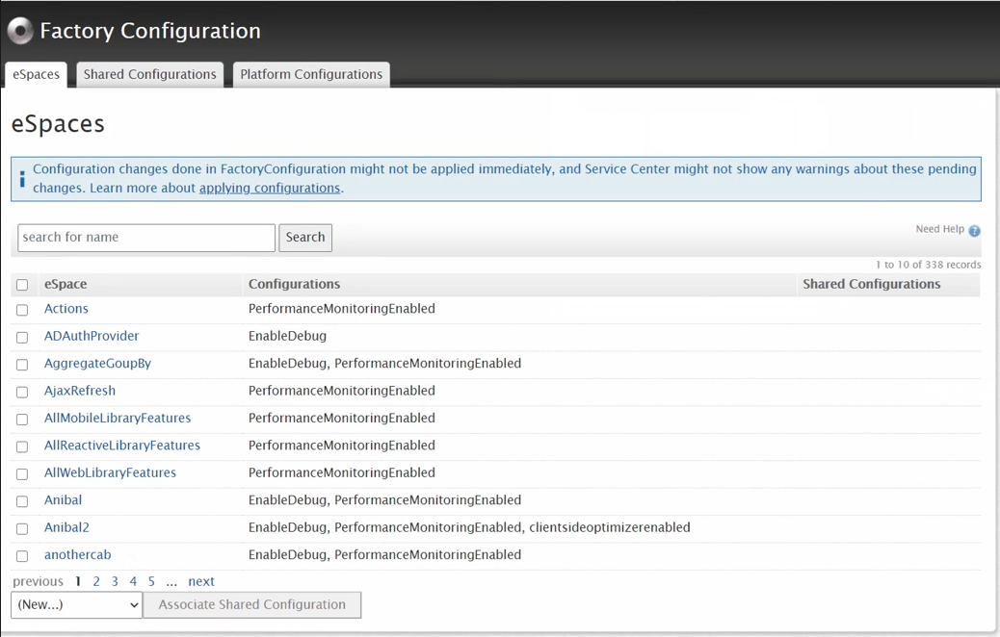
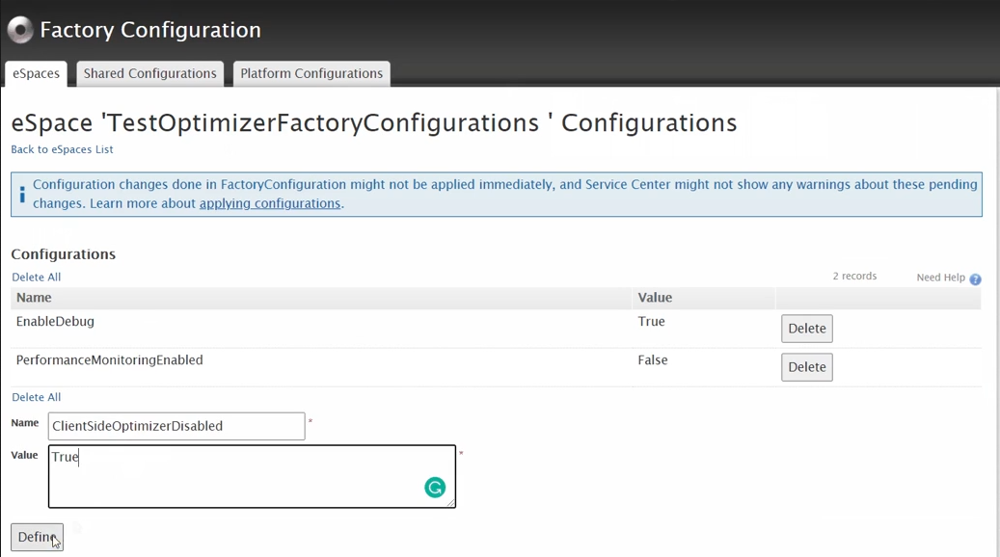

# Technical Preview - Server-to-client data transfer optimization

Server-to-client data transfer optimization uses a sophisticated data flow algorithm that analyses how the data flows and then optimizes the transfer from the server to the client. 

## Prerequisites

To have your apps use server-to-client data transfer optimization, as part of a technical preview, you need to meet the following requirements:

* Platform Server 11.10.0 or later.
* LifeTime 11.6.0 or later.
* Activation of the [technical preview](https://success.outsystems.com/Support/Enterprise_Customers/Upgrading/Technical_Preview_features) **Client-side optimizations for Reactive Web Apps** or **Client-side optimizations for Mobile Apps** in LifeTime. After you activate or deactivate  the feature, **publish your app** to apply the optimization changes.

After this optimization the apps receive only the information that users of the app really need. Activate this optimization as a technical preview to try out the following benefits:

* Performance improvements, due to the reduced amount of data transfer. The improvement is noticeable in data-demanding apps that use complex database joins.
* Improved security, since limiting the data coming to the client reduces the possibility of an accidental data leak.

The optimization works for Screen Aggregates, Data Actions, and for the Server Actions in the logic flows of the Screen Client Actions. You can turn the optimization on for both Mobile Apps and Reactive Web Apps.

## Selective Optimization

Where certain apps, or certain modules, should not be optimized, they can be excluded in the following way.

1. Download and install [Factory Configuration ](https://www.outsystems.com/forge/component-overview/25/factory-configuration) from the OutSystems Forge.
2. Launch **Factory Configuration** in your browser from Service Center.

3. Select the module that should be excluded from optimization by searching for it or scrolling through the list.
4. With the module selected set the value of  **ClientSideOptimizerDisabled** to **True**.

5. Click Define and then republish the app.

The selected module is not longer optimized.

## Send feedback

If you experience issues with this technical preview, let us know by posting [a new question with the **technical preview** tag](https://www.outsystems.com/forums/tag/6875/technical-preview/) in Forums.
