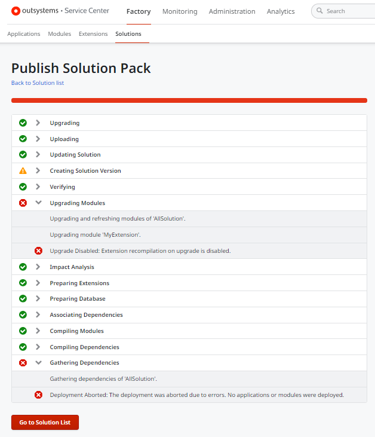
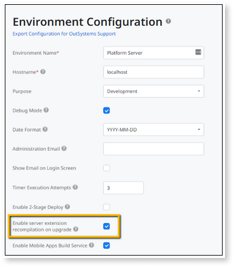
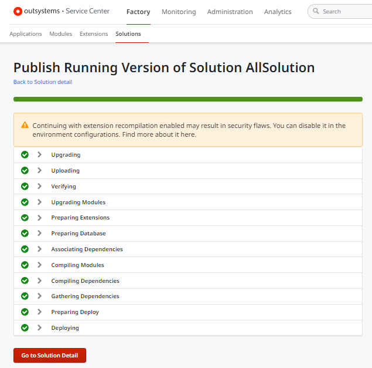

# Server extension recompilation on upgrade

Extensions consist of C# code that [extends the functionality of your OutSystems applications](https://success.outsystems.com/Documentation/11/Extensibility_and_Integration/Extend_Logic_with_Your_Own_Code) and enables integration with external systems and databases. OutSystems recommends that you follow a secure development approach for extensions.

During the publishing process, the Platform Server uses [Integration Studio](https://success.outsystems.com/Documentation/11/Reference/Integration_Studio) to recompile extensions in an unattended execution of the Microsoft Build Engine.

For scenarios where the Platform Server needs to automatically upgrade and recompile an extension, the publishing process can be exploited so that unwanted code gets deployed. These scenarios are limited to the following:

* Publishing an application or solution that includes an extension created in an earlier major version of OutSystems.

* Installing a Forge extension already created in an earlier major version of OutSystems.

* Publishing an extension after upgrading the Platform Server to a later major version (for example, from OutSystems 10 to OutSystems 11).

To prevent unattended and unwanted code modifications in the scenarios listed above, you must always [upgrade and recompile extensions in a secure way](#secure-upgrade).

## Server-side blocking of extension recompilation on upgrade

When running **Platform Server 11.14.0** or later, the automatic upgrade and recompilation of extensions on the server-side is **blocked** by default. This prevents unattended and unwanted code modifications.

When the Platform Server needs to upgrade and recompile an extension during the publishing process, you get the following error:

`Upgrade Disabled: Extension recompilation on upgrade is disabled.`

When this error occurs, the extension must be [upgraded and recompiled in a secure way](#secure-upgrade) before proceeding with the upgrade.

For environments running **Platform Server 11.13.2 or earlier**, you should always execute [secure upgrading and recompilation of extensions](#secure-upgrade), as you can't disable extension recompilation on upgrade.

### Enable/Disable server extension recompilation on upgrade { #enable-disable }

This behavior is controlled by the **Enable server extension recompilation on upgrade** option in the **Environment Configuration** screen of the environment’s Service Center console.

Service Center administrators can enable or disable automatic upgrade and recompilation of extensions in the environment by executing the following steps:

1. Go to the **Environment Configuration** screen of the environment’s Service Center console.

1. Select/unselect the option **Enable server extension recompilation on upgrade** to enable/disable it.

    

The option **Enable server extension recompilation on upgrade** is disabled by default. To prevent unattended and unwanted code modifications in extension upgrade scenarios, **keep this option disabled**.

For production environments, it’s not possible to enable server extension recompilation on upgrade. The extensions must be upgraded in another environment and then deployed to production.

### Accepting the risk { #accept-risk }

You should only enable automatic upgrade and recompilation of extensions in your environment if the following conditions are met:

* You trust the origin of the extensions that need to be upgraded.
* You enable the option temporarily for that specific upgrade operation and disable the option again after the upgrade.

By enabling the automatic upgrade and recompilation of extensions, you are **accepting the risk of unattended and unwanted code modifications** during the publishing process.

When this option is enabled, the Platform Server automatically upgrades and recompiles extensions during the publishing process. You get the following warning:

`Continuing with extension recompilation enabled may result in security flaws. You can disable it in the environment configuration.`

## Secure upgrading and recompilation of extensions { #secure-upgrade }

To prevent unattended and unwanted code modifications in extension upgrade scenarios during the publishing process, the extension must be upgraded locally:

1. A developer must open the extension and upgrade it using the Integration Studio on their local machine.

1. The upgraded extension must be uploaded and published to the environment through the Service Center console.

When the extension is upgraded, you can repeat the publishing operation. Now you won’t get the `Upgrade Disabled` error, as the Platform Server has no need to automatically upgrade and recompile the extension.
