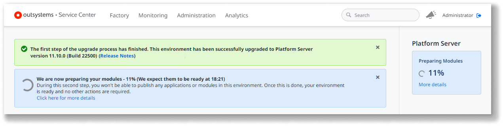
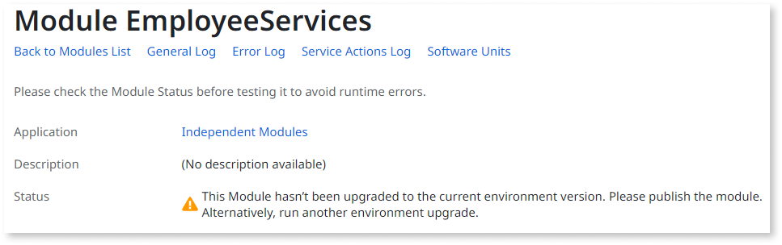
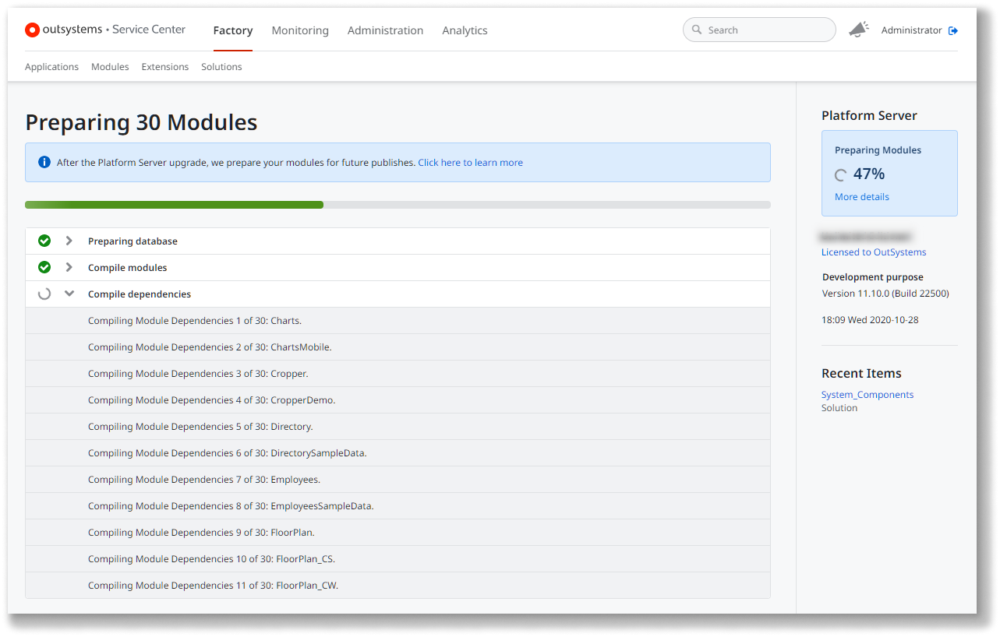
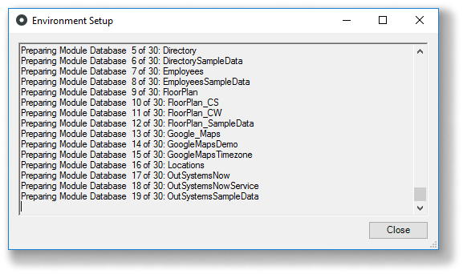
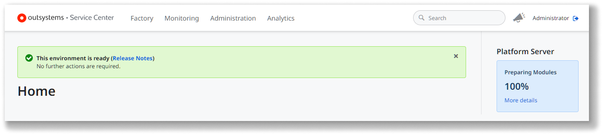

# Modules preparation step during Platform Server upgrade

Starting from **Platform Server 11.12.0**, the upgrade process includes a new **modules preparation** step.

When [upgrading your OutSystems environment](upgrade-platform.md#upgrade-ps) from **Platform Server 11.x** to **Platform Server 11.12.0 or later**, the Platform Server installation starts **preparing your modules** for the new version.

During this step, the Platform Server performs a **background compilation** of all your modules using the new platform version, but it doesn't deploy them. Your running applications aren't changed during the upgrade.

This enables you to **publish your applications gradually**, following your teams' pace, after the Platform Server is upgraded.

The modules preparation step only has effect over the **modules that were previously published with success** in the environment. Modules that were only uploaded, or never published successfully will not be compiled during this step.

For OutSystems Cloud environments, the modules preparation step takes place outside your maintenance window, as it doesn't require any downtime.

You must wait until the modules preparation step finishes to start publishing your applications.

See below how to [check the progress](#progress) of the modules preparation step.

## During the modules preparation step

While the modules preparation step is taking place, Service Center displays the step progress:

During this period, if you go to the detail screen of a module that hasn't yet been compiled with the new platform version, the module Status is the following:

Until the modules preparation step finishes, **you cannot** perform the following operations in the environment:

* Publish any application or modules
* Apply configurations
* Delete modules

The attempt to execute any of the above operations while the modules' preparation is in progress, results in an error.

### Checking the progress of the modules preparation step { #progress }

You can check the progress of the modules preparation step in any screen of the Service Center console of the environment (`https://<your_environment>/ServiceCenter`).

While the modules preparation step is in progress, Service Center notifies you that the environment has been successfully upgraded to a new Platform Server version, and the modules preparation step is taking place, showing the status of the operation:

To see the details of the modules preparation step, click the link **Click here for more details** on the blue banner, or the link **More details** on the sidebar:

In **self-managed installations**, you can also see the progress of the modules preparation step in the Configuration Tool, in the window that appears after pressing **Apply/Exit**:

## After the modules preparation step finishes

Once the modules preparation step finishes successfully, your environment is ready and you can start publishing your applications in the new version.

When you publish a module after the modules preparation step, the Platform Server uses the producers compilation generated during the preparation phase. This ensures all the code is updated, even if you haven't published those producers since the upgrade.

If some error occurs during the modules preparation step, [see here](upgrade-platform-errors.md) how to proceed.

After the modules preparation step finishes, you can always access the latest preparation step report going to the Service Center's screen `https://<your_environment>/ServiceCenter/PrepareModules.aspx`.
