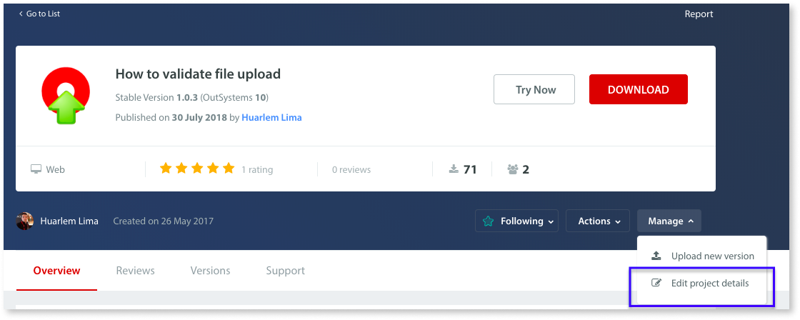
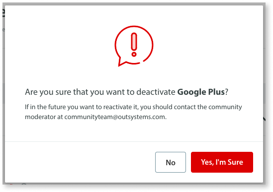

# How to remove a component from the Forge

For reasons related to security and intellectual property protection (IPP), users cannot remove their components from the Forge on their own. However, the owner of a component in Forge can request its removal. The Community team will evaluate each request and determine whether to remove the component on a case-by-case basis.

To request the removal of a component that you own, do the following:

1. Login to the Forge as the owner of the component.

1. Access the component that you want to remove.

1. Select **Edit project details**.

    

1. At the bottom, request the removal by clicking **Deactivate Component**.

    

1. Click **Yes, I’m Sure** to confirm the request.

    

If a removal needs to be done urgently, contact us by email: [communityteam@outsystems.com](mailto:communityteam@outsystems.com)

You will still be able to access all your deactivated/deleted components in your components list.

