# Sharing a project

## What project format should I use? { #formats }

The recommended format to share a project in Forge is using an **OutSystems Application Package** (.oap).

OutSystems Application Packages (.oap) are fully functional applications or assets. They have automatic installation and dependency management capabilities that provide the best possible experience for others in the community.

## How do I export an OutSystems Application Package for sharing? { #export-oap }

In Service Studio, on the main Development tab where the list of applications appears, click the application you want to open. On the application page where the modules appear, click **Download**.

Alternatively, you can download the application in the Service Center console:

1. To access Service Center, open the application in Service Studio, click the **Environment** menu, and select **Application Management in Service Center...**. This redirects you to the application details page in Service Center, under the **Factory** section.

2. On the application details page, click the **Download** button.

## How do I export an OutSystems Module for sharing? { #export-oml }

Open the module in Service Studio, click the **Module** menu and select the **Export > Save As...** option.

Alternatively, you can download the module in the Service Center console:

1. To access Service Center, open the module in Service Studio, click the **Module** menu and select **Module Management in Service Center...**. This redirects you to the module details page in Service Center, under the **Factory** section.

2. On the module details page, click the **Download Published Version** button.

## How do I upload an asset? { #publish }

Before uploading your OutSystems asset to Forge, make sure it follows [the best practices](https://success.outsystems.com/Documentation/Best_Practices/Development/Forge_components_best_practices).

Once your asset is ready, follow the steps below to upload it to Forge.

### Before you upload

1. Make sure you [remove the unused dependencies](https://success.outsystems.com/Documentation/11/Getting_started/Service_Studio_Tips_and_Tricks#Make_sure_you_Remove_Unused_Dependencies) from your asset.

1. [Download the application package (.oap)](#export-oap) for your asset. 

The [recommended format](#formats) for sharing is an application package (.oap). If the file is too big, consider compressing any used image files or resources. The maximum file size you can upload to Forge is 256MB.

1. [Download the application package (.oap)](#export-oap) of the [demo application](https://success.outsystems.com/Documentation/Best_Practices/Development/Forge_components_best_practices#demo). 

    Again, consider compressing any used image files or resources if the file is too big.

### Upload the asset to Forge

1. Log into [Forge](https://www.outsystems.com/forge/) and click **Upload asset**.

    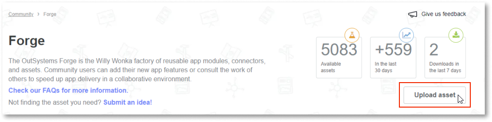

1. In the **Add file** section, upload the asset file that you previously downloaded and in the **Upload demo** section, upload the demo application file. Click **Continue**. 

    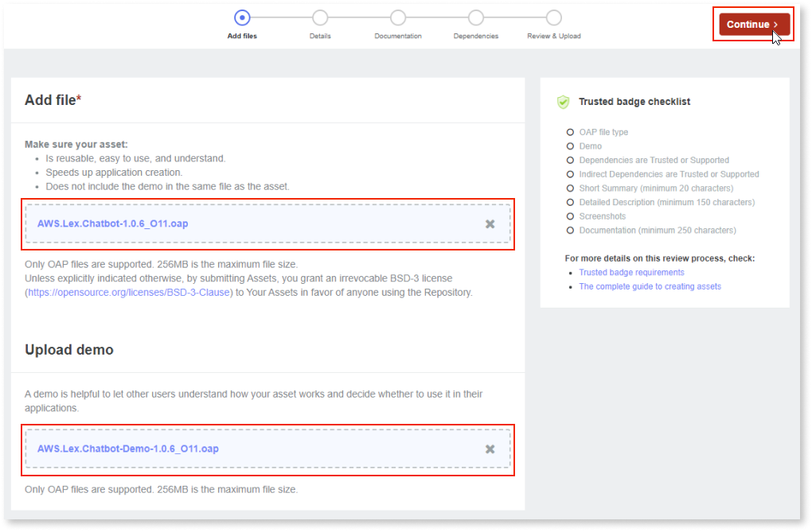

    The **Trusted badge checklist** is updated. Once all of the minimum requirements are fulfilled, you can request a badge.

    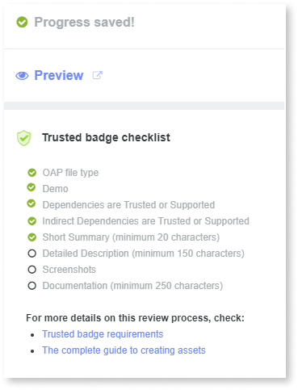

1. Enter the asset details.

    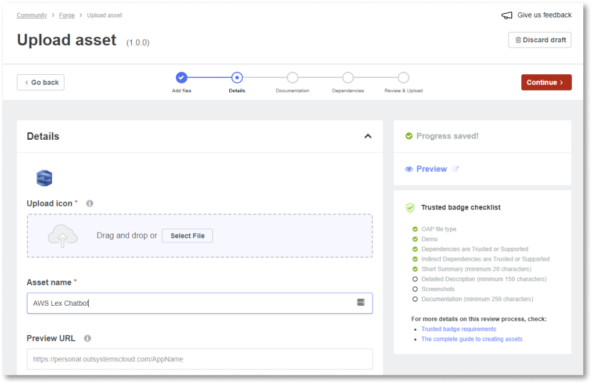

    * By default, the **asset name**, the **icon**, and the **description** are defined during development. You can change these descriptions after you publish your asset.

    * The **Preview URL** is the URL where everyone can try out your asset. The URL brings the user to a demo application that they can use without having to install the asset. We recommend you host your preview on a public server, such as a [Personal Environment](https://success.outsystems.com/Support/Licensing/What_is_an_OutSystems_Personal_Environment).

    * Select the **app type** - Reactive, Mobile, Service, or Web.

    * Upload **screenshots** that best illustrate the asset's features, main use cases, and behavior.
    
    * Enter a **detailed description** for your asset.
        
        Follow the [best practices](https://success.outsystems.com/Documentation/Best_Practices/Development/Forge_components_best_practices#name-desc) and make sure it fully describes the asset's features and options.

1. Enter the **version control and ownership details**. 

    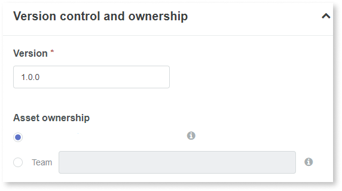

    * Enter the project version.
        
        Keep in mind that version numbers are unique. Forge suggests a version number, but you can change it. The version is visible on the main page and in the **Versions** tab. Assign an incremental number for each new version update so people can easily identify the latest version.

    * Select the platform version.

        **Note**: This applies to OutSystems version 10 and earlier.

        Under **Requirements**, Forge indicates the corresponding **Platform Version**. You can select the **Stack** and the **Supported Database**. This information helps users know if their environment is compatible with your asset.

        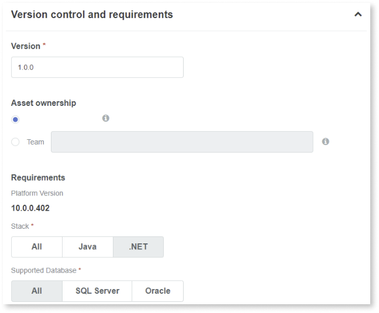

1. Enter the **categorization** details. 

    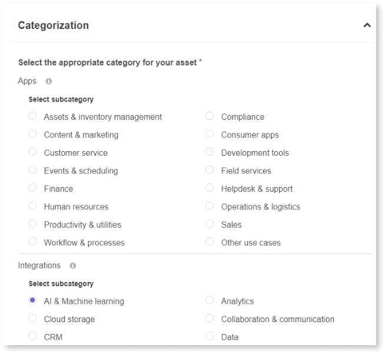

    * Select at least one subcategory within the category that suits your asset best. 
    
        The category helps users find your asset.

    * Add any relevant tags. 
        
        Tags help users find your asset and filter published assets.

1. Click **Continue**.

1. Add the asset documentation and click **Continue**.

    The documentation should provide guidance on how to install and configure the asset as well as general instructions on how to use it.

    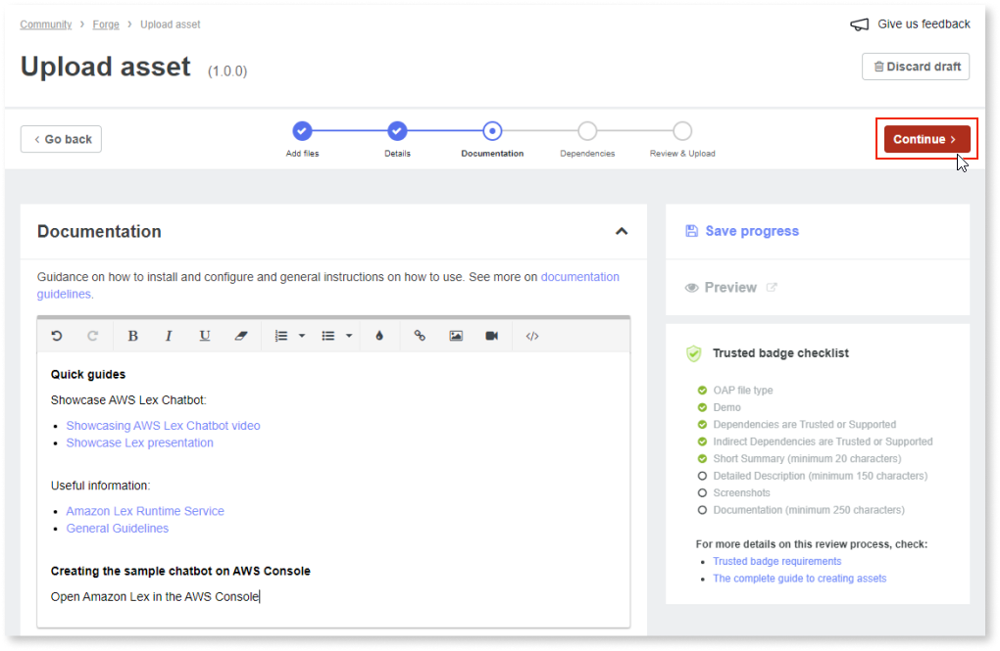

1. Review the asset dependencies and click **Continue**.

    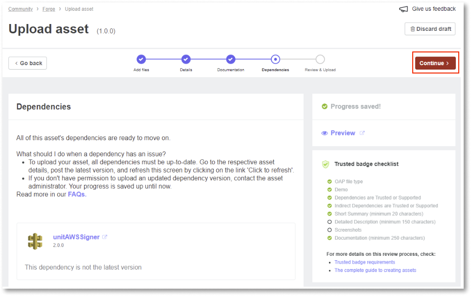

1. If your asset has a complete first version and is ready for use in production, click **Upload**. Alternatively, if you are still building the asset, but want to make it available to the community for testing, select **Upload as Under Development**.

    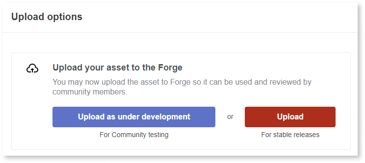

1. Confirm that you want to upload your asset.

    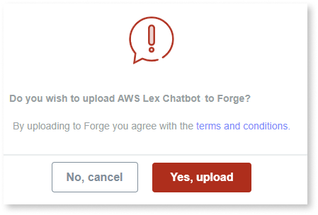

    Once your asset is uploaded, a confirmation message is displayed. 

    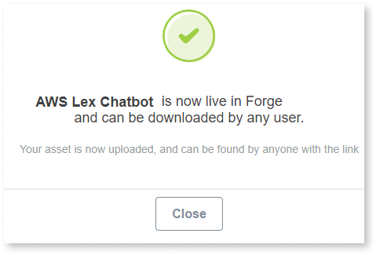
