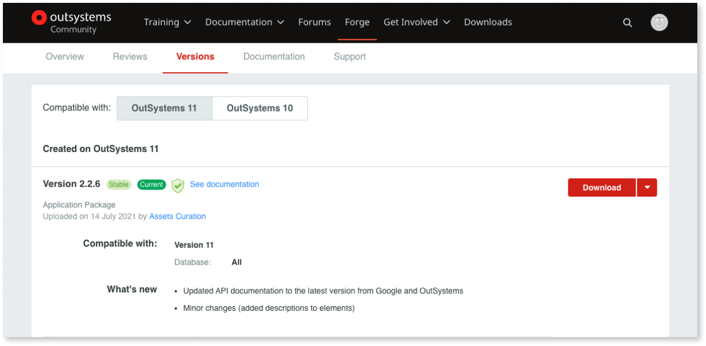

# Trusted asset requirements

[OutSystems Forge](https://www.outsystems.com/forge/) provides a large set of reusable assets that help accelerate application delivery. These assets are made available by our community users and by OutSystems.

When searching for assets in OutSystems Forge, take into consideration that some have a curation stamp - either **OutSystems Supported** or **Trusted**. Using the curated assets can ease your quality assurance process.

* **OutSystems Supported assets** - developed, maintained, and supported by OutSystems.
* **Trusted assets** - developed and shared by the OutSystems Community. Validated by the OutSystems Curation team to ensure these assets deliver the promised functionality and are built based on best practices.

This article describes the set of requirements that an asset shared in Forge must comply with to be considered a **Trusted** asset. To request a trusted badge for your asset, select **Request trusted badge** from the **Manage** dropdown.

If you want to share your asset with the OutSystems Community and have it trusted by the OutSystems Curation team, you must ensure that your asset complies with the requirements listed below.

## Requirements for trusted assets

Trusted assets must comply with quality standards within the following categories:

* Forge presence
* Installation
* Functionality
* Usability
* Implementation
    * Architecture
    * Security
    * Performance
    * Code maintainability
    * Compliance
* Support and maintenance

The following sections describe the requirements that trusted assets must meet for each category.

### Forge presence

The asset information in Forge must be clear and complete. For this, the asset must have the following characteristics:

* A meaningful name, a clear long description and a clear short description
* Correctly categorized and tagged
* Correct type (for example, Reactive, Mobile or Service Web)
* Correct requirements
* Screenshots
* Dependencies that are trusted or supported by OutSystems
* Documentation
* Demo
* Release notes (New versions of the asset must indicate in detail what changed and be correctly categorized and tagged.)

    

For more information on how to create clear and complete assets, see [Forge assets best practices](https://success.outsystems.com/Documentation/Best_Practices/Development/Forge_components_best_practices?_gl=1*nxd83y*_ga*MjI3NTY0NTA3LjE2NTk1MzQ4MzE.*_ga_ZD4DTMHWR2*MTY2MTg1NDk3My4zMy4xLjE2NjE4NTUxNzUuOC4wLjA)

### Installation

The asset must install successfully. For an asset to install successfully, the following requirements must be met:

* No missing dependencies
* No dependencies to other Forge assets that have been deprecated
* Documentation describing any type of additional configuration needed before using the asset (for example, Run Timers, Site Properties configuration, external services configuration).

### Functionality

The asset must work as expected. For this, the asset must have the following characteristics:

* Provide the described functional requirements, functions, and use cases
* Use functionality that's not deprecated, considering the features released by the latest OutSystems versions (for example, deprecated system actions)

### Usability

The asset must be easy to use. For this, the asset must include the following:

* Clear and concise documentation, describing the provided functionality
* Documentation of all actions (for example, Timers that run on publish or periodically)
* Documentation of any implementation pattern that's specific to the asset’s usage (for example, the need to use Blocks/Actions/Entities in a specific order)
* Clear and helpful description for all public elements
* When possible, have an associated demo asset showcasing all the provided functionality

### Implementation

Trusted assets must comply with the implementation best practices described in this section. The OutSystems Curation team uses the [AI Mentor Studio](https://success.outsystems.com/Documentation/11/Managing_the_Applications_Lifecycle/Manage_technical_debt/Code_Patterns) to perform the necessary validations.

#### Architecture

Assets comprising a whole application must follow the [best practices for application architecture design](https://success.outsystems.com/Documentation/Best_Practices/Architecture/Designing_the_Architecture_of_Your_OutSystems_Applications), which determines the organization of the application modules according to the layers described in the [OutSystems Architecture Canvas](https://success.outsystems.com/Documentation/Best_Practices/Architecture/Designing_the_Architecture_of_Your_OutSystems_Applications/The_Architecture_Canvas) (End-user, Core, and Foundation modules).

The asset architecture must comply with the following rules:

* End-user modules/applications don’t provide services
* Foundation modules/applications don’t consume Core modules/applications
* No cyclic references between modules/applications
* Core modules don’t provide services to sublayers
* Foundation modules don’t provide services to sublayers
* Expose Public Entities as read-only

For more information about  architecture, see [Code Analysis Patterns - Architecture](https://success.outsystems.com/Documentation/11/Managing_the_Applications_Lifecycle/Manage_technical_debt/Code_Analysis_Patterns#architecture).

#### Security

The asset must comply with the following security standards:

* Expand Inline properties in SQL Query Parameters are disabled or sanitized
* No unescaped/unencoded user inputs or screen variables (applies to Traditional Web only)
* Only enabled buttons are visible (to prevent enabling disabled buttons at runtime using development tools on a browser)
* Exposed REST services enforce SSL/TLS and require authentication
* No anonymous screens unless they are strictly necessary
* No APIs that send or collect data to external services out of the asset scope
* No functionalities that can be misused with malicious intent (for example, allow the upload and execution of binary files)
* No manipulation of system tables

For more information about security, see [Code Analysis Patterns - Security](https://success.outsystems.com/Documentation/11/Managing_the_Applications_Lifecycle/Manage_technical_debt/Code_Analysis_Patterns#security)

#### Performance

The asset must comply with the following performance best practices:

* Aggregates or SQL queries Count property is never used to check if results were returned
* SQL queries Count property is always used in simplified SQL queries
* No Aggregates or SQL queries executed inside a loop
* Site Properties aren’t updated using application login
* Long-running Timers follow a wake timer pattern to process big amounts of data in chunks
* No Server Request Timeout for server actions set to more than 10s (applies only to Reactive Web and Mobile)
* Avoid server calls on client events - On Initialize, On Ready, On Render, On After Fetch (applies only to Reactive Web and Mobile)
* Only one server request - Aggregate or Server Actions - inside Client Actions (applies only to Reactive Web and Mobile)
* Correct implementation of the offline sync patterns (applies only to Mobile)
* Server data is stored in the local database asynchronously (applies only to Mobile)
* No query data passing from Preparation to Screen Actions through the ViewState (applies only to Traditional Web)
* No screen Local Variables of type Compound or Collection (applies only to Traditional Web)

For more information about performance, see the [OutSystems Platform Best Practices - Performance](https://success.outsystems.com/Documentation/Best_Practices/Development/OutSystems_Platform_Best_Practices#performance).

#### Code maintainability

The asset code must be easy to maintain. For this, the following requirements must be met:

* Preparation and Screen Actions have less than 20 nodes, otherwise they must have Comments describing the logic
* Server Actions and Client Actions have less than 40 nodes, otherwise they must have Comments describing the logic
* No disabled code
* Extension assets have external libraries installed in Microsoft Visual Studio, preferably via NuGet Package Manager

For more information about code maintainability, see [Code Analysis Patterns - Maintainability](https://success.outsystems.com/Documentation/11/Managing_the_Applications_Lifecycle/Manage_technical_debt/Code_Analysis_Patterns#maintainability) 

#### Compliance

The asset must ensure license compliance. For this, all external libraries (JavaScript libraries in modules and libraries in extensions) must be used correctly according to their license terms.

### Maintenance and support

The asset must be kept up to date. For this, the asset must have the following characteristics:

* Available in the latest OutSystems version
* Description and documentation must be up to date with the latest asset version

The asset owner must provide the following required support:

* Reply to any comments or questions
* Solve the reported errors

