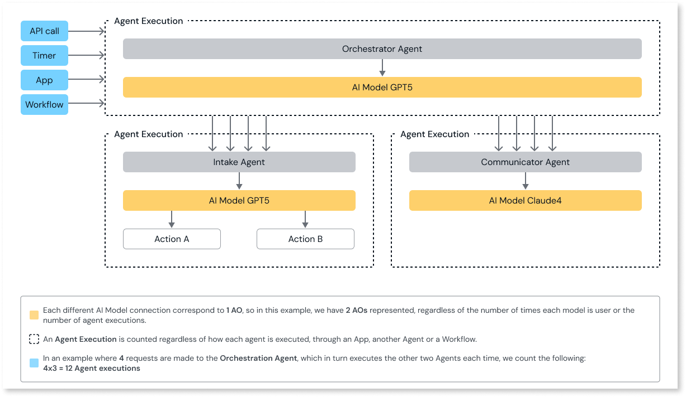

# Agent execution

An Agent Execution is counted each time the action CallAgent is executed in runtime. Independent of how many actions or tools the Agent is using or how many times it calls an AI model inside that loop, each call to the Agent is still only 1 Execution. The following diagram shows a detailed example of how Agent executions and AOs are counted:

