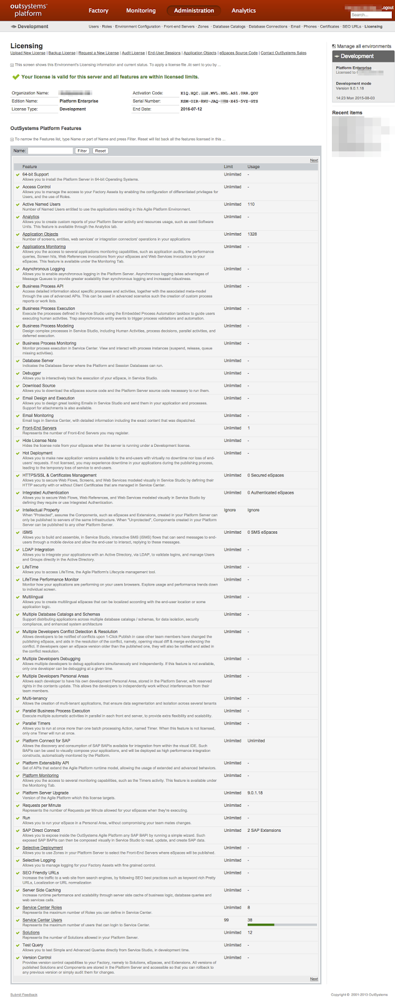

# Check what your license includes, and your effective usage

The license installed in an environment, define which feature are available and their limits. To **find out the licensing limits** of your environment, navigate to the **environment management console** at `http://<yourenvironment>/ServiceCenter`. Click the '**Administration**' tab, and navigate to the '**Licensing**' submenu.

There you can check:

* The maximum number of users, and how many users are currently registered;

* The maximum number of Application Objects or Software Units, and the amount you're currently using;

* And much more.

