# The detach process for OutSystems 10

This document is a step-by-step guide for extracting the source code of your applications (web and mobile) from the .NET version of OutSystems and how to set it up to be executed and maintained independently of OutSystems, if you ever decide to detach from it. This is a complement to the [OutSystems Platform – Standard Architecture with No Lock-in](https://www.outsystems.com/goto/standard-architecture-with-no-lock-in "https://www.outsystems.com/goto/standard-architecture-with-no-lock-in") content that gives a high-level view on how OutSystems, unlike other proprietary technologies and frameworks, generates standard, optimized, and fully documented .NET source code that does not require runtime interpreters or engines.

To extract the source code of your applications (web and mobile) from Java infrastructures check the [Detach process for Java](resources/OutSystems_10_-_The_Detach_Process_for_Java.pdf).

## Detach Process Overview

### If you're using the OutSystems Cloud

Detaching from OutSystems means you'll no longer be running on OutSystems Cloud. Instead, you'll be hosting a .NET application on a system you fully manage. The high-level overview of detaching from OutSystems Cloud is:

1. **Preparing to start detaching from OutSystems Cloud**
    
    OutSystems will need to enable you to start detaching and install the additional self-managed environment. This requires changes to the license of your OutSystems Cloud environments.
    Reach out to your account executive or account manager letting them know you're starting your detach process so he can proceed internally.

1. **Move your OutSystems Cloud production environment to a self-managed environment**
    
    This is the high level sequence of steps to move your production OutSystems Cloud environment to a hosting environment controlled by you:

    1. Install a brand new OutSystems environment to receive your applications.

        We advise you to install the environment with the exact setup you expect to have moving forward (number of front-ends, same database engine as your OutSystems Cloud, etc), as it will simplify the detachment and later maintenance of the system. To install a new OutSystems environment, always use the exact same OutSystems Platform Server major and minor versions. Refer to [Setting Up OutSystems](https://success.outsystems.com/Documentation/11/Setting_Up_OutSystems).

    1. Install your OutSystems applications in your new self-managed environment.

        Download all the applications from your production OutSystems Cloud environment and publish them to your new self-managed environment. Refer to [Creating and using an All Components solution](https://success.outsystems.com/Documentation/How-to_Guides/DevOps/Creating_and_using_an_All_Components_solution) for a simple way to perform this step.

    1. Move the data of your OutSystems Cloud applications to your new self-managed environment.

       Request to [Access the database of your OutSystems Cloud](https://success.outsystems.com/Support/Enterprise_Customers/Maintenance_and_Operations/Access_the_database_of_your_OutSystems_Cloud) and use that database user to copy data from the OutSystems Cloud into the self-managed database. Or you can implement API in your application that export the data and then call them from the new self-managed environment. Refer to [this article](https://www.outsystems.com/forums/discussion/14620/how-to-map-servicestudio-entities-to-actual-table-names/) to understand how to map physical table names in the database to OutSystems entities. 

    1. Confirm that your applications behave as expected in your new self-managed environment. 

        This may include functional and scalability validation. We advise not moving past this point until you are sure your self-managed system would be able to replace your OuSystems Cloud system at this point.

    1. Detach from OutSystems as self-managed.

        Proceed to the next sections in this article.

### For self-managed installations

The detach process applies when you wish to completely remove OutSystems. It’s not possible to detach only some applications from OutSystems while keep other applications still using the OutSystems platform infrastructure. To perform a complete detach, you will need to:

1. Guarantee that, before you start, you have all the requirements and followed all the recommendations from Chapter 2; 
2. Prepare the Application Server and Database Server according with Chapter 3; 
3. Detach, compile and deploy all individual modules and mobile apps as detailed in Chapter 4; 
4. Test the result application(s) without OutSystems as presented in Chapter 5. 

Make sure you read the full content of this document before you start to get a better overview of all the steps required and to better plan the process.

If at any step you run into a problem, you may need to repeat the previous steps until you get things working properly. Be careful and do not skip any instructions in the document to minimize the chance of making mistakes. In the case of not being able to proceed at any of those steps, you are free to contact OutSystems Support and we will happily help you.

## Before You Start

Do you want to evaluate the detach source code process? For the purpose of evaluating the detach source code process, OutSystems provides a Service Studio embedded tutorial to guide you through the process.  
The steps described in this document are to be used only if you decide to stop using OutSystems.  

Nevertheless, you can follow the steps below if you want to test the OutSystems detach capabilities. In that case, follow the detach process using a **brand new Application Server** and a **new database**. This will prevent unexpected behaviors on your existing OutSystems applications since the detach process will require changes to the applicational server (IIS) and to your database.

### What will you lose?

If you choose to stop using OutSystems, you will no longer have access to all the application development, management, and operation capabilities of the platform. Also, you’ll no longer benefit from the embedded change technology (ECT), performance monitoring and logging capabilities, which means you’ll have to implement such functionality by resorting to other tools. You will however retain all core functionality of the applications you developed using Service Studio and Integration Studio, although any changes made to the detached source are not supported by OutSystems anymore.

After detaching the source code of your applications, all OutSystems tools and services will become unavailable (including Service Studio, Integration Studio, Service Center, and Lifetime), along with all of their features for visual development and composition, services repository, integration adapters automatic generation, database and application hot deployment, configuration management and versioning, packaging and staging, automatic code containment and optimization, factory access control management, performance monitoring and analytics.

Also notice that this is a one-way street. Once you detach the source code and start developing your applications using Visual Studio or Eclipse, there is no reverse engineering process to get those applications back into OutSystems.

### Recommendations before you start the detach process

In order to minimize the risks of getting errors during and after the detach process:

* Ensure that OutSystems applications are running with the expected behavior. Since OutSystems capabilities are lost, it will be more difficult to fix the majority of the problems after the detach. 
* Update to the latest release of your OutSystems version to benefit from having all known bugs for that specific version fixed; This translates to having the latest Release of your **M**ajor. **m**inor. **R**elease. **r**evision version installed correctly. 
* Detaching Development source code and deploying it to a Production Environment is not a valid process, as the generated code is different for each environment: the generated code considers the environment where it was compiled and the corresponding database. If you want to do this, first you need to stage your applications from one environment to another and only then you can proceed with the detach. 

#### Personnel requirements

Since you will lose most of the OutSystems capabilities, you must guarantee that your personnel:

* Fully understands the complete life cycle of .NET applications; This includes understanding how to create, modify and deploy those applications, as well as creating and managing the references between them while having a good understanding of IIS. 
* Has access to the Database Server and have the ability to modify the existing data; During the detach process, it is necessary to change some of the OutSystems metadata. This is typically done by a DataBase Administrator (DBA); 
* Knows how to develop, build and deploy Android and/or iOS apps (applies to mobile apps only). 

### OutSystems Scheduler Service

If you are using Timers or BPT Activities in your applications, you will be able to keep this functionality even after detaching. Unlike other OutSystems services, the source code of the Scheduler Service will be provided for this purpose, just contact OutSystems by opening a Support Case and requesting it.

To compile the scheduler, open the **Scheduler.sln** file, located in the Scheduler directory, with Visual Studio and build the solution. After that, open the Developer Command Prompt for Visual Studio, go to the `\Scheduler\bin\Debug` folder and execute `installutil scheduler.exe`. This will install a service called Detached Scheduler Service. To uninstall it, run `installutil /u scheduler.exe`. If any problem happens, check the scheduler logs in the Event Viewer.

If you are installing the Scheduler Service in an Application Server that never hosted the OutSystems Platform Server, you must copy the plugins folder (`C:\Program Files\OutSystems\Platform Server\plugins`) from a Platfrom Server instalation.
If the plugins folder and its content is not available, it will not be possible to run the service after the installation.

If you choose to re-implement these services using external tools you can later remove this dependency manually.

### Understand how OutSystems structures the code

When you deploy an application module using 1-Click Publish operation, a standard .NET application is generated by the OutSystems Compiler. This is what is provided when you detach an application and download the source code.

The code is structured in the following folders:

* **DatabaseAbstractionLayer** – the Interfaces and base code responsible for allowing the Platform access and manage the data from the database. 
* **DatabaseProviders** – 
    * **iDB2DatabaseProvider** – the iDB2 implementation of the DatabaseAbstractionLayer used by the platform when connected to an iDB2 database 
    * **MySQLDatabaseProvider** – the MySQL implementation of the DatabaseAbstractionLayer used by the platform when connected to a MySQL database 
    * **OracleDatabaseProvider** – the Oracle implementation of the DatabaseAbstractionLayer used by the platform when connected to an Oracle database. 
    * **SQLServerDatabaseProvider** – the SQLServer implementation of the DatabaseAbstractionLayer used when connected to a SQLServer database. 
* **OutSystems\.RuntimeCommon** – the basic runtime code used by all runtime libraries and modules. 
* **Plugin\.SAP** – 
    * **Runtime** \- runtime code responsible for consuming SAP services 
    * **RuntimeAPI** – API exposed to extend the SAP functionalities 
    * **SapNcoConnectionManager** – wrapper for the SAP .NET Connector libraries 
* **Plugin\.Widgets\.Runtime** – the runtime code for the various custom web controls using the WidgetsRuntimeAPI 
* **&lt;Project Name&gt;** – the module’s source code. 
* **REST\.RuntimeAPI** – used to consume REST services and to extend REST behaviors using extensibility. 
* **RESTService.Runtime** – the runtime code used to expose REST services 
* **RuntimePlatform** – the Platform’s runtime code used by the module. 
* **SMSInterface** – the runtime code to deal with SMS. 
* **ThirdParty** – Third party components that are necessary for the applications to work 
    * **EXIFExtractor** – the EXIFextractor is a .NET component which allows the extraction and manipulation of image files information. 
    * **GemboxSpreadSheet** – the GemboxSpreadSheet .NET component which enables developers to write, read or convert spreadsheet files (XLS, CSV, XLSX, HTML or ODS) from their .NET applications. 
    * **ICSharpCode.SharpZipLib** – the SharpZipLib which is a .NET compression library used by the generated applications. 
    * **Json\.NET** – the Newtonsoft Json\.NET is a library to serialize and deserialize between \.NET objects and JSON formats. 
    * **SAP** – the SAP\.NET Connector libraries used by the SapNcoConnectionManager project. 
    * **WebApi2** – the ASP\.NET Web API is a framework that makes it easy to build restful HTTP services. 
* **WebWidgets** – the runtime code for the various custom web controls 
* **WidgetsRuntimeAPI** – framework to allow building custom web controls   

      
    Figure 1: Code Structure of a generated Application.

In the application folder (&lt;Project Name&gt;) there is a set of packages that hold the different types of code. These folders are

* **Actions** – the code generated for both built-in actions and functions, and user actions and functions; 
* **Blocks** – the code generated for both built-in and custom web blocks; 
* **Entities** – the code to manage entities; 
* **Structures** – the code to manage structures; 
* **ProcExc&lt;ProcessName&gt;** – the code generated for processes; 
* **Exceptions** – the declaration of user defined exceptions; 
* **Roles** – the code to support role based security enforcement; 
* **TypeFactory** – the code used by consumers of the module so they can access the referred elements; 
* **WebServices** – the code to support all Web Services exposed by your module; 
* **WebReferences** – the code to support all Web Services consumed by your module. 

## Preparing Your Systems to Run Detached

### Preparing the Application Server to deploy the Generated Code

The machine that will run the detached applications must be prepared to that purpose. Making sure that all the requirements are met minimizes the chance of failure of this process.

Some web services of OutSystems communicate inside the machine through the HTTP protocol. This requires the machine to access itself using HTTP protocol, on port 80, in its local IP address, 127.0.0.1, most commonly known as localhost.

You must guarantee that this is correctly configured, even if you only want to use HTTPS to access your applications.

To check it:

1. From Windows Start Menu search for ‘IIS’ and open ‘Internet Information Services (IIS) Manager’. 
2. In the left pane tree expand the following items:

    * **&lt;your machine name&gt;** 
    * **Sites**
    * **Default Web Site** 
          

3. Make sure that there is a binding for the HTTP protocol on port 80 for IP address 127.0.0.1 at least. It is recommended that you an asterisk (*) instead as that means all IP address can access it. Leaving only the 127.0.0.1 address will mean that it can only be accessed locally.   

    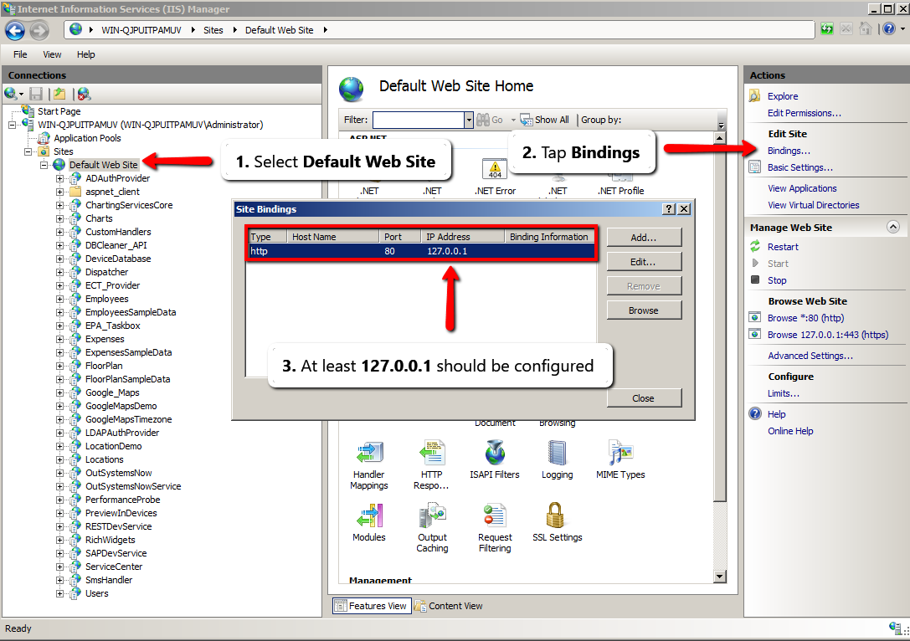

If you are using the same Application Server that previously hosted OutSystems check Section 3.1.1. Otherwise, if a brand new Application Server is going to be used, configure it according with Section 3.1.2.

#### Using the Application Server that previously hosted OutSystems

If you are using the same Application Server that has OutSystems correctly installed, your machine is already well configured to detach the code, but you need to change the data model on OutSystems Database server.

This occurs because after uninstalling OutSystems all related files and folders are deleted. For that reason, you need to change where Cache Control should now be done. To do that:

1. Update the cache files path in the **OSSYS\_PARAMETER** table of the OutSystems database.   
`C:\Windows\Temp` represents a path where any user can write – it can be replaced by another, if needed.

    
        update ossys_parameter
        set val = 'C:\Windows\Temp'
        where name = 'Cache.ControlPath' 
    

In case of having SEO Friendly URLs, you will need to remove the ISAPI Filter, since SEO Rules will no longer work after detaching. To accomplish that:

1. Inside IIS (check Section 3.1), click on your **Default Web Site**.

2. In the middle-pane, find **ISAPI Filters** and double-click it.   

    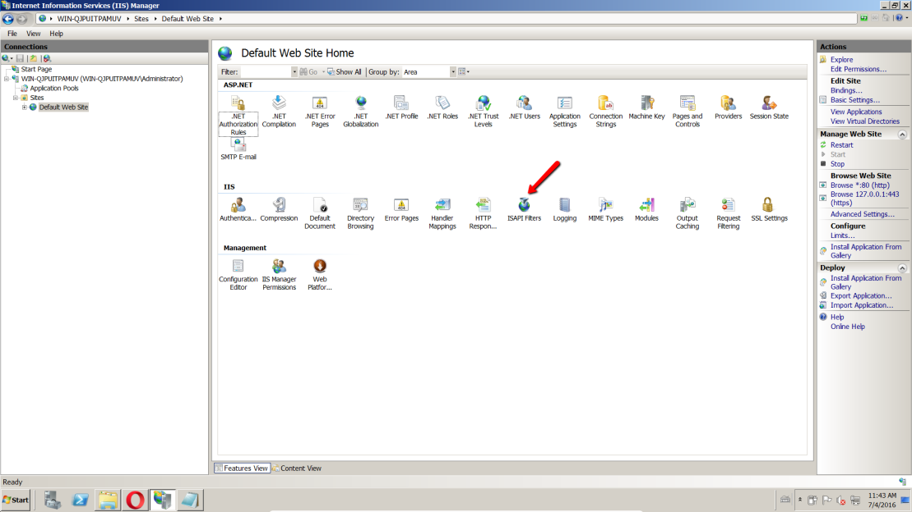  

3. Search for OutSystems **ISAPI Filter** and delete it.   

    

#### Using a brand new Application Server

If you want, you can deploy your module in a new server where you never installed OutSystems. If you’re not considering this option skip this section.

For the new Application Server to accommodate your applications, you must first set up the server with the needed configurations, as if you were installing OutSystems, skipping the OutSystems installation itself.

To do this, you will need to either decommission the OutSystems server, or get a database copy to use with the new server.

Proceed as follows:

1. Install IIS component (as described in the [installation checklist](http://www.outsystems.com/goto/checklist-10-NET "http://www.outsystems.com/goto/checklist-10-NET")). If you want to use Visual Studio remotely (from a workstation) install also Frontpage Extensions; 

2. Install .NET Framework 4.5.2 or above and configure it for use with IIS. Use the instructions in the install checklist; 

3. Install Message Queuing component. Use the instructions in the install checklist; 

4. Start Windows Management Instrumentation service; 

5. Configure the Default Web Site in IIS to use .NET Framework 4.0; 

6. Update the data model in the OutSystems server:

    1. Update OSSYS_SERVER entity. Replace  **new_hostname** with the output of the **hostname** command ran in a command line (in the new server). 
        
            update ossys_server
            set name = 'new_hostname'
            where name = 'old_hostname'
        

    2. Update OSSYS_PARAMETER entity. Replace  **new\_hostname** with the output of the **hostname** command in a command line (in the new server) and  **old\_hostname** with the output in the old server. `C:\Windows\Temp`  represents a path where any user can write – it can be replaced by another, if needed. 
        
            update ossys_parameter
            set host = 'new_hostname'
            where host = 'old_hostname'  
                
            update ossys_parameter
            set val = 'C:\Windows\Temp'
            where name = 'Cache.ControlPath' and host = 'new_hostname' 
        

7. Copy the _&lt;appSettings&gt;_ from _machine\.config_ of the machine that previously hosted OutSystems to the _machine\.config_ file of the new machine. To do this: 

    1. Locate the _machine.config_ files for .NET Framework 4.0, on both the old and the new server.   
    Open them with a text editor;

        * On 64-bit machines you should update both the 32 and the 64-bit configuration files. These are usually available in the following locations:   
        `%WINDIR%\Microsoft.NET\Framework\v4.0.30319\CONFIG\`  
        `%WINDIR%\Microsoft.NET\Framework64\v4.0.30319\CONFIG\`  

    2. Locate the _&lt;appSettings&gt;_ tag from the _machine\.config_ of the machine that previously hosted OutSystems and copy its content.   
                
            <appSettings>  
            …  
            </appSettings>

        Note that actual tag contents may vary, and even include settings that are not related to OutSystems. As a rule of thumb we recommend that you copy only the entries (keys) with the “OutSystems” prefix.  

    3. Locate the _&lt;appSettings&gt;_ tag from the _machine\.config_ of the new Application Server and paste the content inside this tag.   

8. Configure the **DefaultAppPool** to run as **Local System**. This is needed at least for first-time run, since some settings are written in the registry. To accomplish that: 

    1. Open IIS Manager (see section 3.1) and expand the menu of your machine.

    2. Search for **Application Pools** and double-click it.

    3. In the middle-pane, find **DefaultAppPool** and right-click it and open **Advanced Settings…**.

    4. Inside **Process Model**, find the **Identity** field. By clicking it a button with … will appear.   
    Click on it.

        

    5. Inside **Application Pool Identity**, select **Built-in account** and choose **LocalSystem** from the options provided.

        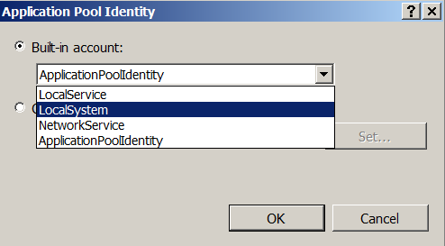

### Preparing the database to host the data of your applications

Your application data will be preserved either in the same databases/schemas and database server, or by moving the databases/schemas from the current database server to a new one. In case you are keeping the same database follow the procedure of section 3.2.1, on the contrary, if you are moving database server go to section 3.2.2.

#### Using the Database that previously kept the OutSystems data

OutSystems encrypts sensitive configuration data such as passwords. To secure that data, an encryption key was generated when you installed OutSystems.

That key is stored in the _private.key_ file under the Platform installation folder (`C:\Program Files\OutSystems\Platform Server`). To allow your application to decrypt sensitive data you need to ensure that it uses that key.

By default, your application will use the _private\.key_ file located in the Platform installation folder and after uninstalling it will be removed. For that reason, create a copy of the _private\.key_ file in a path where an IIS user can read and change the configuration file accordingly. To change the configuration file:

1. Locate the _machine\.config_ files for .NET Framework 4.0, on both the old and the new server.   
Open them with your favourite text editor;

    * On 64-bit machines you should update both the 32 and the 64-bit configuration files. These are usually available in the following locations:   
    `%WINDIR%\Microsoft.NET\Framework\v4.0.30319\CONFIG\`  
    `%WINDIR%\Microsoft.NET\Framework64\v4.0.30319\CONFIG\`  

2. Under _&lt;appSettings&gt;_, locate the _&lt;add&gt;_ element with the _key = "OutSystems\.HubEdition\.SettingsKeyPath(DEFAULT)"_.  
Change the value attribute of this element to point to the new location of the _private.key_ file.

#### Using a brand new Database

If you will use a new database, you have to manually reconfigure your database connection strings. To do this:

* Locate the machine.config files for .NET Framework 4.0, on both the old and the new server.   
Open them with a text editor;

    * On 64-bit machines you should update both the 32 and the 64-bit configuration files. These are usually available in the following locations:   
    `%WINDIR%\Microsoft.NET\Framework\v4.0.30319\CONFIG\`  
    `%WINDIR%\Microsoft.NET\Framework64\v4.0.30319\CONFIG\`

* Change the connection strings under _&lt;appSettings&gt;_. You will not be able to use them since their value attribute is encrypted, hence the need to convert them to plain text format. These strings vary with the different database providers and are provided in Section 6.1. There are 7 connection strings to declare. You can find them searching for the values presented in the table in the key attribute:   

    |**Connection** |
    |---|
    |OutSystems.DB.Application.Log.ConnectionString| 
    |OutSystems.DB.Application.Runtime.ConnectionString|  
    |OutSystems.DB.Application.Session.ConnectionString| 
    |OutSystems.DB.Services.Admin.ConnectionString| 
    |OutSystems.DB.Services.Log.ConnectionString| 
    |OutSystems.DB.Services.Runtime.ConnectionString|  
    |OutSystems.DB.Services.Session.ConnectionString| 
  
    An example using SQL Server and one of the connection strings is provided:
    
        <add key="OutSystems.DB.Services.Log.ConnectionString"
            value=" User ID={LogUser};Password={LogPassword};Data Source={Server};Initial Catalog={Database}; />
    
    Depending on the connection string, you must use the corresponding user and password. For the example given, the Log user was used since it was the one referenced.  

* In the OutSystems database, find the OSSYS_DBCONNECTION table. You need to update the DATABASE_CONFIGURATION connection string since it is encrypted by OutSystems. Use the same user that is configured in Service Center for that Database Connection. Change the connection string to the following format: 

        ProviderKey=SqlServer
        <DBConfiguration><ConnectionStringOverride>{CONNECTION_STRING_IN_PLAIN_TEXT}</Co nnectionStringOverride></DBConfiguration>
    

    In order to create a correct `{CONNECTION_STRING_IN_PLAIN_TEXT}`, follow the Section 6.1.

## Detaching an Application from OutSystems

This chapter covers how to detach, compile and deploy a single module.

In order to have a system that replicates your previous factory, you must deploy all the applications published by OutSystems. This way you guarantee that all dependencies are met, further reducing the chances of failure.

Since there are some specific OutSystems applications for application and environment configuration and management, like Service Center and Lifetime, those cannot be detached.

If your OutSystems is running on the OutSystems PaaS, in order to detach the source code of your applications, first you need to build a hybrid deployment, where you installed one OutSystems environment either on-premises or on another public cloud.

You must follow sections 4.1 to 4.6 for a successful detach of all modules. This includes OutSystems modules that your applications, most likely, depends on, like RichWidgets and Users applications.

### How to get the source code of an application

#### Web applications

To obtain the source code of a web application module, open the Licensing page under the Administration tab in Service Center and detach the source code as follows:

1. Click on ‘eSpaces Source Code’. 

    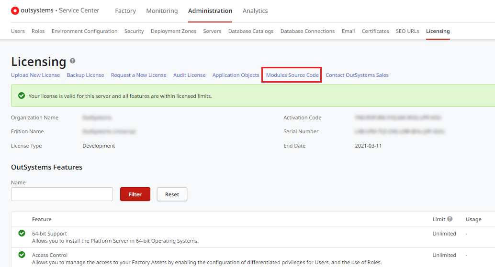  

2. Click on ‘Detach’ for the module whose source code you want to obtain. 

    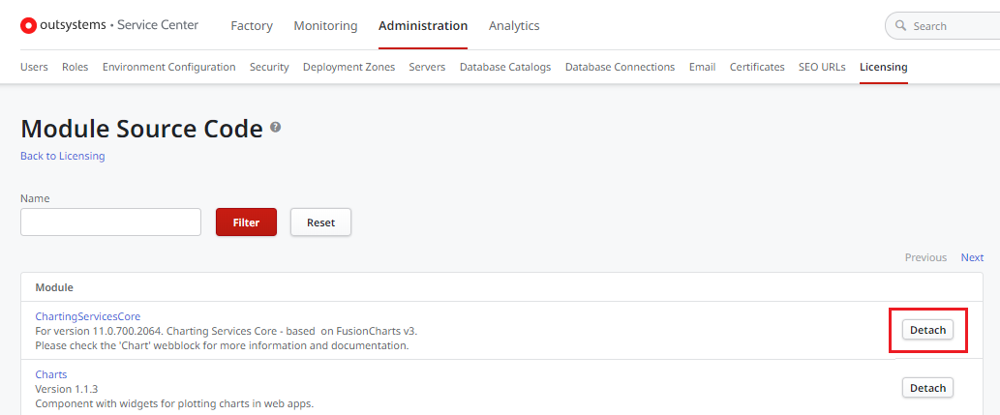  

3. Wait until OutSystems has finished packing the module source code and click on ‘Download’.   
    
    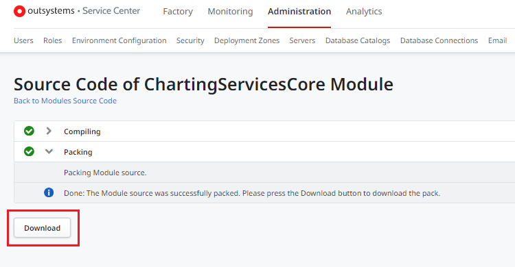

4. Save the zip file and extract it. 

#### Mobile apps

To fully detach a **mobile** app from OutSystems you will need to:

* Detach the back-end source code of the mobile app by following the same procedure outlined in section 4.1.1 (Web applications), selecting the eSpace corresponding to your mobile app when doing the detach; 
* Detach the native app source code used to build the installable APK or IPA application package (known as the ‘native shell’) by following the procedure presented below. 

You will need to obtain and deploy/build these two detached components to get a fully working mobile app detached from OutSystems.

  
To obtain the native app source code of an Android or iOS mobile app, open the Applications page under the Factory tab in Service Center and proceed as follows:

1. Search for the application corresponding to your mobile app and click on its name to go to the detail page.

    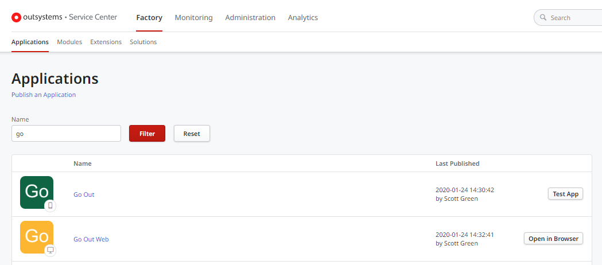  

2. In the Native Platforms tab click in the ‘Download source code’ icon for the desired platform build (Android or iOS).

    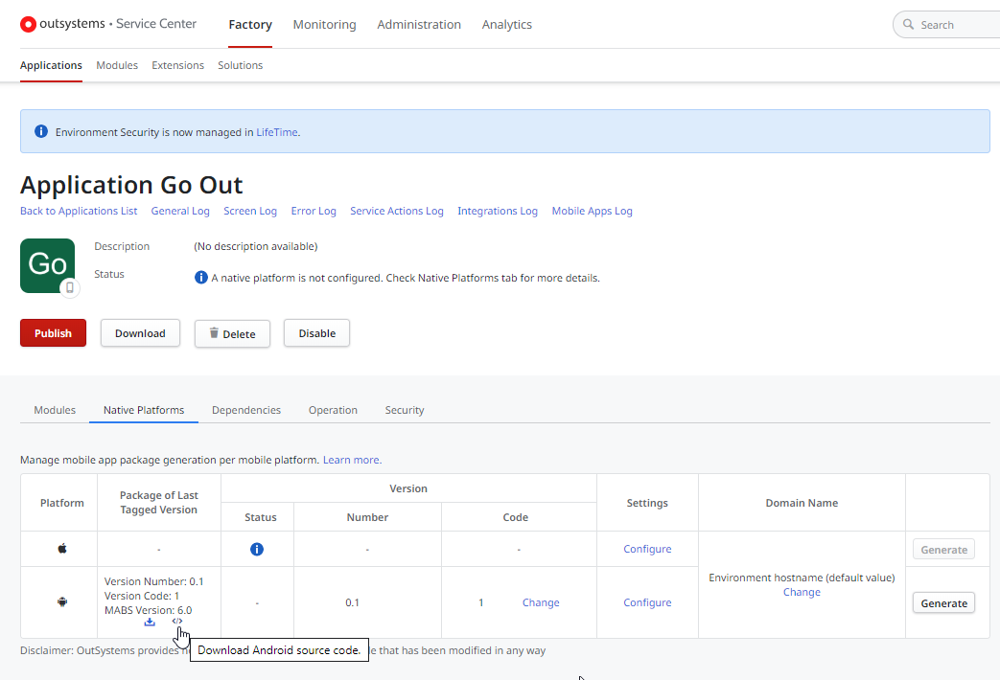

3. Save the tar\.gz file and extract it. 

The obtained source code corresponds to the source code of the most recent build of the mobile app for the selected platform.

**Note:** The mobile app source code is only kept for 7 days after a successful build. You will need to generate the mobile app again if the last build was made more than 7 days ago.

### Compiling and Deploying Applications

#### Web applications

Before you open the application’s solution in Visual Studio, you need to make sure that no application or module publication has occurred in the local machine or otherwise you will get errors. To do this, check for any existing application publication data in Internet Information Services (IIS) and clear it out with the following steps:

1. From Windows Start Menu search for ‘IIS’ and open it. 
2. In the left pane tree expand the following items:

    1. **&lt;your machine name&gt;**

    2. **Sites** 

    3. **Default Web Site**   
    
          

3. Look for a virtual directory (  ) that has the same name has the module you have detached and remove it; either by clicking on it and then pressing the Del key, or by right-clicking on it to open the popup menu and then choosing the ‘Remove’ option.

    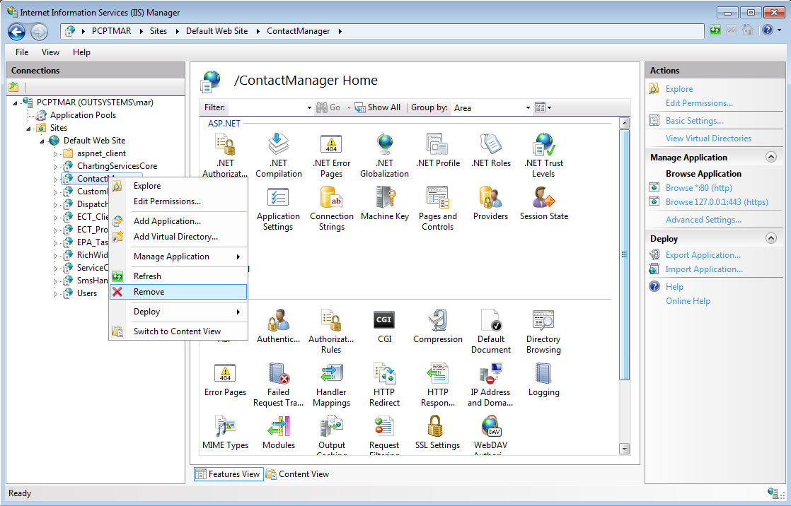

If your application uses the OutSystems SAP plugin, then the SAP .NET Connector libraries have to be manually added to the detached source code. To ensure that the application compiles successfully, you need to copy the _sapnco.dll_ and _sapnco\_utils.dll_ files, located in the _\thirdparty\lib\\_ folder in the Platform Server installation directory, into the _ThirdParty\SAP_ folder that came with the detached source code.

In order to deploy applications to IIS, you will need Visual Studio 2015 with Visual C# and Web components. To deploy your applications, proceed as follows:

1. Open the **&lt;Project Name&gt;.sln ** file that is provided in the extracted source code of the detached application. If using Visual Studio Express, choose Web Developer option.

2. Execute the Visual Studio’s Build Solution command to compile your application.

3. Execute the Visual Studio’s Publish **&lt;Project Name&gt;** command to publish your application to IIS by creating a **Custom** profile. When asked choose the Custom option and give a name to the profile.

4. Configure the new profile:   

      

5. After a successful publication, open IIS (see section 4.3.2) and search under your **Default Web Site** for the virtual directory with the name of your published module and click on it.

6. Make sure that your application is running under an Application Pool that uses .NET 4.0.   
To change the application pool of the underlying web site, select the web site and in the Actions pane click on Basic Settings. Click Select, and select an application pool that is configured to use .NET 4.0.

#### Mobile apps

**Before you start**  
If you detached the back-end source code of the mobile application and deployed it outside OutSystems, update the back-end endpoint in the _&lt;extract_path&gt;\source\config.xml_ file by changing the following entries:  

_&lt;content src="https:// ** &lt;new_endpoint_hostname&gt; ** /MyAppName/" /&gt;_  
_&lt;preference name="DefaultHostname" value=" ** &lt;new_endpoint_hostname&gt; ** " /&gt;_

##### Android mobile apps

To build a detached Android mobile app you will need:

* [Android Studio](https://developer.android.com/studio/index.html "https://developer.android.com/studio/index.html") installed in your computer.

* **Android SDK** (it should have been installed together with Android Studio).

* (optional) **Your own keystore to sign generated app packages (APKs)** . If you don’t use a specific keystore, a default keystore will be used to sign the app. You may encounter issues in updating applications when you generate the mobile app in different machines without using your own keystore, since each machine will have its own default keystore. 

Build your Android app by following these steps:

1. Open Android Studio; 
2. Click on the ‘Open an existing Android Studio project’ option and select the   
_extract_path&gt;\source\platforms\android_ folder;

3. When the Gradle sync operation finishes, choose one of the following: 

    * Build > ‘Build APK’ menu option to generate an application package signed using a **default keystore** ; OR 
    * Build  > ‘Generate Signed APK…’ to generate an application package signed with **your own keystore** (you will be asked for some data related to the keystore). 

##### iOS mobile apps

To build a detached iOS mobile app you will need a Mac with [ Xcode ](https://developer.apple.com/xcode/ "https://developer.apple.com/xcode/") installed. You will also need an Apple Developer or an Apple Enterprise Developer account to test your mobile app on an real iOS device.

To build the app and run it on your device, do the following in Xcode:

1. Open the _&lt;your_application_name&gt;.xcodeproj_ project file available in   
_&lt;extract_path&gt;\source\platforms\ios folder_;

2. Make sure that your Apple ID is correctly set up in Xcode so that it is associated with your Apple Developer account; 

3. Make sure that you have defined your team (set it in Project editor > ‘General’). If your Apple Developer account doesn’t have any provisioning profiles or certificates yet, Xcode should create a team provisioning profile and a development certificate for you; 

4. Connect your iOS device to your Mac; 

5. Select your connected device as the target in the ‘Scheme’ toolbar menu; 

6. Click the ‘Run’ button. 

Xcode will build and install the app on the device and then launch it.

### Custom Database plugins

OutSystems already includes database plugins that come within the source code of the detached application. In case of having custom plugins, put those inside the _&lt;your_application_name&gt;/bin_ folder of the detached application. In Visual Studio add a reference from the detached project to the database provider assembly that you just copied to the bin folder.

### Extensions

Extension modules don’t generate source code. As such, source code for custom extensions are always available for detachment and reuse. Just use Integration Studio, as usual, to open and compile the source code using Visual Studio.

### Microsoft Excel files

If your application handles, either reads or writes, data stored in MS Excel files, you will have to change the _SetLicense()_ method.

This can be found on _RuntimePlatform/GemBoxLicensing.cs_ file of the detached source code project. Set the method to use your own Gembox Spreadsheet license.

In case of not having such a license, you can use the limited Gembox Spreadsheet free edition. Although this license offers the same performance as the paid version, there are limitations in the number of rows per sheet, and the number of sheets per workbook. You should investigate these values further, as they are subject to change.

### Managing .NET references

When publishing an application, OutSystems automatically compiles that specific module and also its references. It then propagates the files generated from the referenced application to the application that references them.

Take as an example application A that uses a web block of application B. Application B is referenced by application A. When publishing application A, first OutSystems compiles application B and uses the files generated in that compilation to be used as reference to application A. Only then does OutSystems compiles and deploys application A.

When you detach an application, you lose this automatic procedure and you will need to perform those steps (either manually, creating scripts or by managing references through Visual Studio). This means that, after you detach, when you modify application B and then publish application A without any other action, the changes made were not reflected.

In order to manage the references manually:

* Compile the referenced application, in this case only application B. 
* Go to the Application B/bin folder and copy all the .dll files. 
* Paste the content to Application A/bin folder. 

Now application A is ready to be compiled and deploy. This procedure is the same as described in section 4.2.

If an application depends on another applications, you might need to deploy all its dependencies in order to guarantee that it keeps working correctly.

## Final Steps

When all applications have been successfully published, it is recommended that you test everything first before uninstalling OutSystems Platform Server. If you moved from Application Server, skip section 5.1 and test your applications, since no uninstallation needs to be performed.

### Before uninstalling

If no error was found there’s a great chance you followed everything correctly, nevertheless some errors may appear when you uninstall the OutSystems Platform Server. To safely test this without having to reinstall everything follow this steps:

* Stop all OutSystems services; 

* Store a copy of `C:\Program Files\OutSystems\Platform Server` on another location. After that, you can either change the name of `C:\Program Files\OutSystems\Platform Server`, for example to `C:\Program Files\OutSystems1\Platform Server` or simply delete this folder. 

* If you are keeping the Scheduler Service after the detach you must keep the plugins folder in its original location (for example `C:\Program Files\OutSystems\Platform Server\plugins`) even after the Platform Server is unistalled and the detach process is complete.
If the plugins folder and its content is not available, it will not be possible to run the service.

This way you can simulate an uninstall and you should be able to access all your applications.

### Testing

Test your application extensively to guarantee no errors are found. If any issue is found, repeat all the steps to confirm that you didn’t miss any. If the error persists, contact OutSystems Support.

When you are sure everything is working correctly and no OutSystems files are present (other than the ones we asked you to keep), you have successfully performed the detach.

If you changed the name of the folders where OutSystems server was installed, to uninstall you must change the names back to the original values.

If you are keeping the Scheduler Service after the detach you must keep the plugins folder in its original location (for example `C:\Program Files\OutSystems\Platform Server\plugins`) even after the Platform Server is unistalled and the detach process is complete.
If the plugins folder and its content is not available, it will not be possible to run the service.

## Appendix

### Connection strings

When you need to convert your connections string to plain text, use the corresponding string according with your database provider(s).

An example is provided so that you can easily map the placeholders from the **Configuration Tool**, which can be found under **Windows Start Menu -> OutSystems -> Administration Tools** .

If it is an external database connection, you can get the same information accessing **ServiceCenter - > Administration -> Database Connections**, since the names are exactly the same.

Do not forget to change the placeholders, wrapped around curly brackets `{}`, with your own information. Also, each connection string refers to a different User; this mean that for each string you must check which User it refers to.

#### MySQL
    
    Server= **{Server}** ;Database= **{Schema}** ;Uid= **{User}** ;Pwd= **{Password}** ;Allow User Variables=true; ConnectionLifeTime=6000; ConnectionReset=true;

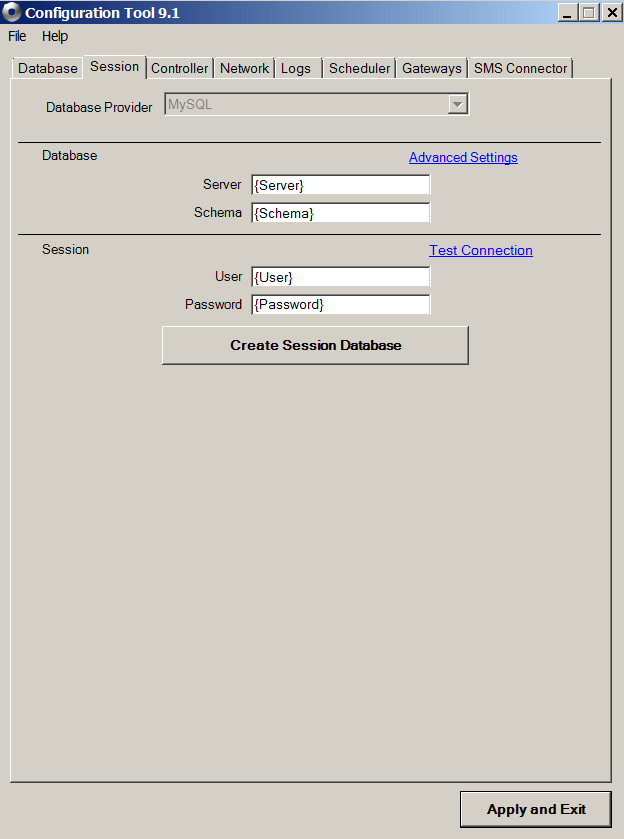

#### Oracle 
    
    User ID= **{User}** ;Password= **{Password}** ;Data Source= (DESCRIPTION=(ADDRESS=(PROTOCOL=TCP)(HOST= **{Host}** )(PORT= **{Port}** ))(CONNECT_DATA=(SER VICE_NAME= **{Service Name}** )));

#### SQL Server 
    
    User ID= **{User}** ;Password= **{Password}** ;Data Source= **{Server}** ;Initial Catalog= **{Database}** ;
    

#### iDB2   
    
    DataSource= **{Server}** ;Database= **{Database}** ;UserId= **{Username}** ;Password= **{Password}** ;Def aultCollection= **{Schema}** ; 
    
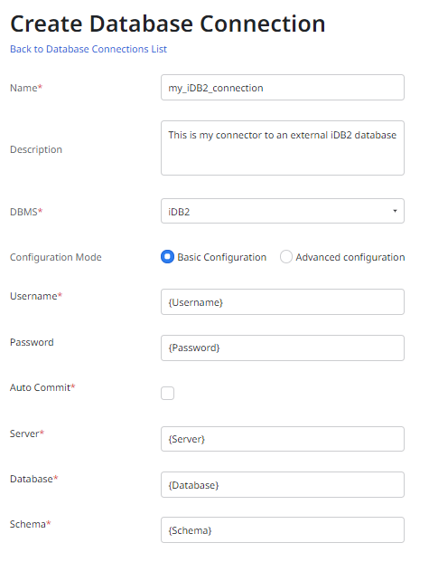
