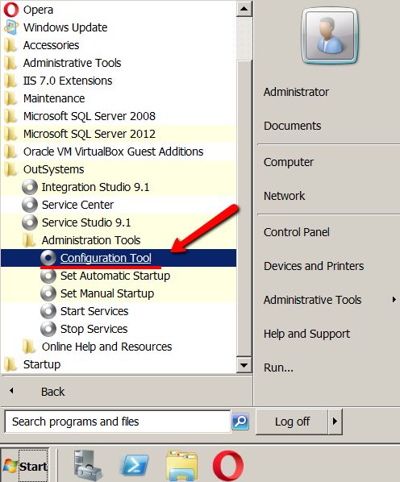
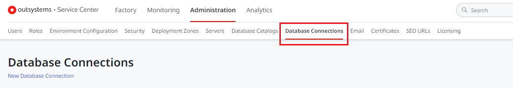

# The detach process for OutSystems 11

This document is a step-by-step guide for extracting the source code of your applications (web and mobile) from the .NET version of OutSystems and how to set it up to be executed and maintained independently of OutSystems, if you ever decide to detach from it.

## An overview of the detach process

The detach process is only applicable when you wish to completely stop using OutSystems and it applies to all applications. **It is not possible to detach only some apps from OutSystems** while keeping other apps that still use the OutSystems platform infrastructure.

<div class="info" markdown="1">

The detach process doesn't apply to and can't be used in any other scenarios not explicitly mentioned in this article. OutSystems has no obligation to support any other scenarios.

</div>

The detach process consists of a set of activities that need to be carried in sequence and are [described in detail later](#actual-detach-process) in this document. In summary, you will need to perform the following operations:

**If you're detaching from the OutSystems Cloud, you must:**

 1. Contact your account executive or account manager and let them know you're starting your detach process.
 1. Create a self-managed OutSystems environment (servers and database) to host your applications.
 1. Open a support case. Further instructions [here](#support-case-cloud).
 1. Migrate your applications and data from the OutSystems Cloud to your self-managed environment.
 1. Follow the process for detaching a self-managed installation.

**If you're detaching from a self-managed installation, you must:**

 1. Contact your account executive or account manager and let them know you're starting your detach process.
 1. Ensure that you have followed all of the recommendations and can meet all of the prerequisites described in the [before you start](#before-you-start) section.
 1. Prepare the Application Server and Database Server.
 1. Open a support case. Further instructions [here](#open-support-case-on-prem).
 1. Build the source code for the [Scheduler Service](#scheduler-service) and install it.
 1. Detach, compile, and deploy all individual modules and mobile apps.
 1. Test the resulting apps without OutSystems.

Ensure that you read and understand this entire document before you start. Doing so will give you a better overview of all the required steps and allow you to plan the process better.

If you run into any issues at any step, you will need to repeat the previous steps until everything is working properly. Be careful and do not skip any instructions in this document to minimize the chance of mistakes. At any of these steps, you can contact OutSystems Support and ask for help.

## Before you start { #before-you-start }

<div class="info" markdown="1">

To detach, the Platform Server must be on version 11.18.1 or later. If the environment has an older version, you must upgrade Platform Server to 11.18.1 or higher before detaching.

</div>

If you are detaching from the OutSystems Cloud, you're responsible for:

* Creating the brand new Application Server and brand new database that make up the self-managed environment to be used in the detach process. OutSystems will not create those self-managed environments.

* Loading and bootstrapping any data and configurations that your apps require into the new Application Server and new database. OutSystems will not provide any full or partial clone of your OutSystems Cloud database. OutSystems provides [access to the database of your OutSystems Cloud](https://www.outsystems.com/tk/redirect?g=4cdae94f-8633-4875-98bd-a3a4ac1bd89a), but it's your responsibility to copy any data from the OutSystems Cloud into the self-managed database.

### Recommendations

To minimize the risks of getting errors during and after the detach process, OutSystems **strongly recommends** that you do the following:

* Update to the latest release of OutSystems Platform Server 11 to benefit from the fixes to all known bugs and security vulnerabilities. You'll need to publish all modules with the latest version.

* Ensure that OutSystems apps are running with the expected behavior. Since OutSystems capabilities are lost at the end of the detach process, it will be harder to fix the majority of the problems after the detach.

* Stage any required applications from Development to Production before starting the detach process. The generated code considers the environment where it was compiled and the corresponding database, so it is not possible, nor supported, to use the detached code from one environment in a different environment.

<div class="warning" markdown="1">

Not following the above recommendations will greatly increase the difficulty and required time to successfully complete the process.

This document instructions are written regarding the latest release, some steps might not be accurate for older versions.

</div>

### Personnel requirements

Since you will lose most of the OutSystems capabilities, you must guarantee that your personnel:

* Fully understands the complete lifecycle of .NET applications. This includes understanding how to create, modify, and deploy those applications, as well as creating and managing the references between them while having a good understanding of IIS.

* Has access to the database server and the ability to modify the existing data. During the detach process, it is necessary to perform some changes in the OutSystems metadata. This is typically done by a database administrator (DBA).

* Knows how to develop, build, and deploy Android and/or iOS apps (applies to mobile apps only).

### Technical pre-requisites { #technical-pre-requisites }

If you are creating a new self-managed environment, you must:

* Identify the exact Platform Server version and release from which you are detaching;
* Create the new environment so that it fulfills the [system requirements](https://www.outsystems.com/tk/redirect?g=244db17a-7a98-4cb0-93c0-db91f1c91fd8);
* Install Microsoft Visual Studio 2022 on the environment;
* Download the [installation checklist](http://www.outsystems.com/goto/checklist-11) for the exact Platform Server version and release from which you are detaching;
* Follow all of the steps in the **Pre-installation checklist** section of the installation checklist;
* Follow the mandatory steps in the **Tuning and Security checklist** section of the installation checklist.

If you are reusing an existing self-managed environment, which is only possible if you are detaching from a self-managed environment, you will likely already have almost everything that you need installed and you probably don't need anything else. You will still need to install Microsoft Visual Studio 2022 on the environment, though.

For the Visual Studio installation ensure that the following workloads and components are selected in the installation:

* .NET desktop development workload
* ASP.NET and web development workload
* .NET Framework 4.6.1 SDK selected in individual components
* .NET Framework 4.6.1 targeting pack selected individual components
* .NET Framework 4.7.2 SDK selected in individual components
* .NET Framework 4.7.2 targeting pack selected individual components
* .NET SDK selected individual components

### What will you lose?

If you choose to stop using OutSystems, you will no longer have access to all the application development, management, and operation capabilities of the platform. Also, you'll no longer benefit from the Embedded Change Technology (ECT), performance monitoring, and logging capabilities, which means you'll have to implement such functionality by resorting to other tools.

You will retain all core functionality of the applications you developed using Service Studio and Integration Studio. **However, any changes made to the detached source are not supported by OutSystems.**

After detaching the source code of your applications, all OutSystems tools and services will become unavailable (including Service Studio, Integration Studio, Service Center, and LifeTime), along with all of their features for visual development and composition, services repository, integration adapters automatic generation, database, and application hot deployment, configuration management and versioning, packaging, and staging, automatic code containment and optimization, factory access control management, performance monitoring, and analytics.

Detaching is a one-way street. Once you detach the source code and start developing your applications using Visual Studio or some other IDE, there is no reverse engineering process to get those applications back into OutSystems.

### OutSystems Scheduler Service { #scheduler-service }

If you are using Timers, BPT Activities, or emails in your applications, you can keep such functionality even after detaching from the OutSystems platform. Unlike other OutSystems services, the source code of the Scheduler Service will be provided for this purpose.

If you choose to re-implement such functionality using external tools, you can later remove this dependency manually.

Since the Service Center console will no longer be available, managing timers has to be done directly in the database. To better understand how the Scheduler runs timers and what information is available, please refer to the [Timers documentation](https://www.outsystems.com/tk/redirect?g=92beb602-6c17-4991-a42d-c9860a32326f).

### Understand how OutSystems structures the code

When you deploy an application module using 1-Click Publish operation, the OutSystems Compiler generates a standard .NET application. This is what's provided when you detach an application and download the source code.

The code is structured in the following folders:

* **Application**
    * **OutSystems\.Application\.Core** – interfaces to access runtime information.
    * **OutSystems\.Application\.Initialization\.ASPNet** – base implementation for the application lifecycle in ASPNet
    * **OutSystems\.Application\.ManifestGeneration** – shared code generating the manifest files for reactive and mobile applications.
    * **OutSystems\.Application\.Session** – shared code for the session runtime service.
    * **OutSystems\.Application\.Session\.Abstractions** – session runtime service interfaces.
    * **OutSystems\.Application\.Session\.Persistent** – session runtime service code that implements database persisted sessions.
* **DatabaseProviders**
    * **iDB2DatabaseProvider** – the iDB2 implementation of the DatabaseAbstractionLayer used by the platform when connected to an iDB2 database.
    * **MySQLDatabaseProvider** – the MySQL implementation of the DatabaseAbstractionLayer used by the platform when connected to a MySQL database.
    * **OracleDatabaseProvider** – the Oracle implementation of the DatabaseAbstractionLayer used by the platform when connected to an Oracle database.
    * **PostgreSQLDatabaseProvider** – the SQLServer implementation of the DatabaseAbstractionLayer used when connected to a PostgreSQL database.
    * **SQLServerDatabaseProvider** – the SQLServer implementation of the DatabaseAbstractionLayer used when connected to a SQLServer database.
* **OutSystems\.CachingCommon** – shared code used for the cache implementations
* **OutSystems\.DebuggerClient** – the debugger protocol code.
* **OutSystems\.HubEdition\.DatabaseAbstractionLayer** – the interfaces and base code responsible for allowing the Platform access and manage the data from the database.
* **OutSystems\.Logging** – the logging system code.
* **OutSystems\.Logging\.Database** – interfaces for logging libraries that log to the database.
* **OutSystems\.ModuleServices** – shared code for BPT Activities.
* **OutSystems\.Plugin\.FileBased** – a File-based implementation of the cache invalidation service.
* **OutSystems\.Plugin\.RabbitMQ** – a RabbitMQ-based implementation of the cache invalidation service.
* **OutSystems\.PluginAPI** – code and interfaces to manage plugin configurations.
* **OutSystems\.RESTService\.Runtime** – implementation of the controllers for the REST Services endpoints.
* **OutSystems\.RESTService\.Runtime\.Abstractions** – shared code with base implementations for the REST Services endpoints.
* **OutSystems\.RuntimeCommon** – the basic runtime code used by all runtime libraries and modules.
* **OutSystems\.RuntimePlatform** – the Platform's runtime code used by the module.
* **OutSystems\.RuntimeSettingsConfiguration** – definitions of the runtime settings.
* **OutSystems\.Spreadsheet** – runtime code to load and export Excel files.
* **Plugin\.SAP** –
    * **Runtime** – runtime code responsible for consuming SAP services.
    * **RuntimeAPI** – API exposed to extend the SAP functionalities.
    * **SapNcoConnectionManager** – wrapper for the SAP .NET Connector libraries.
* **Plugin\.Widgets\.Runtime** – the runtime code for the various custom web controls using the WidgetsRuntimeAPI.
* **&lt;Project Name&gt;** – the module's source code.
* **REST\.RuntimeAPI** – used to consume REST services and to extend REST behaviors using extensibility.
* **RESTService.Runtime** – the runtime code used to expose REST services.
* **Scheduler\.Core** – the scheduler core code.
* **ThirdParty** – third-party components that are necessary for the applications to work.
    * **GemboxSpreadSheet** – the GemboxSpreadSheet .NET component which enables developers to write, read or convert spreadsheet files (XLS, CSV, XLSX, HTML, or ODS) from their .NET applications.
    * **Json\.NET** – the Newtonsoft Json\.NET is a library to serialize and deserialize between \.NET objects and JSON formats.
    * **SAP** – the SAP\.NET Connector libraries used by the SapNcoConnectionManager project.
    * **WebApi2** – the ASP\.NET Web API is a framework that makes it easy to build restful HTTP services.
* **WebWidgets** – the runtime code for the various custom web controls.
* **WidgetsRuntimeAPI** – a framework to allow building custom web controls.

The following image shows the code structure of a sample-generated application:

  

In the application folder (`<Project Name>`) there is a set of packages that hold the different types of code. These folders are:

* **Actions** – the code generated for both built-in actions and functions, and user actions and functions.
* **Blocks** – the code generated for both built-in and custom web blocks.
* **Entities** – the code to manage entities.
* **Structures** – the code to manage structures.
* **ProcExc&lt;ProcessName&gt;** – the code generated for processes.
* **Exceptions** – the declaration of user-defined exceptions.
* **Roles** – the code to support role-based security enforcement.
* **TypeFactory** – the code used by consumers of the module so they can access the referred elements.
* **WebServices** – the code to support all Web Services exposed by your module.
* **WebReferences** – the code to support all Web Services consumed by your module.

## The actual detach process { #actual-detach-process }

The detach process starts with you reaching out to your account manager to start the detach process.

### If you're using the OutSystems Cloud

Detaching from OutSystems means you'll no longer be running on OutSystems Cloud. Instead, you'll be hosting a .NET application on a system you fully manage. The high-level overview of detaching from OutSystems Cloud is:

1. **Move your OutSystems Cloud production environment to a self-managed environment**

    This is the high-level sequence of steps to move your production OutSystems Cloud environment to a hosting environment controlled by you:

    1. Install a brand new OutSystems environment to receive your applications, ensuring the [technical pre-requisites](#technical-pre-requisites) covered earlier.

        We advise you to install the environment with the exact setup you expect to have moving forward (number of front-ends, same database engine as your OutSystems Cloud, etc), as it will simplify the detachment and later maintenance of the system. To install a new OutSystems environment, always use the exact same OutSystems platform server major and minor versions. Refer to [Setting Up OutSystems](https://www.outsystems.com/tk/redirect?g=079418c8-7a3d-4b5e-9c13-c1ae7a1f122e).

    1. <p id="support-case-cloud"> Reach out to OutSystems Support and open a support case. The support case must: </p>

        * Have normal or low priority.
        * Clearly state that you are detaching.
        * Include the exact OutSystems Platform Server major and minor versions, release and build number from which you are detaching (eg. 11.18.1 build 37828).
        * Include the serial number of your new self-managed environment.

        You'll receive a detach bundle containing the instructions you need to follow, together with license files and the scheduler source code.

    1. Install your OutSystems applications in your new self-managed environment.

        Download all the applications from your production OutSystems Cloud environment and publish them to your new self-managed environment. Refer to [Creating and using an All Components solution](https://www.outsystems.com/tk/redirect?g=065b4d9d-5b4a-4892-9e82-bdfc77ea98d3) for a simple way to perform this step.

    1. Move the data of your OutSystems Cloud apps to your new self-managed environment.

       Request [access to the database of your OutSystems Cloud](https://www.outsystems.com/tk/redirect?g=4cdae94f-8633-4875-98bd-a3a4ac1bd89a) and use this access to manually transfer your application data to the new self-managed database. The direct database access user doesn't have backup privileges. This includes the data in your app entities.

    1. Confirm that your applications behave as expected in your new self-managed environment.

        This may include functional and scalability validation. We advise not moving past this point until you are sure your self-managed system would be able to replace your OuSystems Cloud system at this point.

1. **Detach from OutSystems as self-managed.** Proceed to the next sections in this article.

### For self-managed installations

As previously stated, the detach process applies to all applications and it's not possible to detach only a subset of applications, while keeping other applications still using the OutSystems platform infrastructure.

To perform a complete detach, you will need to:

1. Ensure that you have followed all of the recommendations and can meet all of the pre-requisites described in the [before you start](#before-you-start) section;
1. Prepare the Application Server and Database Server according to [Preparing your systems to run detached](#prepare);
1. [Open a support case](#open-support-case-on-prem);
1. Build the source code for the Scheduler Service [and install it](#build-install-scheduler-service)
1. Detach, compile, and deploy all individual modules and mobile apps as detailed in [Detaching an application from OutSystems](#detach-app);
1. Test the result application(s) without OutSystems as presented in [Final steps](#final-steps).

## Preparing your systems to run detached { #prepare }

<div class="warning" markdown="1">

The Platform Server [uninstallation](#final-steps)  will delete the built-in RabbitMQ service, which breaks cache invalidation. Before you uninstall the platform, you must do the following:

1. Install new, standalone versions of Erlang and RabbitMQ in a separate folder. For example, `C:\Program Files\RabbitMQ`.

1. Open the **Configuration Tool**, go to the **Cache** tab, and point it to your new RabbitMQ installation.

1. Click **Apply and exit**.

This updates all apps automatically. If you do not do this before uninstalling, your cache invalidation will fail.

</div>

### Preparing the Application Server to deploy the generated code { #prepare-app-server }

The machine that will run the detached applications must be prepared for that purpose. Making sure that all the requirements are met minimizes the chance of failure of this process.

Some web services of OutSystems communicate inside the machine through the HTTP protocol. This requires the machine to access itself using HTTP protocol, on port 80, in its local IP address, `127.0.0.1`, most commonly known as `localhost`.

You must guarantee that this is correctly configured, even if you only want to use HTTPS to access your applications.

To check it do the following:

1. Search for **IIS** in Windows Start Menu and open **Internet Information Services (IIS) Manager**.

1. In the left pane tree expand the following items:

    **&lt;your machine name&gt;** > **Sites** > **Default Web Site**

      

1. Make sure that there is a binding for the HTTP protocol on port 80 for IP address 127.0.0.1 at least. It's recommended that you use an asterisk (`*`) instead, as that means all IP address can access it. Leaving only the 127.0.0.1 address means that it can only be accessed locally.

    

If you are using the same Application Server that previously hosted OutSystems, check [Using the Application Server that previously hosted OutSystems](#use-existing-app-server). Otherwise, if you're going to use a brand new Application Server, configure it according to [Using a brand new Application Server](#use-new-app-server).

#### Using the Application Server that previously hosted OutSystems { #use-existing-app-server }

In case of having SEO Friendly URLs, you will need to remove the ISAPI Filter, since SEO Rules will no longer work after detaching. To accomplish that:

1. Inside IIS (check [Preparing the Application Server to deploy the generated code](#prepare-app-server)), click on your **Default Web Site**.

1. In the middle-pane, find **ISAPI Filters** and double-click it.

      

1. Search for **OutSystems ISAPI Filter** and delete it.

    

#### Using a brand new Application Server { #use-new-app-server }

If you want, you can deploy your module in a new server where you never installed OutSystems. If you're not considering this option, skip this section.

For the new Application Server to accommodate your applications, you must first set up the server with the needed configurations, as if you were installing OutSystems, skipping the OutSystems installation itself.

To do this, you will need to either decommission the OutSystems server, or get a database copy to use with the new server.
The following instructions assume that there a 1 to 1 relationship between the number of old and new servers. While it is possible to increase the number of servers, that will require understanding the content of the tables being modified below and adapting the changes to add new entries instead. It is recommended to start the detach process with the desired number of servers configured in order to make this process easier.

Do the following:

1. Install IIS component (as described in the [installation checklist](http://www.outsystems.com/goto/checklist-11)). If you want to use Visual Studio remotely (from a workstation), you must also install Frontpage Extensions.

1. Install .NET Framework 4.7.2 or above and configure it for use with IIS. Use the instructions in the install checklist.

1. Start Windows Management Instrumentation service.

1. Configure the Application Pool associated with Default Web Site in IIS to use .NET Framework 4.0 and Managed pipeline mode set to **Integrated**.

1. Update the data model in the OutSystems server:

    1. Update `OSSYS_SERVER` entity. Replace **new\_hostname** with the output of the **hostname** command ran in a command line (in the new server).

            update ossys_server
            set name = 'new_hostname'
            where name = 'old_hostname'

    1. Update `OSSYS_PARAMETER` entity. Replace **new\_hostname** with the output of the **hostname** command in a command line (in the new server), and **old\_hostname** with the output in the old server.

            update ossys_parameter
            set host = 'new_hostname'
            where host = 'old_hostname'  

    1. Update `OSSYS_MODULEFRONTEND` entity. Replace **new\_hostname** with the output of the hostname command in a command line (in the new server), and **old\_hostname** with the output in the old server.

            update ossys_modulefrontend
            set frontendname = 'new_hostname'
            where frontendname = 'old_hostname'

    1. Update `OSSYS_MODULEINTERNALADDRESS` entity to reflect your factory deployment zones configurations, which maps each module to the respective deployment zone internal address. Replace **old\_address** with the old deployment zone address and **new\_address** with the new address where the module is deployed.

            update ossys_moduleinternaladdress
            set deploymentzoneaddress = 'new_address'
            where deploymentzoneaddress = 'old_address'

        If you'll be running modules in different front-end servers, you can identify each module with the `MODULEKEY` column and update its `DEPLOYMENTZONEADDRESS` accordingly:

            select ossys_moduleinternaladdress.modulekey, ossys_espace.name
            from ossys_moduleinternaladdress
            inner join ossys_espace
                on ossys_espace.ss_key = ossys_moduleinternaladdress.modulekey

            update ossys_moduleinternaladdress
            set deploymentzoneaddress = 'new_address'
            where modulekey = 'target_module_key'

1. Copy the `<appSettings>` section from the `machine.config` file of the machine that previously hosted OutSystems to the `machine.config` file of the new machine. To do this:

    1. Locate the `machine.config` files for .NET Framework 4.0, on both the old and the new server, and open them with a text editor.

        **Note:** On 64-bit machines you should update both the 32 and the 64-bit configuration files. These are usually available in the following locations:

        `%WINDIR%\Microsoft.NET\Framework\v4.0.30319\CONFIG\`  
        `%WINDIR%\Microsoft.NET\Framework64\v4.0.30319\CONFIG\`  

    1. Locate the `<appSettings>` tag from the `machine.config` of the machine that previously hosted OutSystems and copy its content.  

            <appSettings>  
              ...
            </appSettings>

        Note that actual tag contents may vary, and even include settings that are not related to OutSystems. As a rule of thumb, it's recommended that you copy only the entries (keys) with the "OutSystems" prefix.  

    1. Locate the `<appSettings>` tag from the `machine.config` of the new Application Server and paste the content inside this tag.

1. Configure the **DefaultAppPool** to run as **Local System**. This is needed at least for first-time run, since some settings are written in the registry. To accomplish that:

    1. Open IIS Manager (check [Preparing the Application Server to deploy the generated code](#prepare-app-server)) and expand the menu of your machine.

    1. Search for **Application Pools** and double-click it.

    1. In the middle-pane, find **DefaultAppPool**, right-click it, and open **Advanced Settings...**

    1. Inside **Process Model**, find the **Identity** field. By clicking it a button with **...** appears. Click on that button.

        

    1. Inside **Application Pool Identity**, select **Built-in account** and choose **LocalSystem** from the provided options.

        

### Preparing the database to host the data of your applications

Your application data will be preserved either in the same databases/schemas and database server, or by moving the databases/schemas from the current database server to a new one.

If you're keeping the same database, follow the procedure in [Using the database that previously kept the OutSystems data](#use-existing-db). If you're moving to a new database server, follow the instructions in [Using a brand new database](#use-new-db).

#### Using the database that previously kept the OutSystems data { #use-existing-db }

OutSystems encrypts sensitive configuration data such as passwords. To secure that data, an encryption key was generated when you installed OutSystems.

That key is stored in the `private.key` file under the Platform Server installation folder (`C:\Program Files\OutSystems\Platform Server`). To allow your application to decrypt sensitive data you need to ensure that it uses that key.

By default, your application will use the `private.key` file located in the Platform Server installation folder and after uninstalling it will be removed. For that reason, create a copy of the `private.key` file in a path where an IIS user can read and change the configuration file accordingly. To change the configuration file:

1. Locate the `machine.config` files for .NET Framework 4.0, on both the old and the new server, and open them with a text editor.

    **Note:** On 64-bit machines you should update both the 32 and the 64-bit configuration files. These are usually available in the following locations:

    `%WINDIR%\Microsoft.NET\Framework\v4.0.30319\CONFIG\`  
    `%WINDIR%\Microsoft.NET\Framework64\v4.0.30319\CONFIG\`  

1. Under `<appSettings>`, locate the `<add>` element with the key `"OutSystems.HubEdition.SettingsKeyPath(DEFAULT)"`.  
Change the `value` attribute of this element to point to the new location of the `private.key` file.

Even if you're using the same database that previously stored OutSystems data, connection strings may need to be changed if the database credentials were altered. If that's the case, please refer to the instructions at [Using a brand new database](#use-new-db) to change the connection strings.

#### Using a brand new database { #use-new-db }

<div class="info" markdown="1">

Your new self-managed environment can't decrypt sensitive configurations or application data migrated from the Cloud. If your apps store any encrypted data, you may need to run a process to decrypt data in your Cloud environment before you copy it to the new database.

</div>

If you're cloning an existing environment on a new database, make to sure to first follow all the steps on [Migrate an Environment Using a Database Clone](https://www.outsystems.com/tk/redirect?g=969DB4B1-51CF-4908-A638-A345D2AB841C). Then proceed to the next steps.

If you will use a new database, you have to manually reconfigure your database connection strings. To do this:

1. Locate the `machine.config` files for .NET Framework 4.0, on both the old and the new server, and open them with a text editor.

    **Note:** On 64-bit machines you should update both the 32 and the 64-bit configuration files. These are usually available in the following locations:

    `%WINDIR%\Microsoft.NET\Framework\v4.0.30319\CONFIG\`  
    `%WINDIR%\Microsoft.NET\Framework64\v4.0.30319\CONFIG\`

1. Change the connection strings under `<appSettings>`. You won't be able to use them since their value attribute is encrypted, hence the need to convert them to plain text format. These strings vary with the different database providers and are provided in [Connection strings](#connection-strings). There are 10 connection strings to declare. You can find them searching in the `key` attribute for the following values:

    * `OutSystems.DB.Logging.Application.Admin.ConnectionString`
    * `OutSystems.DB.Logging.Application.Runtime.ConnectionString`
    * `OutSystems.DB.Logging.Services.Admin.ConnectionString`
    * `OutSystems.DB.Logging.Services.Runtime.ConnectionString`
    * `OutSystems.DB.Platform.Application.Admin.ConnectionString`
    * `OutSystems.DB.Platform.Application.Runtime.ConnectionString`
    * `OutSystems.DB.Platform.Application.Session.ConnectionString`
    * `OutSystems.DB.Platform.Services.Admin.ConnectionString`
    * `OutSystems.DB.Platform.Services.Runtime.ConnectionString`
    * `OutSystems.DB.Platform.Services.Session.ConnectionString`
  
    Here's an example using SQL Server and one of the connection strings:

        <add key="OutSystems.DB.Logging.Services.Runtime.ConnectionString"
            value=" User ID={LogUser};Password={LogPassword};Data Source={Server};Initial Catalog={Database}; />

    Depending on the connection string, you must use the corresponding user and password. For the example given, the Log user was used since it was the one referenced.  

1. In the OutSystems database, find the `OSSYS_DBCONNECTION` table. You need to update the `DATABASE_CONFIGURATION` connection string since it's encrypted by OutSystems. Use the same user that is configured in Service Center for that Database Connection. Change the connection string to the following format:

        ProviderKey=SqlServer
        <DBConfiguration><ConnectionStringOverride>{CONNECTION_STRING_IN_PLAIN_TEXT}</ConnectionStringOverride></DBConfiguration>

    To create a correct `{CONNECTION_STRING_IN_PLAIN_TEXT}`, check [Connection strings](#connection-strings). Make sure the connection string is correctly configured for the selected database provider, while keeping in mind that the parameter names used may not align with the placeholder names.

## Open a support case { #open-support-case-on-prem }

If you are originally detaching from the OutSystems Cloud, you will already have done this step after you finished setting up the new self-managed environment. In that case, skip this section.

Reach out to OutSystems Support, open a new support case and request the source code for the [Scheduler Service](#scheduler-service). The support case must:

* Have normal or low priority.
* Clearly state that you are detaching.
* Include the exact OutSystems Platform Server major and minor versions, release and build number from which you are detaching (eg. 11.18.1 build 37828).
* Request the source code for the [Scheduler Service](#scheduler-service). You'll receive a bundle containing the scheduler source code.

## Build the source code for the Scheduler Service { #build-install-scheduler-service }

To compile the scheduler, do the following:

1. Open the `Scheduler.sln` file (located in the Scheduler directory) using Visual Studio and build the solution.

1. Open the Developer Command Prompt for Visual Studio (with Administrator privileges) and go to the `\Scheduler\bin\Debug` folder.

1. Execute the following command:

    `installutil scheduler.exe`

    This installs a service called Detached Scheduler Service. To uninstall it, run `installutil /u scheduler.exe`. If any problem happens, check the scheduler logs in the Event Viewer.

## Detaching an application from OutSystems { #detach-app }

This chapter covers how to detach, compile, and deploy a single module.

To have a system that replicates your previous factory, you must deploy all the applications published by OutSystems. This way you guarantee that all dependencies are met, further reducing the chances of failure.

Some specific OutSystems applications, like Service Center and LifeTime, are used for application and environment configuration and management. As such, they can't be detached.

<div class="info" markdown="1">

You must follow all the steps described in this section for a successful detach of all modules. This includes OutSystems modules that your applications most likely depend on, like RichWidgets and Users applications.

</div>

### Get the source code of web applications { #source-code-web }

To obtain the source code of a web application module, open the **Licensing** page under the **Administration** tab in Service Center and detach the source code as follows:

1. Click on the **Modules Source Code** link.

      

1. Click **Detach** for the module whose source code you want to obtain.

      

1. Wait until OutSystems has finished packing the module source code and click **Download**.

    

1. Save the ZIP file and extract it.

#### Update appsettings.config file

Besides the changes made regarding the private.key in [Using the database that previously kept the OutSystems data](#use-existing-db) and the connection strings in [Using a brand new database](#use-new-db), similar changes need to be applied to the `appsettings.config` file for each detached application.

Locate the application configuration file, `appSettings.config`, present on the application's source code folder (it should be inside a subfolder named after the application). Under the `<appSettings>` section, perform the following operations:

1. Locate the `<add>` element with the key `"OutSystems.HubEdition.SettingsKeyPath(DEFAULT)"`.  
1. Change the `value` attribute of this element to point to the new location of the `private.key` file.
1. Change connection string configurations like you did for `machine.config` (check [Using a brand new database](#use-new-db)).
1. External database connection strings also need to be updated. Locate the `<add>` elements with keys starting with `"OutSystems.ExternalConnections"`. Use the same format that was used when updating the `OSSYS_DBCONNECTION` table (in step 3 of [Using a brand new database](#use-new-db)) but make sure to encode the characters in the XML file (don't forget the **\r\n**  characters after the `ProviderKey` line). For example:

        `ProviderKey=SqlServer&#xD;&#xA;&lt;DBConfiguration&gt;&lt;ConnectionStringOverride&gt;{CONNECTION_STRING_IN_PLAIN_TEXT}&lt;/ConnectionStringOverride&gt;&lt;/DBConfiguration&gt;`

### Get the source code of mobile apps  { #source-code-mobile }

To fully detach a **mobile** app from OutSystems you need to:

* Detach the back-end source code of the mobile app by following the same procedure outlined in [Get the source code of web applications](#source-code-web), selecting the module corresponding to your mobile app when doing the detach.

* Detach the native app source code used to build the installable APK or IPA application package (known as the "native shell") by following the procedure presented below.

You need to obtain and deploy/build these two detached components to get a fully working mobile app detached from OutSystems.
  
To obtain the native app source code of an Android or iOS mobile app, open the **Applications** page under the **Factory** tab in Service Center and proceed as follows:

1. Search for the application corresponding to your mobile app and click on its name to go to the detail page.

      

1. In the **Native Platforms** tab click in the **Download source code** icon for the desired platform build (Android or iOS).

    

1. Save the `tar.gz` file and extract it.

The obtained source code corresponds to the source code of the most recent build of the mobile app for the selected platform.

**Note:** The mobile app source code is only kept for 7 days after a successful build. You'll need to generate the mobile app again if the last build was made more than 7 days ago.

### Compiling and deploying web applications { #compile-web }

Before you open the application's solution in Visual Studio, you need to make sure that no application or module publication has occurred in the local machine or otherwise you'll get errors. To do this, check for any existing application publication data in Internet Information Services (IIS) and clear it out with the following steps:

1. From the Windows Start Menu search for **IIS** and open it.

1. In the left pane tree expand the following items:

    **&lt;your machine name&gt;** > **Sites** > **Default Web Site**

      

1. Look for a virtual directory ( with the same name as the module you have detached and remove it; either by clicking on it and then pressing the **Del** key, or by right-clicking on it to open the popup menu and then choosing the **Remove** option.

    

If your application uses the OutSystems SAP plugin, then the SAP .NET Connector libraries have to be manually added to the detached source code. To ensure that the application compiles successfully, you need to copy the `sapnco.dll` and `sapnco_utils.dll` files, located in the `\thirdparty\lib\` folder in the Platform Server installation directory, into the `ThirdParty\SAP` folder that came with the detached source code.

To deploy applications to IIS, you need Visual Studio, as explained in the [technical pre-requisites](#technical-pre-requisites) section.

To deploy your applications, proceed as follows:

1. Open the `<Project Name>.sln` file provided in the extracted source code of the detached application.

1. Execute the Visual Studio's **Build Solution** command to compile your application.

1. Since the code is generated using the minimum requirements the OutSystems Platform (.Net Framework 4.7.2), if there are dependent Extensions that were created using .Net Framework 4.8 or above, the build might fail with warnings or errors mentioning "which was built against the '.NETFramework,Version=v4.8' framework. This is a higher version than the currently targeted framework '.NETFramework,Version=v4.7.2'". To fix that, change the `<ModuleName>` and `<ModuleName>ReferencesProxy` project to the appropriate target framework and retry the build process.

1. Look for a warning with the "Found conflicts between different versions of the same dependent assembly" message. Do as the warning recommends and "double-click this warning (or select it and press Enter) to fix the conflicts". This is necessary to make Visual Studio calculate attempt to calculate best possible version of all third parties libraries that are consistent with each other and adjust the config files. For more information read the correspondent [Microsoft documentation](https://learn.microsoft.com/en-us/dotnet/framework/configure-apps/how-to-enable-and-disable-automatic-binding-redirection#enable-automatic-binding-redirects-in-web-apps).

1. After the Build has finished successfully, execute the Visual Studio's **Publish &lt;Project Name&gt;** command to publish your application to IIS by creating a **Custom** profile. When asked, choose the **Custom** option and give a name to the profile.

    

1. Configure the new profile and press **Save**.

      

1. After a successful publication, open IIS and search under your **Default Web Site** for the virtual directory with the name of your published module and click on it.

1. Make sure that your application is running under an Application Pool that uses .NET 4.0.  
To change the application pool of the underlying web site, select the web site and in the **Actions** pane click **Basic Settings**. Click **Select**, and select an application pool configured to use .NET 4.0.

### Compiling and deploying mobile apps { #compile-mobile }

<div class="info" markdown="1">

If you detached the back-end source code of the mobile application and deployed it outside OutSystems, update the back-end endpoint in the following files, according to the mobile platform:

* For Android:  
    `<extract_path>\source\config.xml`  
    `<extract_path>\source\platforms\android\app\src\main\res\xml\config.xml`

* For iOS:  
    `<extract_path>\source\config.xml`  
    `<extract_path>\source\platforms\ios\<app_name>\config.xml`

Change the following entries in the configuration files identified above:  

`<content src="https://<new_endpoint_hostname>/MyAppName/" />`  
`<preference name="DefaultHostname" value="<new_endpoint_hostname>" />`

</div>

#### Android mobile apps

To build a detached Android mobile app you need:

* [Android Studio](https://developer.android.com/studio/index.html) installed in your computer.

* **Android SDK** (it should have been installed together with Android Studio).

* _(Optional)_ **Your own keystore to sign generated app packages (APKs)** . If you don't use a specific keystore, a default keystore will be used to sign the app. You may encounter issues in updating applications when you generate the mobile app in different machines without using your own keystore, since each machine has its own default keystore.

Build your Android app by following these steps:

1. Open Android Studio.

1. Click **Open an existing Android Studio project** option and select the `<extract_path>\source\platforms\android` folder.

1. When the Gradle sync operation finishes, choose **one** of the following:

    * **Build** > **Build APK** menu option to generate an application package signed using a **default keystore**.
    * **Build** > **Generate Signed APK...** to generate an application package signed with **your own keystore** (you will be asked for some data related to the keystore).

#### iOS mobile apps

To build a detached iOS mobile app you need a Mac with [Xcode](https://developer.apple.com/xcode/) installed. You also need an Apple Developer or an Apple Enterprise Developer account to test your mobile app on an real iOS device.

To build the app and run it on your device, do the following in Xcode:

1. Open the `<your_application_name>.xcodeproj` project file available in `<extract_path>\source\platforms\ios` folder;

1. Make sure that your Apple ID is correctly set up in Xcode so that it's associated with your Apple Developer account.

1. Make sure that you have defined your team (set it in **Project editor** > **General**). If your Apple Developer account doesn't have any provisioning profiles or certificates yet, Xcode should create a team provisioning profile and a development certificate for you.

1. Connect your iOS device to your Mac.

1. Select your connected device as the target in the **Scheme** toolbar menu.

1. Click **Run**.

Xcode builds and installs the app on the device and then launches it.

### Custom database plugins

OutSystems already includes database plugins that come within the source code of the detached application. In case of having custom plugins, put those inside the `<your_application_name>\bin` folder of the detached application. In Visual Studio add a reference from the detached project to the database provider assembly that you just copied to the bin folder.

### Extensions

Extension modules don't generate source code. As such, source code for custom extensions are always available for detachment and reuse.
Download the extension files and use Integration Studio to open the source code using the "Edit Source Code" button and save it from there.

### Microsoft Excel files

If your application handles, either reads or writes, data stored in MS Excel files, you must change the `SetLicense()` method.

To setup the professional license you need to:

1. Find the `SetLicense()` method on `OutSystems.Spreadsheet\GemBoxLicensing.cs` and set the method to use your own Gembox Spreadsheet license.

1. Request from GemBox a DLL for the GemBox Professional version.

1. Go to the detached source code solution and, in **References**, replace the GemBox free version DLL with the Professional version DLL. Do this in both `OutSystems.Spreadsheet` and application projects.

In case of not having such a license, you can use the limited Gembox Spreadsheet free edition. Although this license offers the same performance as the paid version, there are limitations in the number of rows per sheet, and the number of sheets per workbook. You should investigate these values further, since they're subject to change.

### Managing .NET references

When publishing an application, OutSystems automatically compiles that specific module and also its references. It then propagates the files generated from the referenced application to the application that references them.

Take as an example application A that uses a web block of application B. Application B is referenced by application A. When publishing application A, first OutSystems compiles application B and uses the files generated in that compilation to be used as reference to application A. Only then does OutSystems compiles and deploys application A.

When you detach an application, you lose this automatic procedure and you will need to perform those steps (either manually, creating scripts or by managing references through Visual Studio). This means that, after you detach, when you modify application B and then publish application A without any other action, the changes made were not reflected.

To manage the references manually:

1. Compile the referenced application, in this case only application B.
1. Go to the `Application B\bin` folder and copy all the `.dll` files.
1. Paste the content in the `Application A\bin` folder.

Now application A is ready to be compiled and deployed. This procedure is the same as described previously, according to the application type:

* For web applications, check [Get the source code of web applications](#source-code-web) and [Compiling and deploying web applications](#compile-web).
* For mobile apps, check [Get the source code of mobile apps](#source-code-mobile) and [Compiling and deploying mobile apps](#compile-mobile).

If an application depends on another applications, you might need to deploy all its dependencies to guarantee that it keeps working correctly.

## Final steps { #final-steps }

When all applications have been successfully published, it's recommended that you test everything first before uninstalling OutSystems platform server. If you moved from Application Server, skip the [Before uninstalling](#before-uninstall) and test your applications, since no uninstallation needs to be performed.

### Before uninstalling { #before-uninstall }

If no error was found there's a great chance you followed everything correctly, nevertheless some errors may appear when you uninstall the OutSystems platform server. To safely test this without having to reinstall everything follow this steps:

* Stop all OutSystems services.

* Store a copy of `C:\Program Files\OutSystems\Platform Server` on another location. After that, you can either change the name of `C:\Program Files\OutSystems\Platform Server`, for example to `C:\Program Files\OutSystems1\Platform Server`, or delete this folder.

This way you can simulate an uninstall and you should be able to access all your applications.

### Testing

Test your application extensively to guarantee no errors are found. If any issue is found, repeat all the steps to confirm that you didn't miss any. If the error persists, contact OutSystems Support.

When you are sure everything is working correctly and no OutSystems files are present (other than the ones we asked you to keep), you have successfully performed the detach.

If you changed the name of the folders where OutSystems server was installed, to uninstall you must change the names back to the original values.

## Appendix

### Connection strings { #connection-strings }

When you need to convert your connections string to plain text, use the corresponding string according with your database provider(s).

An example is provided so that you can easily map the placeholders from the **Configuration Tool**, which can be found under **Windows Start Menu** > **OutSystems** > **Administration Tools**.



If it's an external database connection, you can get the same information accessing **Service Center** > **Administration** > **Database Connections**, since the names are exactly the same.



Don't forget to change the placeholders, wrapped around curly brackets `{}`, with your own information. Also, each connection string refers to a different User; this mean that for each string you must check which User it refers to.

#### SQL Server / Azure SQL Database

```
User ID= {User}; Password= {Password};Data Source= {Server}; Initial Catalog= {Database};
```


#### Oracle

```
User ID= {User}; Password= {Password}; Data Source= (DESCRIPTION=(ADDRESS=(PROTOCOL=TCP)(HOST= {Host} )(PORT= {Port} ))(CONNECT_DATA=(SER VICE_NAME= {Service Name} )));
```


#### iDB2

```
DataSource= {Server}; Database= {Database}; UserId= {Username}; Password= {Password}; Def aultCollection= {Schema};
```


#### MySQL

```
Server= {Server}; Database= {Schema}; Uid= {User}; Pwd= {Password}; Allow User Variables=true; ConnectionLifeTime=6000; ConnectionReset=true;
```


