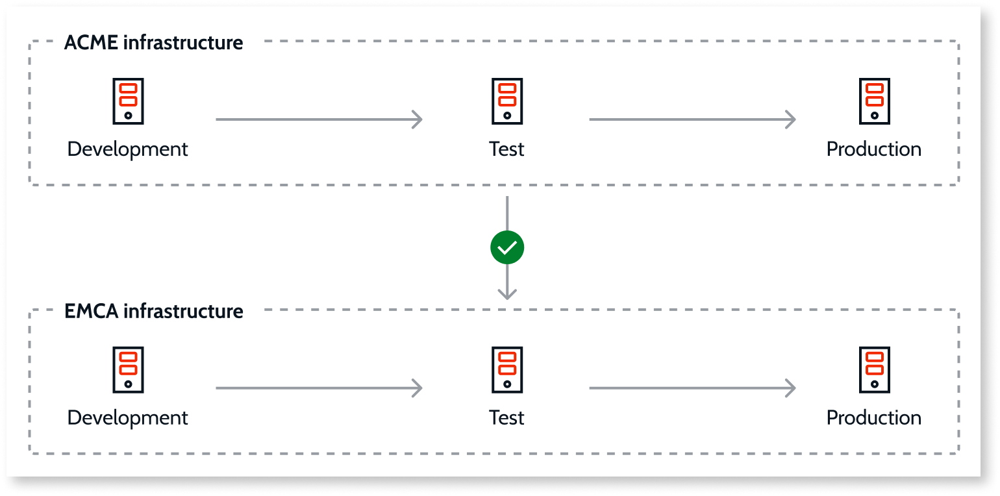
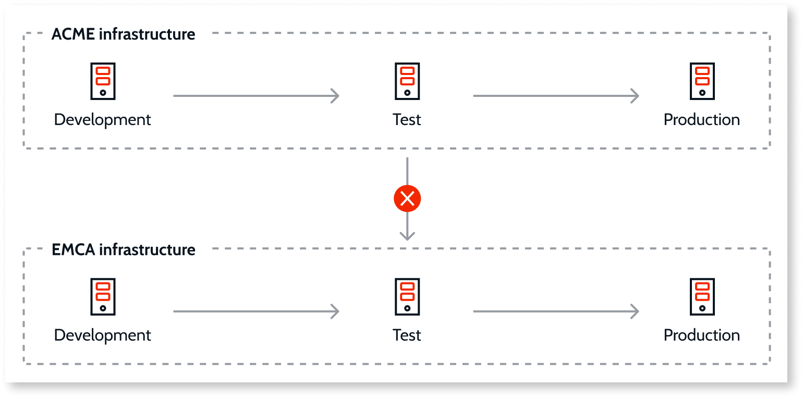

# OutSystems Intellectual Property Protection - IPP

## For OutSystems 11 infrastructures

<div class="info" markdown="1">

**Important update**: License files made available from April 2021 onwards are issued with IPP **unprotected** to ensure you can share your apps with other infrastructures.

</div>

The Intellectual Property Protection (IPP) feature **ensures that your apps can't be deployed to another infrastructure without your consent**. You should always be able to deploy apps between environments of the same infrastructure.
By default, IPP is **unprotected**, which means your application can be deployed to other infrastructures. To request your IPP be **protected**, refer to [OutSystems support](https://www.outsystems.com/legal/success/support-terms-and-service-level-agreements-sla-of-the-outsystems-software/#contacting-outsystems-support).

When IPP is **protected**, you can deploy applications across all the environments of the same infrastructure, but you can't deploy applications to environments belonging to other infrastructures.​

<div class="info" markdown="1">

IPP focuses only on protecting the application logic. No data is transmitted or shared during this process.

</div>

If you're trying to deploy modules from other infrastructures, you may get the error message:

```error
Invalid Intellectual Property: You are trying to upload or publish a solution that was created in a Platform Server and its intellectual Property is protected
```

For more information about resolving IPP errors, refer to [Troubleshoot IPP errors](../../troubleshooting/application-development/ipp-error.md).

To deploy applications to an infrastructure to which they don't belong, use the [IPP portal](http://www.outsystems.com/ipp/). Using the IPP portal service you can change the activation code of your applications. When you complete the process, you can publish applications in different infrastructures.

OutSystems logs all IPP portal operations. To check the IPP operations performed in your applications, refer to [OutSystems support](https://www.outsystems.com/legal/success/support-terms-and-service-level-agreements-sla-of-the-outsystems-software/#contacting-outsystems-support).

### IPP unprotected

With IPP unprotected, when you publish a **new module**, it's not marked with the [Activation Code](https://success.outsystems.com/support/licensing/identify_outsystems_infrastructure_and_runtime_environments/) of your infrastructure. This means you can share your modules with other infrastructures.



In this example, applications developed in an ACME environment can be deployed to any ACME environment and to the EMCA infrastructure.

### IPP protected

With IPP protected, when you publish a module, it's marked with the [activation code](https://success.outsystems.com/support/licensing/identify_outsystems_infrastructure_and_runtime_environments/) of your infrastructure. This means you can only deploy this module to environments with the same activation code. In addition, you can't copy and paste parts of applications that are IPP-protected.



In this example, applications developed in an ACME environment can be deployed to any ACME environment. However, you can't deploy those applications to the EMCA infrastructure.

## For ODC

In OutSystems Developer Cloud (ODC), you don't need to transfer IPP through the IPP portal. Assets can be opened, published, and deployed in ODC Studio.
