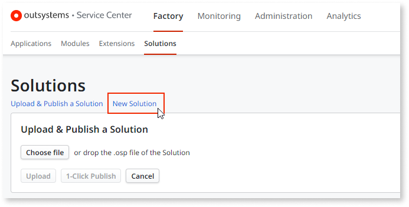
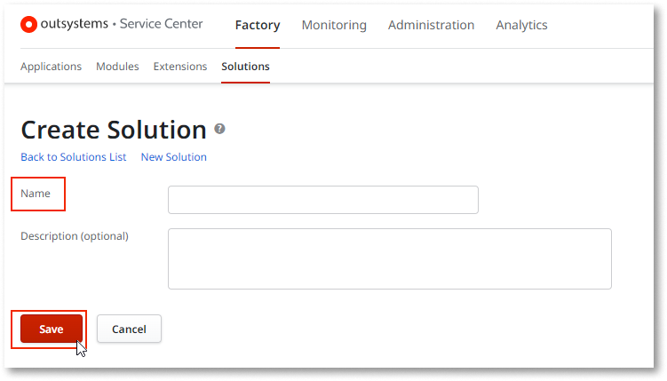
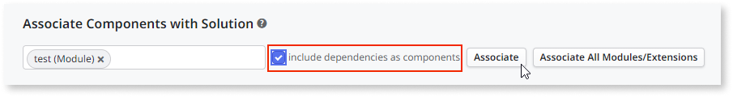
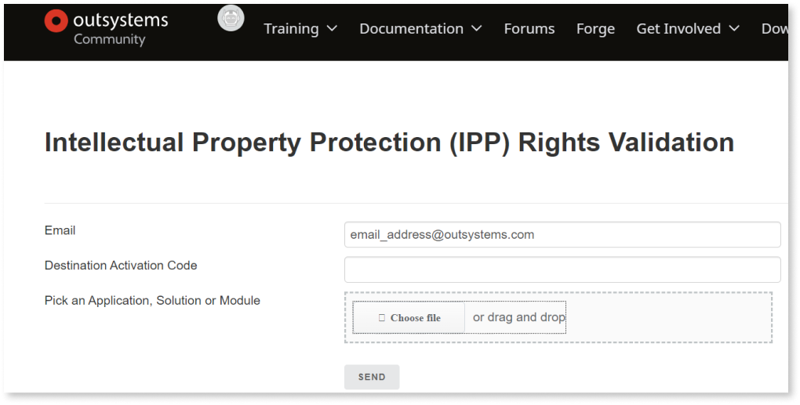

# Move apps from your Personal environment to a subscription license

You can transfer applications when you upgrade from a Personal or Trial Edition to a paid subscription.

To transfer applications from a Personal or Trial environment to an enterprise environment, follow these steps:

1. Go to Service Center in the Personal Environment.  

1. Go to **Factory** > **Solutions**.

1. Click the **New Solution** link.

    

1. Enter a name for the Solution and click **Save**.

    

1. On the **Solution** screen, select the **Components** tab.

1. In the **Associate Components with Solution** field, enter the module you want to transfer. Enter all of the applicable modules.

    

1. If the component is dependent on other modules that are not in the destination environment, ensure that the **Include dependencies as components** checkbox is selected and click **Associate**.

    

1. Click **Save**

    You are brought back to the **Solution** screen.

1. Click **Download** on the **Current Running Version** of the solution. This will compile a file with the .osp extension that you will be able to Download.

1. To remove IP protections, upload this file to [Intellectual Property Protection](https://www.outsystems.com/IPP).

    

    You will receive an email with a link to download the version of the file that can be installed in the new environment.

1. Once you have this file, in the Enterprise Environment, go to the development environment instance of Service Center and go to **Factory** > **Solutions**.

1. Click **Upload and Publish a Solution**.

1. Choose the file and upload it.

    This uploads and publishes all of the components of the solution into the new environment.

    **Note**: This does not transfer data, only the modules themselves.

**FAQs**

_Can I transfer more apps from my Personal Edition in the future?_

Following the terms of use for the Personal Edition, you can share your apps with the Community through the Forge. If you don't intend to share your apps with the Community, develop them in your paid Enterprise Edition.

**Note**: OutSystems reserves the right of preventing transfer requests that are not meant to be part of the one-time migration process from a Personal Environment to a paid subscription.
