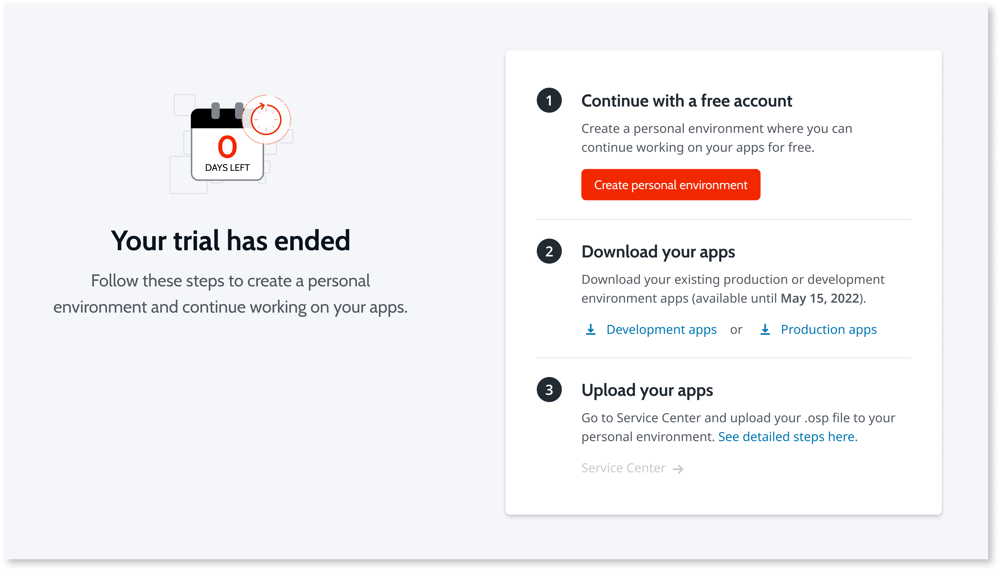
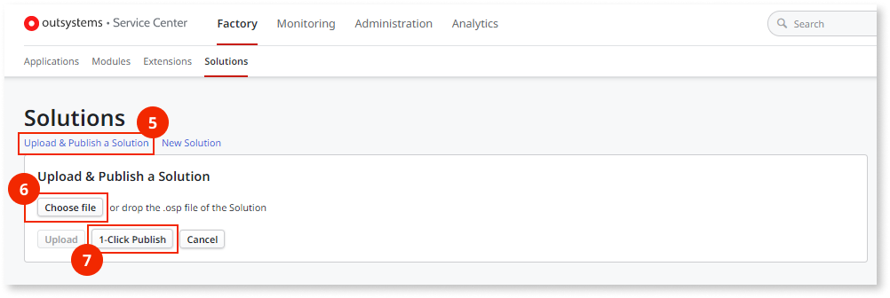
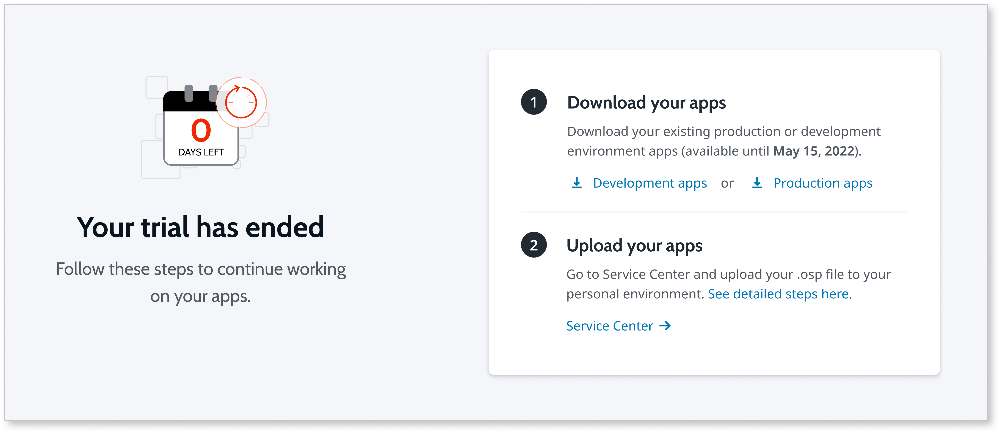

# Backing up and continuing work on your apps at the end of the trial

Even though you are at the end of your trial, you can continue working for free using a Personal Environment.

Alternatively, you can keep full access to OutSystems products with a subscription. [Contact us](https://outsystems.drift.click/book-a-meeting) to set up a meeting and learn more.

**Important:**

* You must have an environment to access the platform, and to edit and deploy your apps.
* The apps you create during the trial are only available for download for 6 months from the end of your trial.
* You are only backing up your apps. Your data isn't recoverable.

## Continuing when you don't have a Personal Environment

Your [Personal Environment](../whats-a-personal.md) is a free, cloud-based version of OutSystems, where you can create, deploy, and run your applications.

Follow these steps to create your Personal Environment when your trial ends, then download and upload your apps, and continue your work.

The following screen displays when your trial ends.

1. From **Continue with a free account**, click **Create Personal Environment**. A new tab opens with a form for you to complete. When done, return to this page and continue with the next step.

1. From **Download your apps**, click either **Development environment apps** or **Production environment apps** to download your apps. Your apps download as  *.osp files to your computer.

1. From **Upload your apps**, click **Service Center**.  
1. From **Service Center**, select **Factory**, then **Solutions**.

    

1. From **Solutions**, click the **Upload & Publish link**.

1. Click the **Choose File** button and select the ***.osp** file to upload.

1. Click the  **1-Click and Publish button**.

1. Open **Service Studio**, connect to your **Personal Environment**, and continue developing your apps.

Interested in upgrading to a paid subscription, see [Move apps from your Personal to an enterprise subscription](../move-apps-personal-enterprise.md).

## Continuing when you have a Personal Environment

The following screen displays when your trial ends and you have a Personal Environment.

1. From **Download your apps**, click either **Development environment apps** or **Production environment apps**. Your apps download as  *.osp files to your computer.

1. From **Upload your apps**, click **Service Center**.

1. From **Service Center**, select **Factory**, then **Solutions**.

    

1. From **Solutions**, click the **Upload & Publish link**.

1. Click the **Choose File** button and select the ***.osp** file you want to upload.

1. Click the  **1-Click Publish button**.

1. Open **Service Studio**, connect to your **Personal Environment**, and continue developing your apps.

Interested in upgrading to a paid subscription, see [Move apps from your Personal to an enterprise subscription](../move-apps-personal-enterprise.md).

