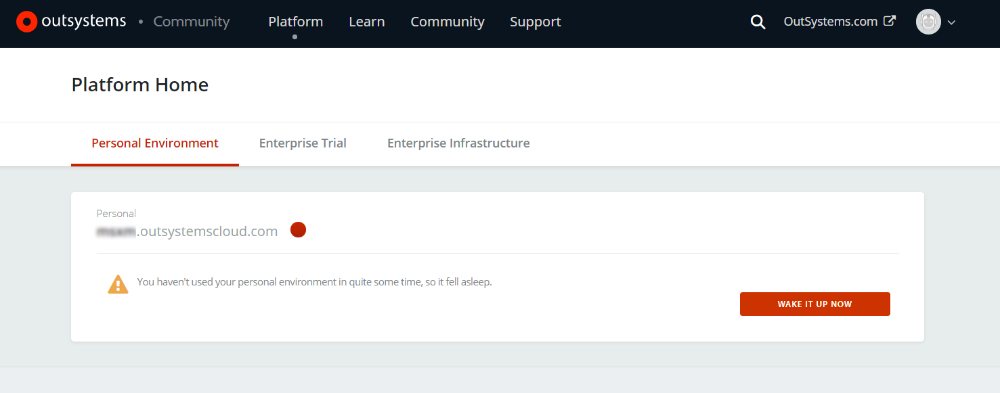

# Can't reach apps on my personal environment

## Symptoms

You're trying to access an application running on your personal environment, but you're being redirected to [http://www.outsystems.com/home/](http://www.outsystems.com/home/)  with the message:

`Your personal environment is suspended`

## Cause

Your personal environment is suspended. This happens when:

* You stopped developing for a while;

* Your apps are not being used.

This happens as part the recycling mechanism to save resources for active personal environments.

## Resolution

Visit [http://www.outsystems.com/home/](http://www.outsystems.com/home/) and login with your OutSystems credentials. Click the "Wake it up now" button and wait a few seconds while the personal environment is restored.

## More information

We send you an email letting you know that your personal environment is going to be recycled.

If you need your personal environment running 24/7, keep an eye on those emails. A couple of visits per week to your apps, is enough to keep the environment running.

