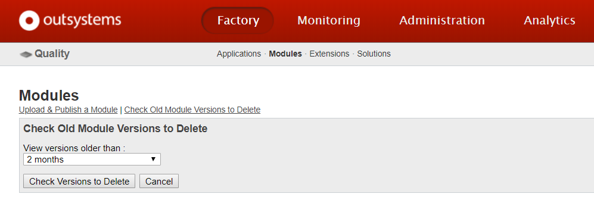

# Manage the database space of your personal environment

**Personal environments have a database limited to 2GB**. The database stores : 

* System data: the meta data used by OutSystems Platform. This includes the applications definition, data model, module configurations, logs, application versions, and other information. The system data usually grows as you develop and deploy your applications;

* Application data: the data your applications generate and manipulate. The application data usually grows as your users access your applications.

## Check how much database space you have

Access your personal environment on `https://<yourpersonal>.outsystemscloud.com`, and navigate to the **Environments** tab.

In this example, we are only using 13% of the available database storage space.

You can also check how much is being used for system data, and application data. Click the **View details** link.

Note that these metrics are updated every hour, so they might not represent the real space you are using at the moment.

## Free up system data

OutSystems periodically cleans up system data, like older application versions. You can also free up some system data manually.

1. Navigate to the environment management console at `https://<yourpersonal>.outsystemscloud.com/ServiceCenter`;

2. Click the **Factory** tab;

3. Click the **Modules** option. Then click the **Check Old Module Versions to Delete** link;

4. Choose the time period to delete, and click the **Check Versions to Delete** button. 

You can then delete those module versions to free up some system data.

## Free up application data

Application data is basically all the information that is stored in the database Entities of your applications.

Our recommendation to control the amount of application data stored, is to have a good data model, and only store in the database what you really need. If you store files or large chunks of data in the database and will never use them, consider deleting them from the database, or storing them on external services like [Amazon S3](https://www.outsystems.com/forge/component-overview/416/advanced-amazon-s3), [Google Drive](http://www.outsystems.com/forge/component/364/google-drive-connector/) or [Dropbox](http://www.outsystems.com/forge/component/587/dropbox-connector/).

To prevent data loss, OutSystems never deletes any database table or column, even when you delete them on the IDE. So it's possible that some database storage is being used for this. You can use the [DB Cleaner API](https://success.outsystems.com/Documentation/11/Reference/OutSystems_APIs/DbCleaner_API) to programmatically delete these database columns and tables that are no longer in use.

