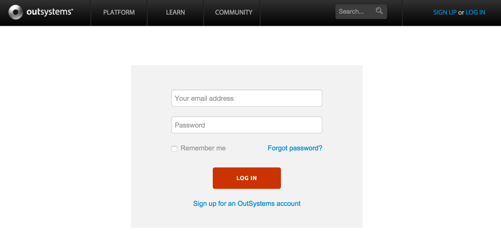

# How to recover your OutSystems password

To recover your OutSystems account password, click the [Forgot password?](http://www.outsystems.com/home/RequestPassword.aspx) link on the login screen.

1. **Enter your email** address, and click the **Forgot  Password** button;

2. Check your email. We sent you an email with a link to reset the password;

3. Follow the instructions on the email, and **choose a new password**.

