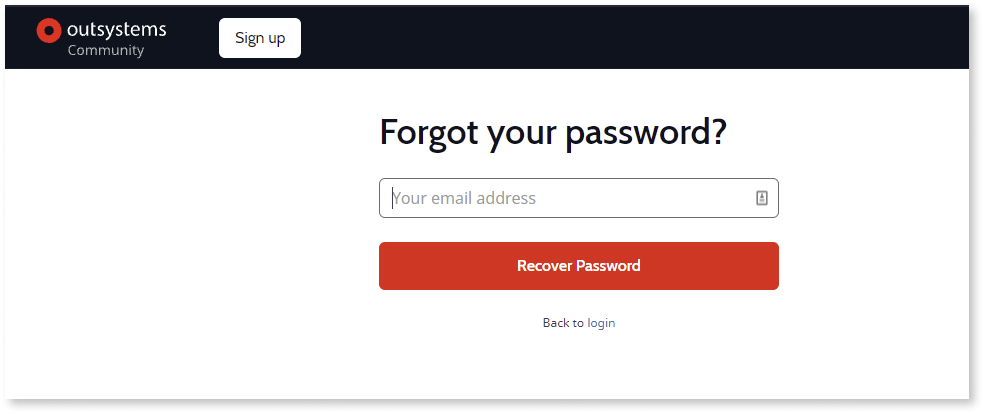

# How to recover your OutSystems password

To recover your OutSystems account password, click the [Forgot password?](http://www.outsystems.com/home/RequestPassword.aspx) link on the login screen.

1. Enter your email address, and click the **Recover Password** button.

    Outsystems sends you an email with a link to recover your password.

1. Follow the instructions in the email to recover your password.

