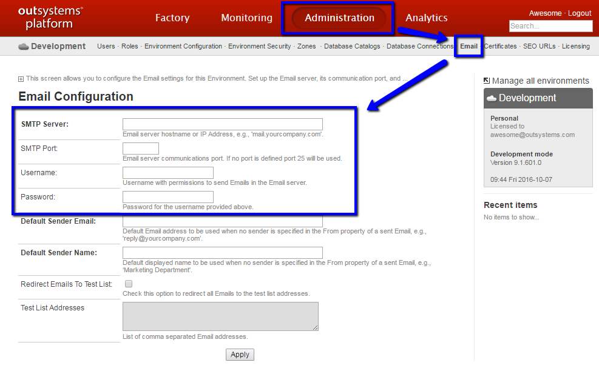

# How-to send emails from your personal environment

Your OutSystems personal environment can be configured to send emails using an external [SMTP](https://en.wikipedia.org/wiki/Simple_Mail_Transfer_Protocol) mail server.

To configure the SMTP server open the page below on your browser, fill in the missing fields and then click Apply:

`https://<YOURPERSONAL>.outsystemscloud.com/ServiceCenter/Email_Configuration.aspx`

## Settings for popular SMTP servers 

* [Gmail / GSuite](https://support.google.com/a/answer/176600?hl=en)

* [Sendgrid](https://sendgrid.com/docs/Classroom/Basics/Email_Infrastructure/recommended_smtp_settings.html)

* [SendinBlue](https://sendinblue.com/)

* [Mailjet](https://www.mailjet.com/)

* [Mailgun](https://www.mailgun.com/)

## More information

The information in this page was originally posted as a forum discussion:

[How to send emails from your personal environment](https://www.outsystems.com/forums/discussion/11645/how-to-send-emails-from-your-personal-environment/)

Join that discussion to pool other community users about which SMTP server they use.
