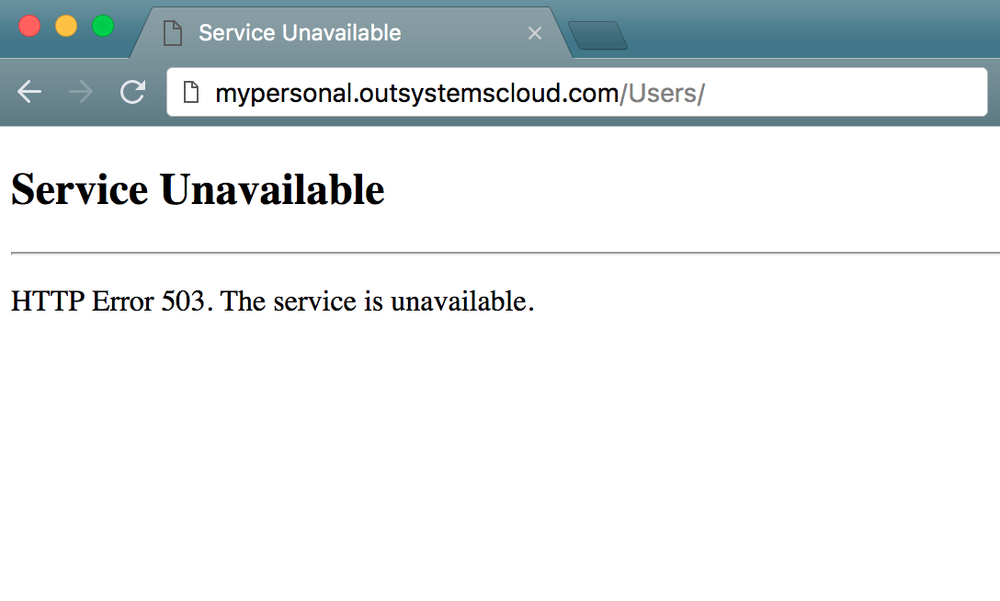
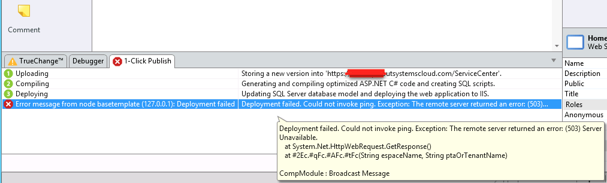
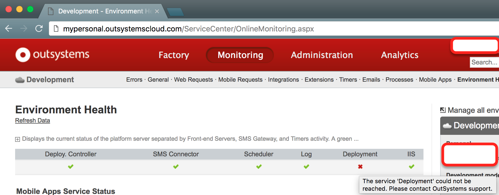
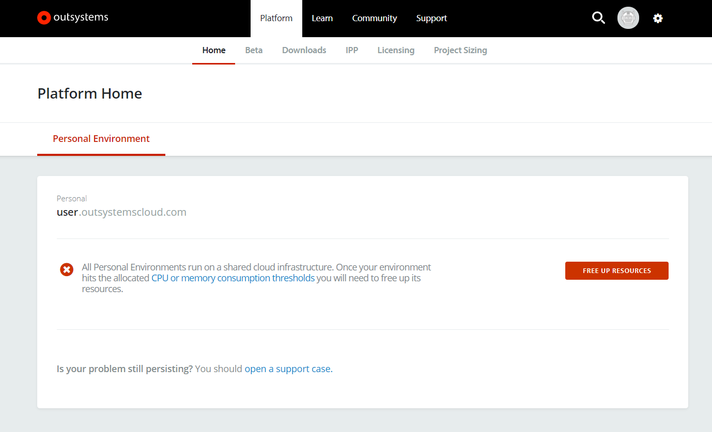

# Personal Environment: Service Unavailable - HTTP Error 503

## Symptoms

### Symptom 1: HTTP Error 503: Service Unavailable

You are accessing eSpace Users (or any other eSpace you created in your Personal Environment) and you get an error message.

The title of the page indicates "Service Unavailable". The content of the page is as below:

### Symptom 2: Error doing 1-Click Publish from Service Studio

You are publishing an eSpace using Service Studio. Deployment phase (3) takes abnormally long, and ends with an error indicating a Deployment failed. If you hover the details of the error, you see an indication of (503) Server Unavailable:

After seeing this message, you confirm that **symptom 1 also applies.**

### Symptom 3: Error in Service Center: The service 'Deployment' could not be reached.

You are accessing Service Center and see an error message in Environment Health related to Deployment Service being down:

After seeing this message, you confirm that **symptom 1 also applies.**

### Symptom 4: Error in LifeTime: Environment health problems; Deployment service is down

You are accessing lifetime and see an error related to Environment Health. When you click details, you see an error related to Deployment Service.

After seeing this message, you confirm that **symptom 1 also applies.**

## Cause

If you are experiencing the symptoms above then your personal environment **has been automatically disabled**. This happened because one of your applications has exceeded the allowed resource usage.

This protection mechanism disables Personal Environments if any of following occurs:

1. Your application has at some point **reached the allowed memory limit** for your personal environment;

2. You have created an application that was using **too much CPU for a long time**;

3. You have created a pattern (an **infinite loop or wrong code pattern** in an integration) that is causing your environment to crash repeatedly;

4. You have **too many complex applications running**.

## Resolution

Your Personal Environment can be recovered in two different ways:

* **For Symptom** [**1**](https://success.outsystems.com/Support/Personal_Environment/Personal_Environment%3A_Service_Unavailable_-_HTTP_Error_503#Symptom_1:_HTTP_Error_503:_Service_Unavailable) **and** [**2**](https://success.outsystems.com/Support/Personal_Environment/Personal_Environment%3A_Service_Unavailable_-_HTTP_Error_503#Symptom_2:_Error_doing_1-Click_Publish_from_Service_Studio), you will get the following error in Service Studio: 

**Click** in *Free up the resources* and you will be redirected to the following page, where you must **click** *[Free Up Resources](https://www.outsystems.com/home/FreeUpResources.aspx):*

 

Keep in mind that if the same conditions apply, freeing up resources in the Personal Environment won't automatically stop it from getting to the resource limit again. So, make sure that you troubleshoot the applications that you were working on that might have triggered the temporary suspension of your environment.

* **For symptoms** [**3**](https://success.outsystems.com/Support/Personal_Environment/Personal_Environment%3A_Service_Unavailable_-_HTTP_Error_503#Symptom_3:_Error_in_Service_Center:_The_service_'Deployment'_could_not_be_reached.) **and** [**4**](https://success.outsystems.com/Support/Personal_Environment/Personal_Environment%3A_Service_Unavailable_-_HTTP_Error_503#Symptom_4:_Error_in_LifeTime:_Environment_health_problems.3B_Deployment_service_is_down), or in the case tha**t you have freed up resources and troubleshoot your apps but the problem persists**, you will need to [contact Support](https://success.outsystems.com/Support). We will help you recover your personal environment and in solving the problem that caused this failure.

## Properties

Applies to Personal Environments, any version.

