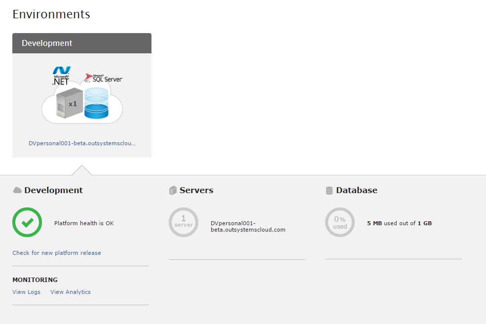
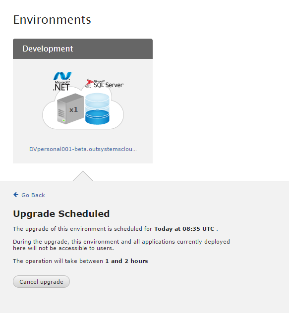

# Upgrade a personal environment to the latest version

Personal environments are **automatically upgraded** to the latest version. Before any upgrade takes place, you will be notified by email.

If you are working in an Enterprise Environment, contact your system administrator to [Upgrade the OutSystems platform server](https://success.outsystems.com/Support/Enterprise_Customers/Upgrading/01_Upgrade_OutSystems_Platform).

## Manually check for upgrades

1. To check if there’s an update available, navigate to your OutSystems Platform (`https://<yourpersonal>.outsystemscloud.com`), and click the **Environment** tab.

    

1. Click the '**Check for new platform release**' link to check if there's a new OutSystems Platform version available.

    

    If a new version is available, you can schedule for an upgrade. Click the **Schedule** button.

    

## Cancel an upgrade

The time the upgrade takes place is displayed. During an upgrade, your applications are not accessible, so if the upgrade time is not convenient, you can cancel it. Click the **Upgrade scheduled for** link and then click the **Cancel upgrade** button.

